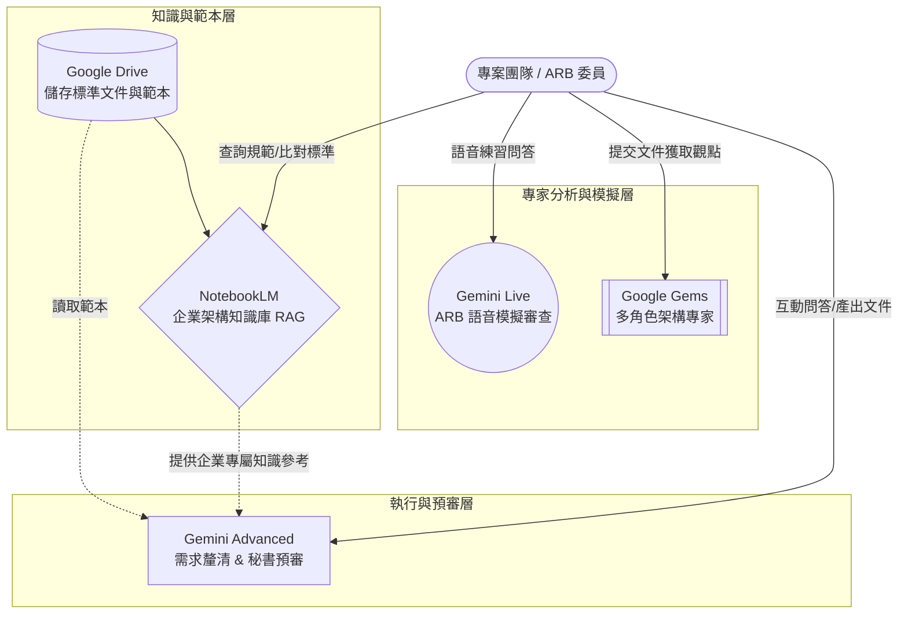

運用 Google 既有的 AI 工具（NotebookLM、Gemini Advanced、Google Gems、Gemini Live）來「拼圖式」地實現您提案中的所有核心功能。

 **「AI 輔助 IT 架構審查機制（AI-Assisted ARB）」Google 工具建置說明手冊**

---

# AI 輔助 IT 架構審查機制建置手冊

## 一、 系統功能對應與運作架構

我們將提案中的五個步驟與 RAG 架構，完美映射到 Google 的各項服務中。

---

## 二、 階段建置指南

### Phase 1：建立企業架構知識庫（對應提案 Step 1 & RAG）

**使用工具：** Google Drive + NotebookLM
**目的：** 建立標準化 IT 架構審查範本文件，並累積架構決策與最佳實務。

**建置步驟：**

1. **建立資料夾：** 在 Google Drive 建立一個專屬資料夾（例如：「ARB 企業架構知識庫」）。
2. **準備基礎文件：** 將以下內容上傳至該資料夾：
* IT 架構原則與技術標準
* 產業最佳實務與過往 ARB 案例
* 雲架構策略與安全規範
* IT 架構審查範本文件（包含：系統概述、架構設計、技術選型等欄位）

3. **建立 NotebookLM 筆記本：**
* 進入 NotebookLM，建立一個新的筆記本，命名為「ARB 企業架構知識庫」。
* 將上述 Google Drive 中的文件全部匯入作為「來源（Sources）」。

4. **日常使用方式：** 專案團隊在設計初期，可直接在 NotebookLM 中提問（例如：「我們目前的高可用設計規範是什麼？」），NotebookLM 會 100% 根據內部文件給予精準解答，避免 AI 產生幻覺。

---

### Phase 2：建立 AI 輪詢式需求釐清與預審秘書（對應提案 Step 2 & Step 3）

**使用工具：** Gemini Advanced（開啟 Google Workspace 擴充功能）
**目的：** 透過互動式問答逐步補齊架構內容，並在正式 ARB 前進行 AI 架構預審。

**建置與操作步驟：**

1. **啟動擴充功能：** 確保使用者的 Gemini 已開啟 Google Drive 擴充功能（輸入 `@Google Drive` 即可呼叫）。
2. **Step 2 需求釐清操作：**
* 專案團隊開啟 Gemini，輸入 Prompt 啟動輪詢：「*請讀取 Google Drive 中的『IT架構審查範本文件』。我現在要撰寫一份新的專案架構文件，請你透過互動式問答，一次問我一個問題（例如：系統目的、技術平台、API整合方式等），逐步幫我補齊架構內容。*」

3. **Step 3 秘書預審操作：**
* 專案團隊將完成的草稿上傳或貼給 Gemini，輸入 Prompt：「*請扮演 ARB 預審秘書，根據『ARB 企業架構知識庫』的標準，針對這份文件進行檢查。請列出：架構一致性、技術選型、安全設計、擴展性等面向的分析，並產出包含架構優點、架構風險與改善建議的 AI 預審報告。*」

---

### Phase 3：設定多角色 AI 架構專家（對應提案 Step 4）

**使用工具：** Google Gems (Gemini Advanced 專屬功能)
**目的：** 模擬多種架構角色，提供 ARB 委員審查觀點建議。

**建置步驟：**

1. 進入 Gemini，點擊左側的「Gems」管理器。
2. 針對提案中的五種角色，分別建立 5 個獨立的 Gem：
* **Enterprise Architect Gem**
* **Cloud Architect Gem**
* **Security Architect Gem**
* **Data Architect Gem**
* **DevOps Architect Gem**

3. **設定 Gem 指令（以 Security Architect 為例）：**
* **名稱：** ARB 資安架構審查專家
* **指示 (Instructions)：** 「*你是一位嚴格的 Security Architect。當我提供 IT 架構文件時，請專注審查『安全控制、資料加密、合規要求』。請指出主要架構風險，並提供具體的技術替代方案與架構改善方向。你的語氣應該專業且一針見血。*」

4. **日常使用方式：** ARB 委員在開會前，將專案文件丟給這幾個 Gems，即可快速獲得不同維度的專家審查建議報告。

---

### Phase 4：AI 架構審查模擬（對應提案 Step 5）

**使用工具：** 手機版 Gemini Live (語音對話模式)
**目的：** 讓受審團隊提前準備 ARB 問答，模擬 ARB 可能提問。

**建置與操作步驟：**

1. **準備前置作業：** 受審者將預審過的架構文件重點，先貼入手機版 Gemini 的對話框中。
2. **啟動 Live 模式：** 點擊右下角的「Live（語音符號）」按鈕進入即時對話模式。
3. **下達模擬指令（口說）：**
* 「*我明天要參加 ARB 審查。請你扮演嚴厲的 ARB 委員，針對我剛剛提供的架構文件對我進行盤問。請問我像是『為何選擇此架構？系統容量規劃？容災策略？安全機制？』等問題。請一次問一個問題，等我回答後再繼續追問。*」

4. **進行演練：** 團隊可以直接透過語音與 AI 進行一問一答的防禦戰練習，鍛鍊臨場反應。
