# AI輔助 IT架構審查機制建置提案
**（AI-Assisted Architecture Review Board）**

---

# 一、提案背景

在大型組織中，**IT架構審查委員會（Architecture Review Board, ARB）** 通常負責確保 IT 系統設計符合企業架構原則、技術標準與長期策略方向。

### ARB 核心職能

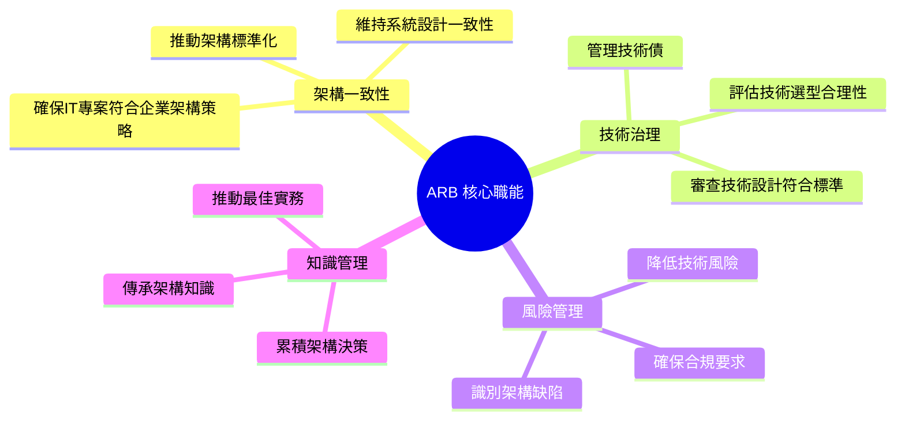

### 現行 ARB 運作痛點分析

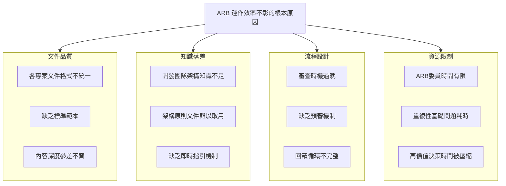
### 問題嚴重性評估矩陣

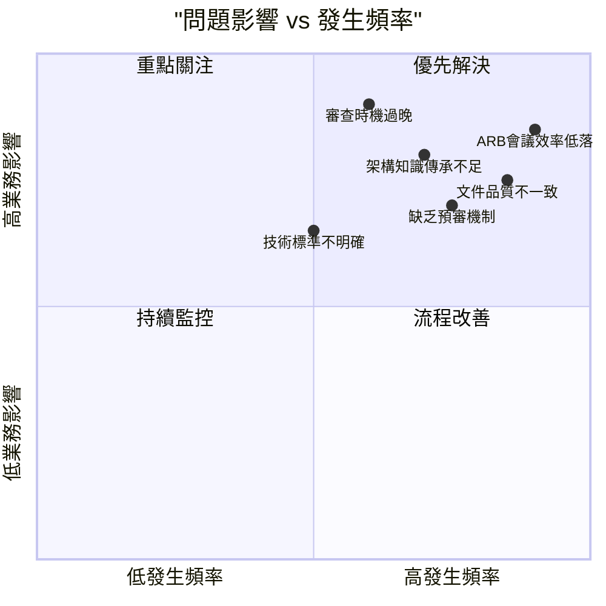

---

# 二、提案目標

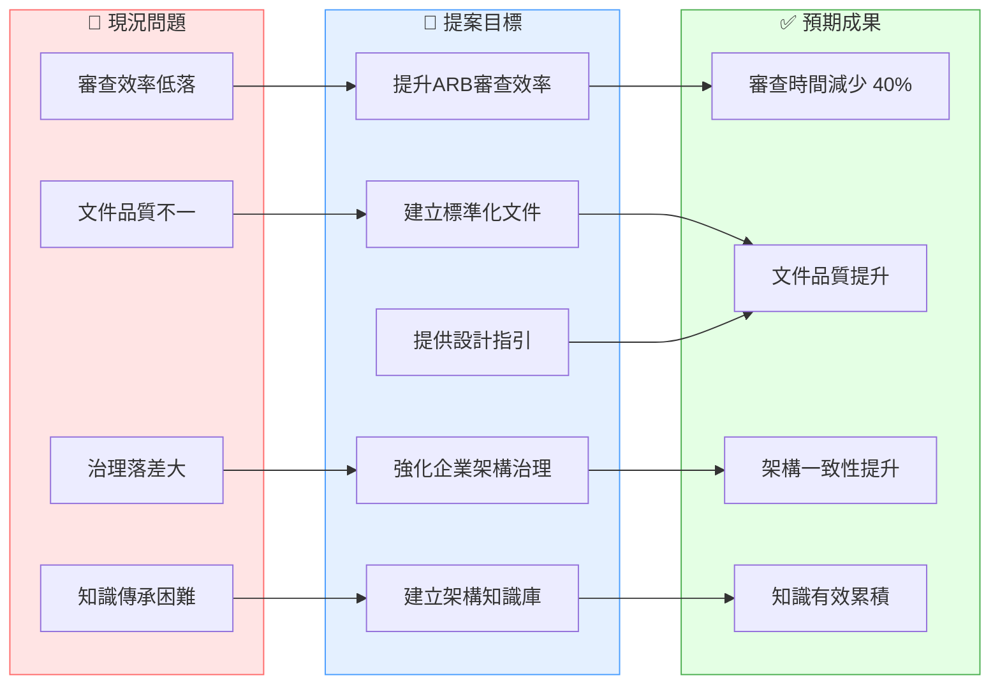

---

# 三、解決方案架構

### AI 輔助架構治理平台 — 整體架構圖

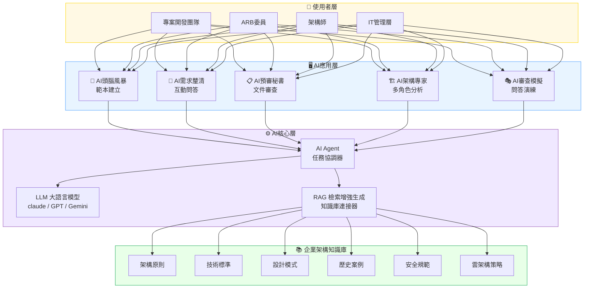

### AI 五大角色定義

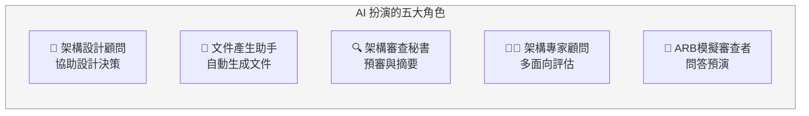

---

# 四、AI輔助架構審查流程

### 端到端流程總覽

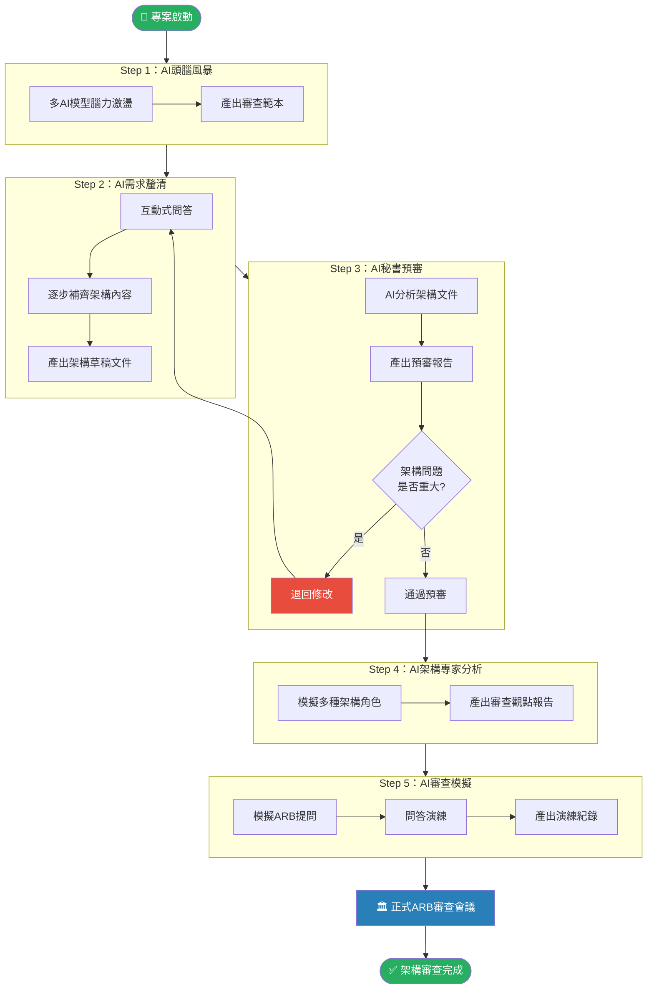

---

## Step 1：AI 頭腦風暴

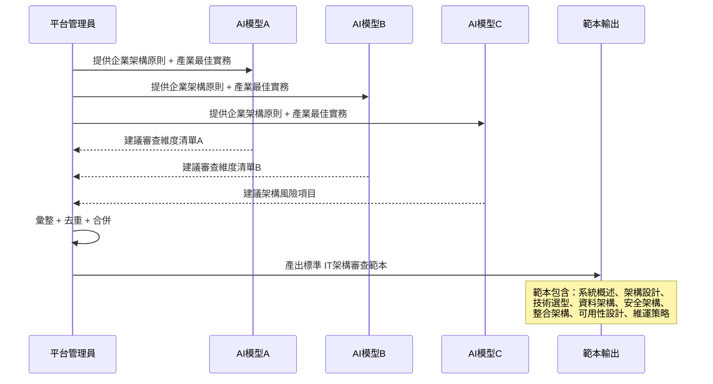

---

## Step 2：AI 輪詢式需求釐清

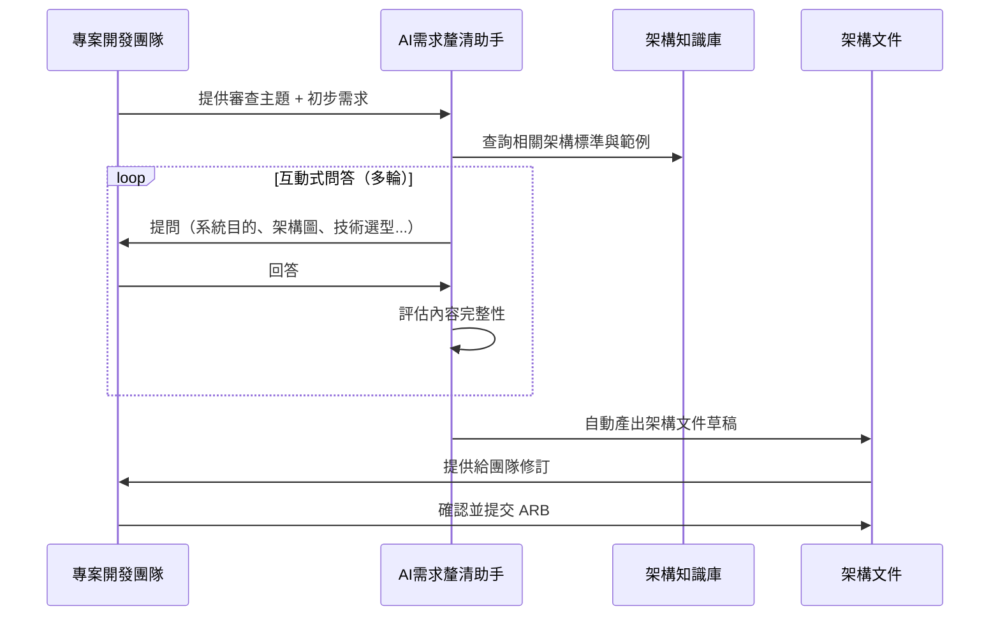

### AI 問答涵蓋面向

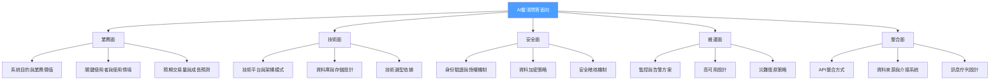

---

## Step 3：AI 秘書預審

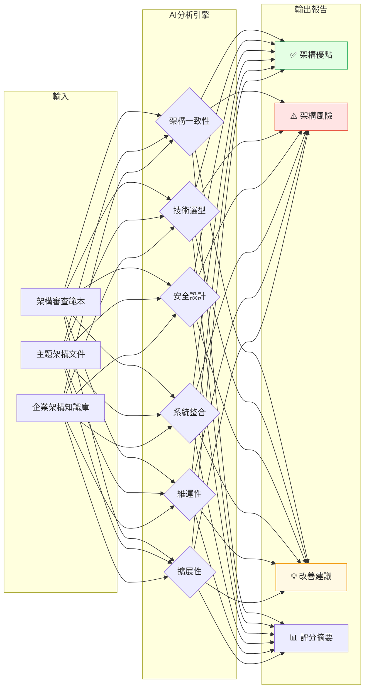

### 預審評分雷達圖（示意）

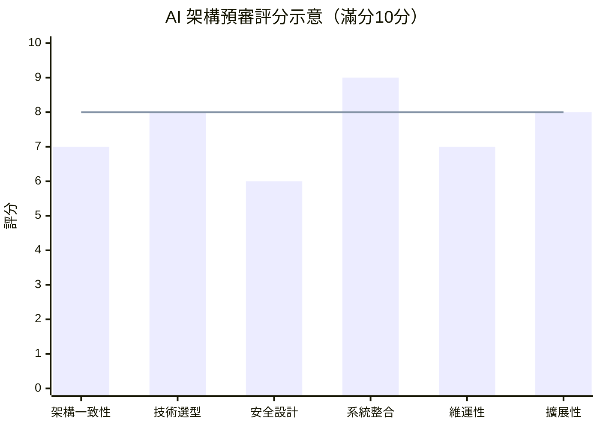

---

## Step 4：AI 架構專家分析

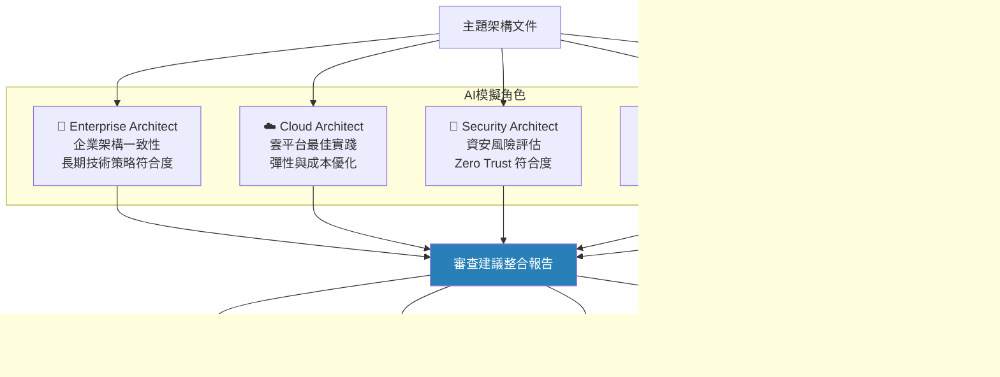

---

## Step 5：AI 架構審查模擬

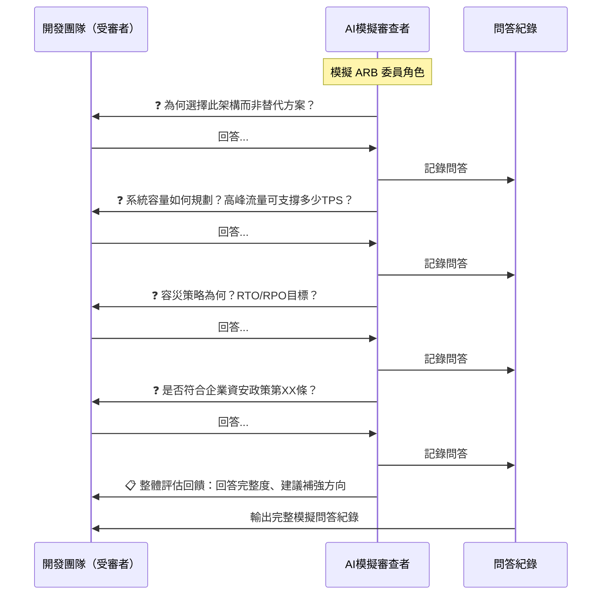

---

# 五、AI 系統架構

### LLM + RAG 技術架構

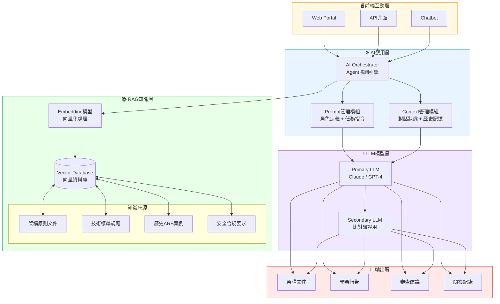

### 企業架構知識庫結構

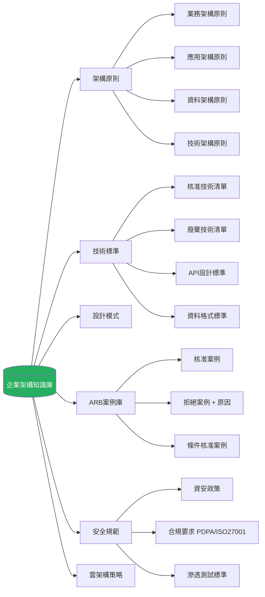

---

# 六、預期效益

### 效益量化預估

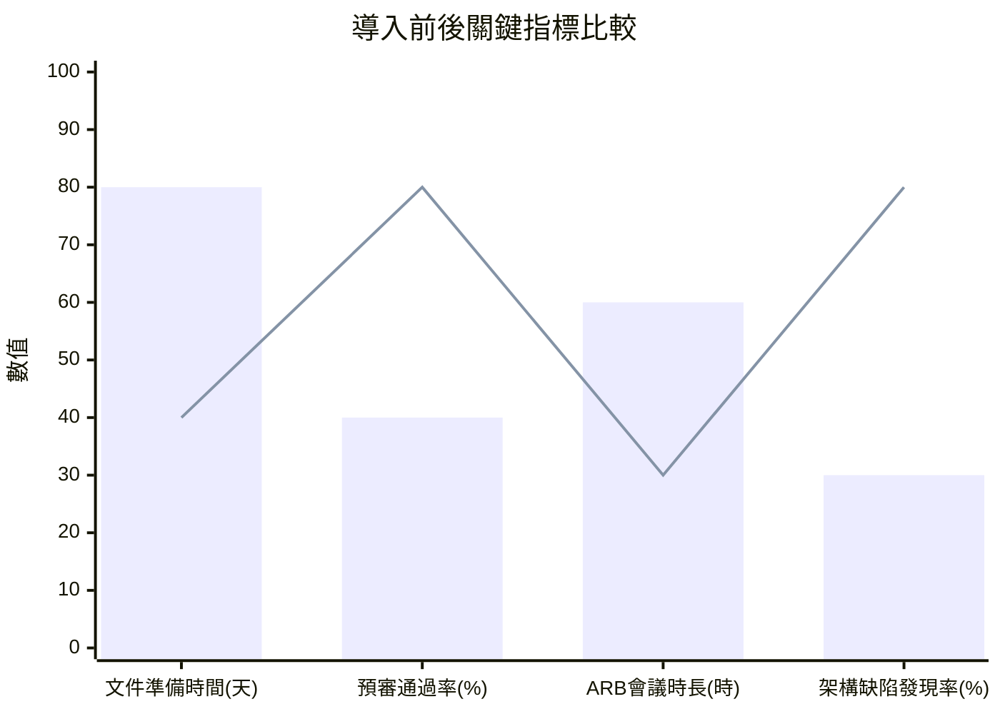

> 藍色柱：導入前　紅色線：導入後目標

### 效益影響範圍

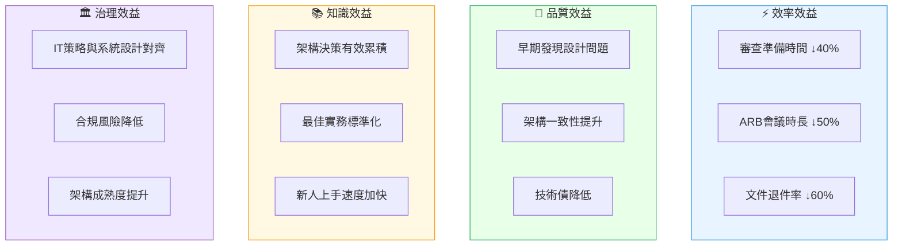

---

# 七、導入建議

### 三階段推動時程

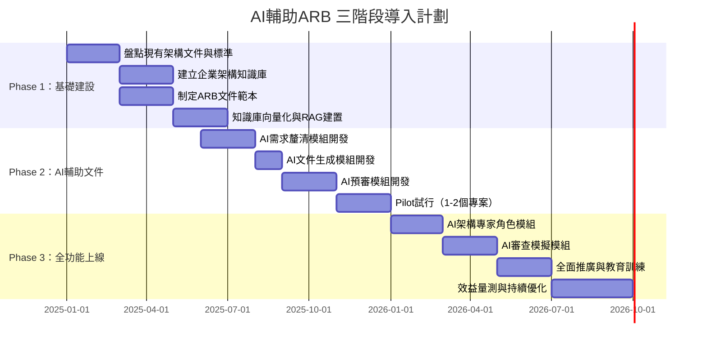

### 三階段導入里程碑

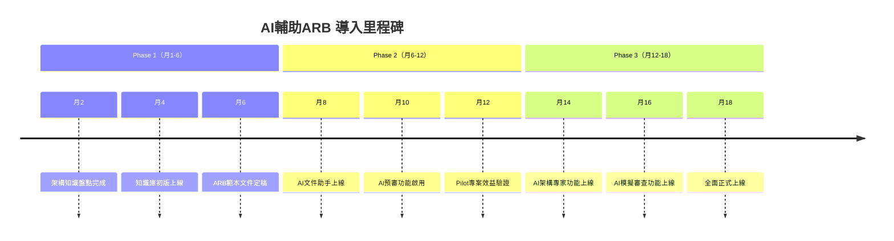

### 導入準備度評估

```mermaid
graph LR
    subgraph 前提條件評估
        C1{現有架構文件\n是否齊全?}
        C2{LLM平台\n是否已選定?}
        C3{ARB流程\n是否已定義?}
        C4{資料安全\n是否符合規定?}
    end

    C1 -->|是| GO1[✅ 可直接建立知識庫]
    C1 -->|否| ACT1[🔧 先進行文件盤點與整理]

    C2 -->|是| GO2[✅ 可直接接入]
    C2 -->|否| ACT2[🔧 進行LLM平台評估與採購]

    C3 -->|是| GO3[✅ 可直接對應AI流程]
    C3 -->|否| ACT3[🔧 先定義ARB審查SOP]

    C4 -->|是| GO4[✅ 可使用雲端LLM]
    C4 -->|否| ACT4[🔧 考慮地端部署LLM]

    style GO1 fill:#E4FFE4,stroke:#27AE60
    style GO2 fill:#E4FFE4,stroke:#27AE60
    style GO3 fill:#E4FFE4,stroke:#27AE60
    style GO4 fill:#E4FFE4,stroke:#27AE60
    style ACT1 fill:#FFE4E4,stroke:#E74C3C
    style ACT2 fill:#FFE4E4,stroke:#E74C3C
    style ACT3 fill:#FFE4E4,stroke:#E74C3C
    style ACT4 fill:#FFE4E4,stroke:#E74C3C
```

---

# 八、風險評估與對應策略

```mermaid
graph TD
    subgraph 風險分類
        R1["🔴 高風險\nAI產出品質不穩定"]
        R2["🔴 高風險\n敏感資料外洩"]
        R3["🟡 中風險\n使用者採用率低"]
        R4["🟡 中風險\n知識庫內容過時"]
        R5["🟢 低風險\n系統可用性問題"]
    end

    subgraph 對應策略
        M1["人工審核機制\nHuman-in-the-loop"]
        M2["地端LLM部署\n資料不出境"]
        M3["教育訓練計畫\n變革管理"]
        M4["定期知識庫更新\n版本控制"]
        M5["高可用架構\n備援機制"]
    end

    R1 --> M1
    R2 --> M2
    R3 --> M3
    R4 --> M4
    R5 --> M5

    style R1 fill:#FFE4E4,stroke:#E74C3C
    style R2 fill:#FFE4E4,stroke:#E74C3C
    style R3 fill:#FFF9E4,stroke:#F39C12
    style R4 fill:#FFF9E4,stroke:#F39C12
    style R5 fill:#E4FFE4,stroke:#27AE60
```

---

# 九、結論

```mermaid
graph LR
    INPUT["🏢 企業現況\n• ARB效率低落\n• 架構知識分散\n• 文件品質不一"]

    SOLUTION["🤖 AI輔助ARB\n• AI頭腦風暴\n• AI需求釐清\n• AI秘書預審\n• AI架構專家\n• AI審查模擬"]

    OUTPUT["🎯 預期成果\n• 治理效率 ↑\n• 架構品質 ↑\n• 知識累積 ↑\n• 團隊能力 ↑"]

    INPUT --"導入"--> SOLUTION --"達成"--> OUTPUT

    style INPUT fill:#FFE4E4,stroke:#E74C3C
    style SOLUTION fill:#E8F4FF,stroke:#3498DB
    style OUTPUT fill:#E4FFE4,stroke:#27AE60
```

導入 **AI輔助 IT架構審查機制**，可大幅提升 ARB 的運作效率與架構治理能力，使 IT 系統設計更符合企業架構策略與技術標準，並促進組織整體架構成熟度的提升。

透過三階段漸進式導入，組織可在控制風險的前提下，逐步實現 AI 輔助架構治理的完整願景，最終達成 **架構即程式碼（Architecture as Code）** 的長期目標。

---

*文件版本：v2.0 | 最後更新：2025*