# AI輔助 IT架構審查機制建置提案（AI-Assisted Architecture Review Board）

---

## 一、提案背景

在大型組織中，**IT架構審查委員會（ARB）** 負責確保系統設計符合企業架構原則、技術標準與長期策略。然而實務上常見以下痛點：

- **文件品質不一**：各專案提交的架構文件深度、格式差異大，審查效率低。
- **知識傳承困難**：新進團隊對企業架構標準陌生，重複犯錯。
- **會議效率低落**：ARB 委員耗費大量時間在基本問題釐清，而非策略性決策。
- **治理與開發脫節**：設計完成後才送審，導致修改成本高昂。

這些問題導致架構治理成效不彰，技術債持續累積。

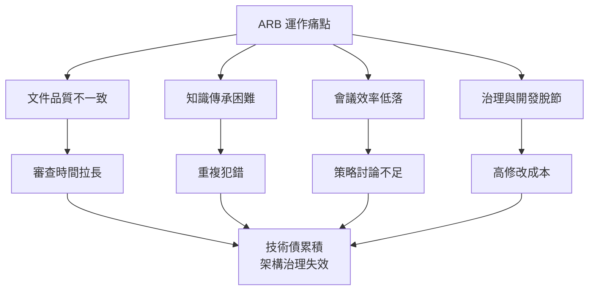

---

## 二、提案目標

導入 **AI輔助架構審查機制** 以達成：

1. **強化企業架構治理**：確保設計與原則一致。
2. **標準化審查文件**：提升品質與一致性。
3. **提升ARB效率**：AI預審減少人工負擔。
4. **建立架構知識庫**：累積決策與最佳實務。
5. **提供設計指引**：協助團隊遵循標準。

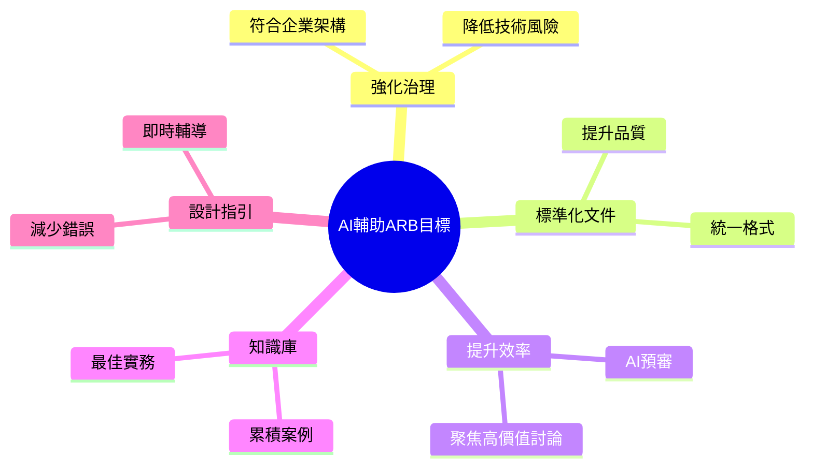

---

## 三、解決方案概念

建置 **AI輔助架構治理平台**，由五種 AI 角色協作，貫穿審查流程。

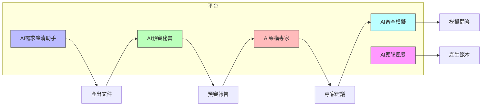

---

## 四、AI輔助架構審查流程

### Step 1：AI頭腦風暴 – 建立架構審查範本

**目的**：產出標準化審查範本，確保審查面向完整。

**輸入**：企業架構原則、產業最佳實務、歷史審查文件。

**AI功能**：多模型協同，收斂出關鍵審查維度。

**輸出**：IT架構審查範本文件（含系統概述、技術選型、安全、資料、整合、維運等）。

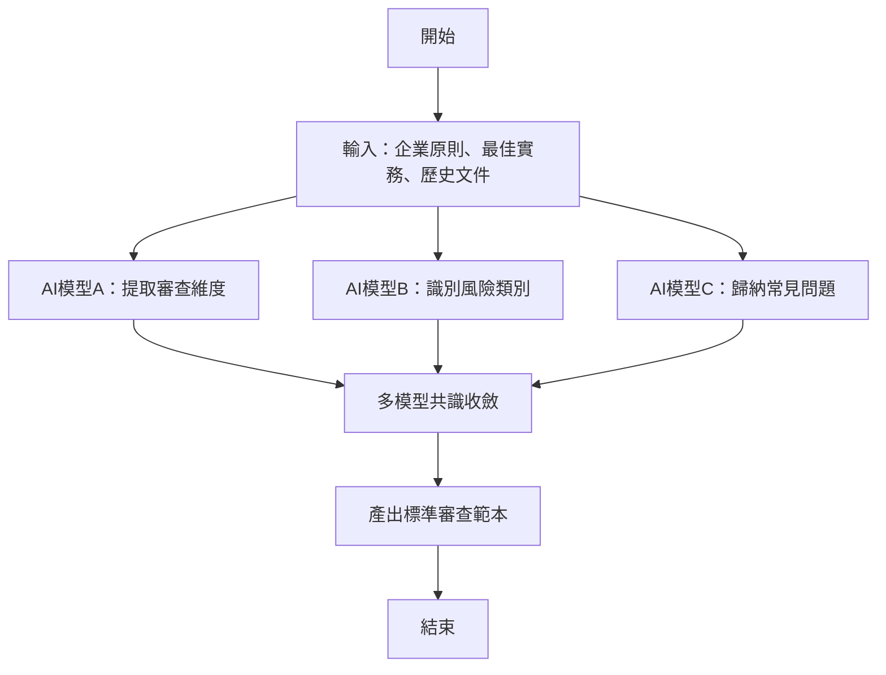

---

### Step 2：AI輪詢式需求釐清 – 協助團隊產出文件

**目的**：透過互動問答引導團隊補齊架構設計細節。

**輸入**：審查範本、企業知識庫、初步需求。

**AI功能**：以對話方式逐項提問，蒐集必要資訊。

**輸出**：主題IT架構審查文件（草稿）。

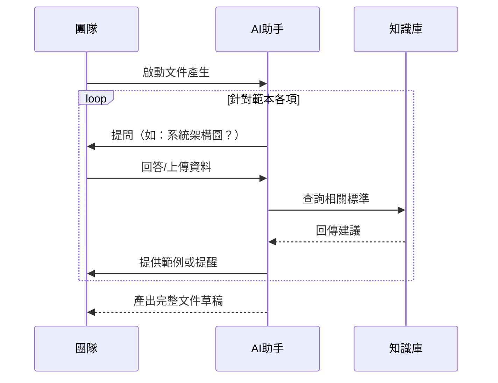

---

### Step 3：AI秘書預審 – 預先分析架構設計

**目的**：在正式會議前進行自動化預審，提早發現問題。

**輸入**：主題架構文件、企業架構知識庫。

**AI分析**：比對標準、識別風險、評估合規性。

**輸出**：AI預審報告（優點、風險、改善建議）。

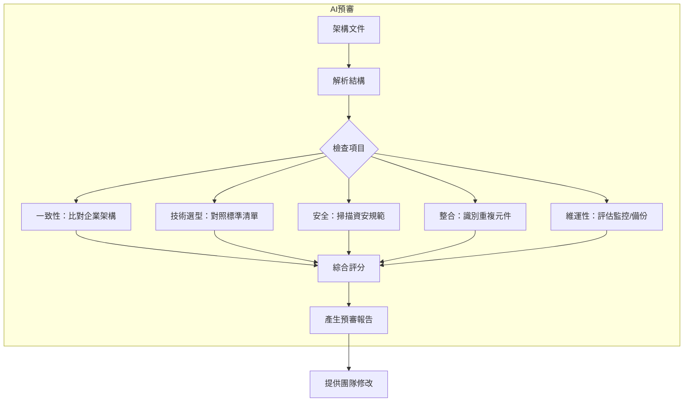

---

### Step 4：AI架構專家分析 – 提供審查觀點

**目的**：模擬不同領域架構師視角，提出專業建議。

**輸入**：預審後的架構文件、企業知識庫。

**AI模擬角色**：企業、雲端、安全、數據、DevOps 架構師。

**輸出**：審查建議報告（風險、替代方案、改善方向）。

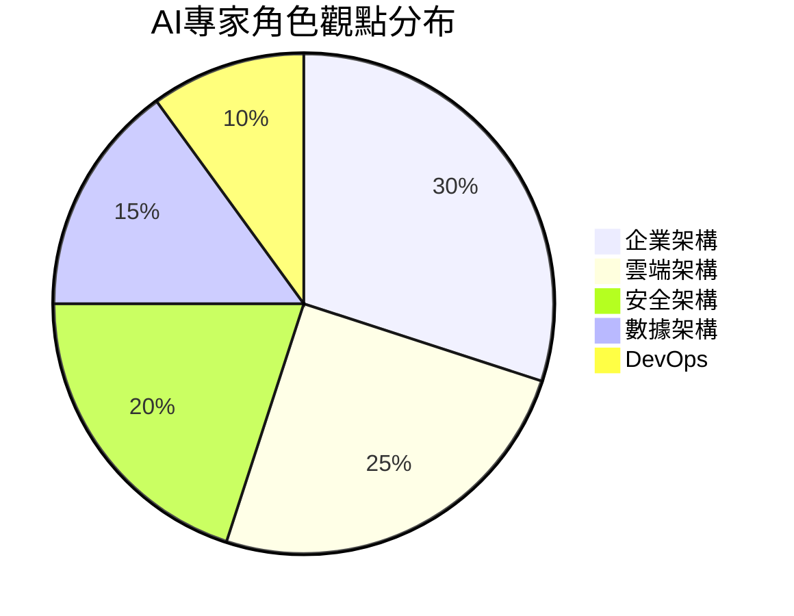

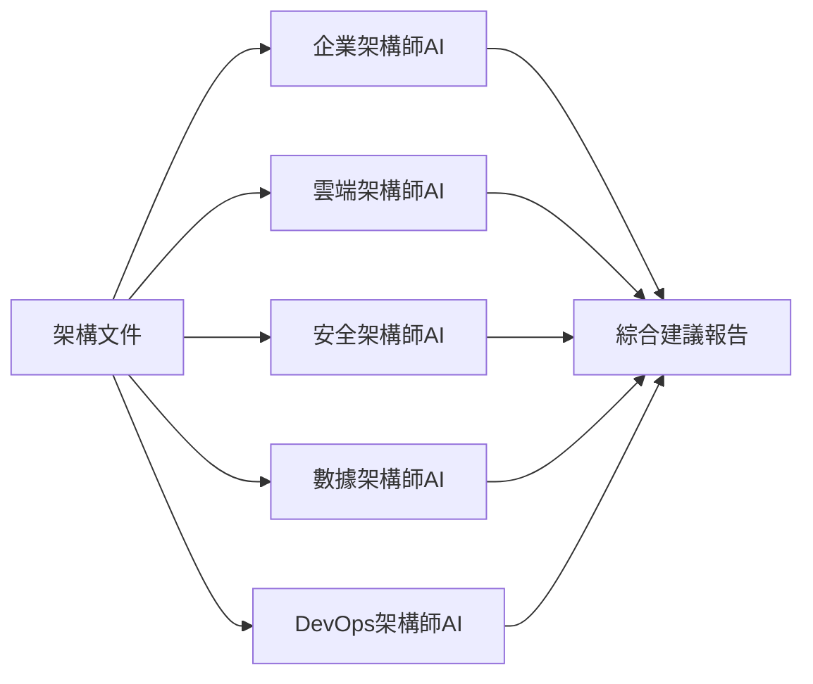

---

### Step 5：AI架構審查模擬 – 準備ARB問答

**目的**：讓團隊提前演練，減輕會議壓力。

**輸入**：架構文件、知識庫、歷史審查紀錄。

**AI功能**：根據文件生成可能的提問與回答。

**輸出**：模擬審查問答紀錄。

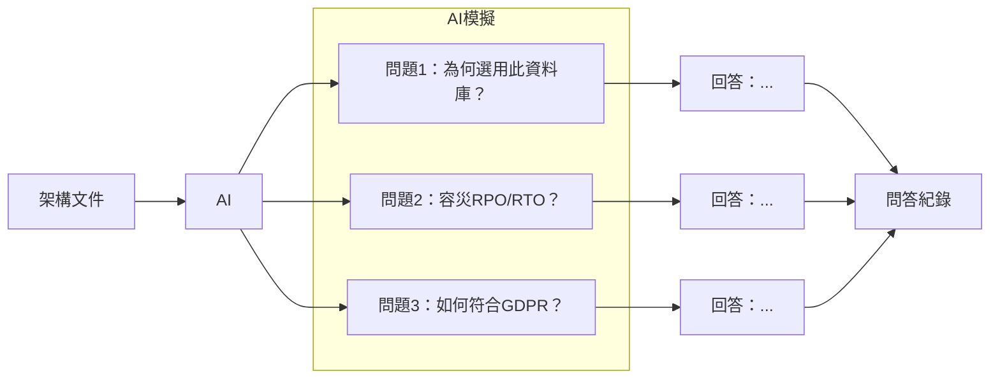

---

## 五、AI系統架構

採用 **LLM + RAG（檢索增強生成）** 架構，結合企業內部知識庫，確保回應準確且符合組織標準。

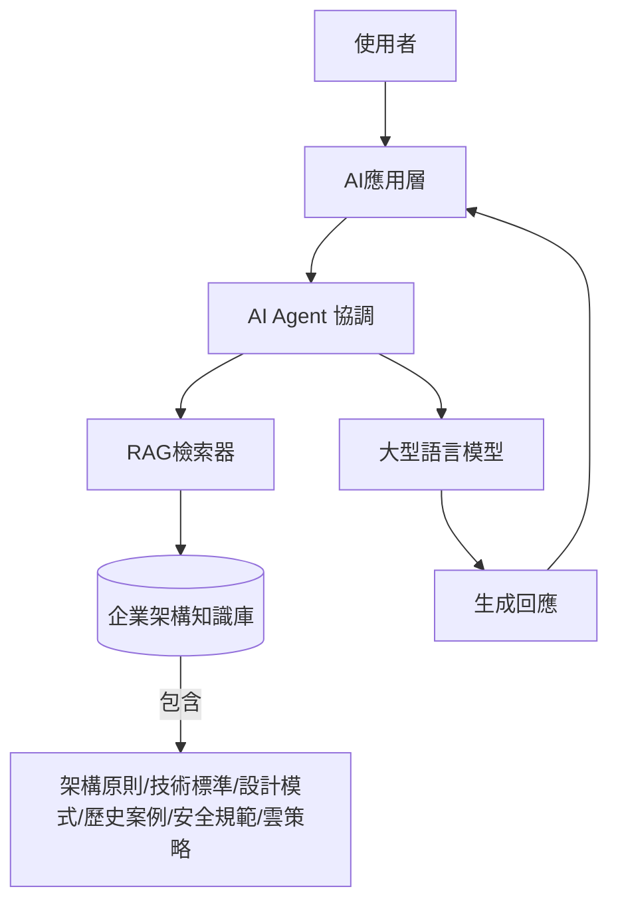

---

## 六、預期效益

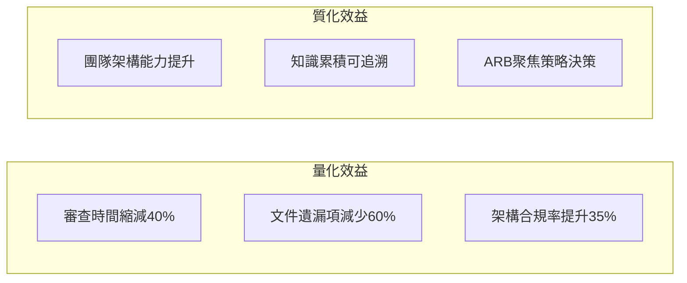

---

## 七、導入建議

三階段穩健導入，降低組織衝擊。

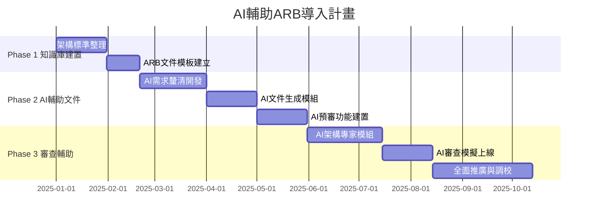

---

## 八、結論

導入 **AI輔助 IT架構審查機制**，能顯著提升 ARB 運作效率、強化架構治理，並促進組織架構成熟度。透過分階段導入，結合 LLM 與 RAG 技術，可實現文件標準化、預審自動化、知識資產化，最終讓 IT 投資與系統設計緊密對齊企業策略。
