# AI輔助 IT架構審查機制建置提案（完整版）

（AI-Assisted Architecture Review Board - Enhanced Edition）

---

## 目錄

1. [提案背景](#一提案背景)
2. [提案目標](#二提案目標)
3. [解決方案概念](#三解決方案概念)
4. [AI輔助架構審查流程](#四ai輔助架構審查流程)
5. [AI系統架構](#五ai系統架構)
6. [預期效益](#六預期效益)
7. [導入建議](#七導入建議)
8. [風險與因應](#八風險與因應)
9. [結論](#九結論)

---

# 一、提案背景

## 1.1 傳統 ARB 運作現況

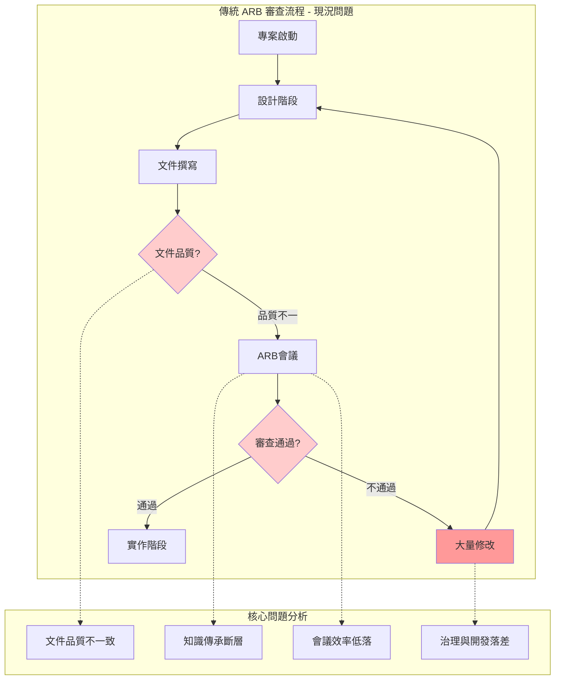
```mermaid
flowchart TB
    subgraph 傳統ARB流程["傳統 ARB 審查流程 - 現況問題"]
        A[專案啟動] --> B[設計階段]
        B --> C[文件撰寫]
        C --> D{文件品質?}
        D -->|品質不一| E[ARB會議]
        E --> F{審查通過?}
        F -->|不通過| G[大量修改]
        G --> B
        F -->|通過| H[實作階段]
        
        style D fill:#ffcccc
        style F fill:#ffcccc
        style G fill:#ff9999
    end
    
    subgraph 問題分析["核心問題分析"]
        P1[文件品質不一致]
        P2[知識傳承斷層]
        P3[會議效率低落]
        P4[治理與開發落差]
    end
    
    D -.-> P1
    E -.-> P2
    E -.-> P3
    G -.-> P4
```

## 1.2 問題詳細分析

### 問題 1：架構文件品質不一致

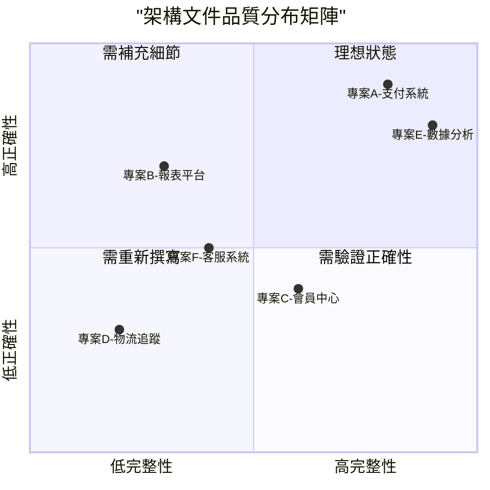
```mermaid
quadrantChart
    title "架構文件品質分布矩陣"
    x-axis "低完整性" --> "高完整性"
    y-axis "低正確性" --> "高正確性"
    
    quadrant-1 "理想狀態"
    quadrant-2 "需補充細節"
    quadrant-3 "需重新撰寫"
    quadrant-4 "需驗證正確性"
    
    "專案A-支付系統": [0.8, 0.9]
    "專案B-報表平台": [0.3, 0.7]
    "專案C-會員中心": [0.6, 0.4]
    "專案D-物流追蹤": [0.2, 0.3]
    "專案E-數據分析": [0.9, 0.8]
    "專案F-客服系統": [0.4, 0.5]
```

### 問題 2：架構知識未有效傳承

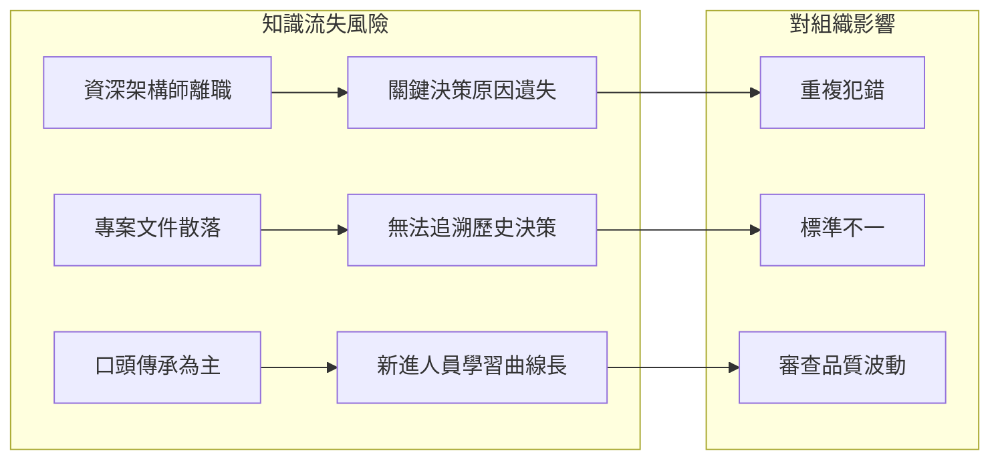
```mermaid
graph LR
    subgraph 知識流失["知識流失風險"]
        A1[資深架構師離職] --> B1[關鍵決策原因遺失]
        A2[專案文件散落] --> B2[無法追溯歷史決策]
        A3[口頭傳承為主] --> B3[新進人員學習曲線長]
    end
    
    subgraph 影響["對組織影響"]
        C1[重複犯錯]
        C2[標準不一]
        C3[審查品質波動]
    end
    
    B1 --> C1
    B2 --> C2
    B3 --> C3
```

### 問題 3：ARB會議效率有限

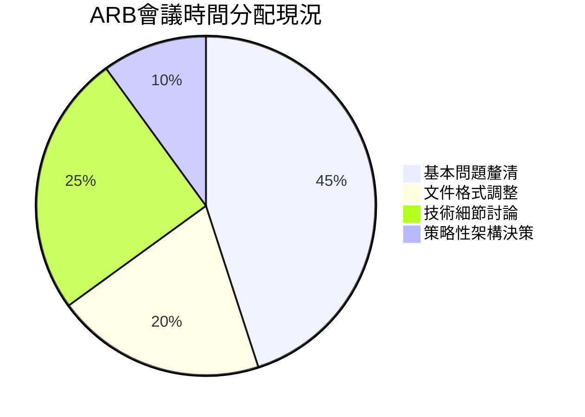
```mermaid
pie title ARB會議時間分配現況
    "基本問題釐清" : 45
    "文件格式調整" : 20
    "技術細節討論" : 25
    "策略性架構決策" : 10
```

### 問題 4：治理與開發落差

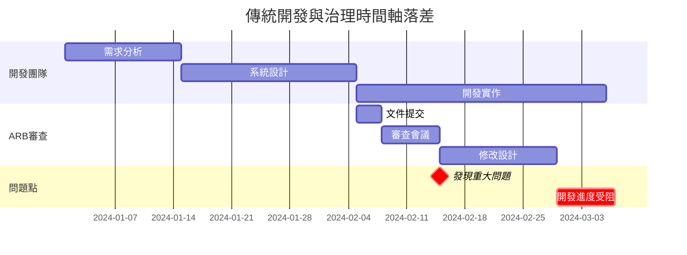
```mermaid
gantt
    title 傳統開發與治理時間軸落差
    dateFormat YYYY-MM-DD
    section 開發團隊
    需求分析           :a1, 2024-01-01, 14d
    系統設計           :a2, after a1, 21d
    開發實作           :a3, after a2, 30d
    
    section ARB審查
    文件提交           :b1, after a2, 3d
    審查會議           :b2, after b1, 7d
    修改設計           :b3, after b2, 14d
    
    section 問題點
    發現重大問題       :milestone, crit, after b2, 0d
    開發進度受阻       :crit, after b3, 7d
```

---

# 二、提案目標

## 2.1 目標架構圖

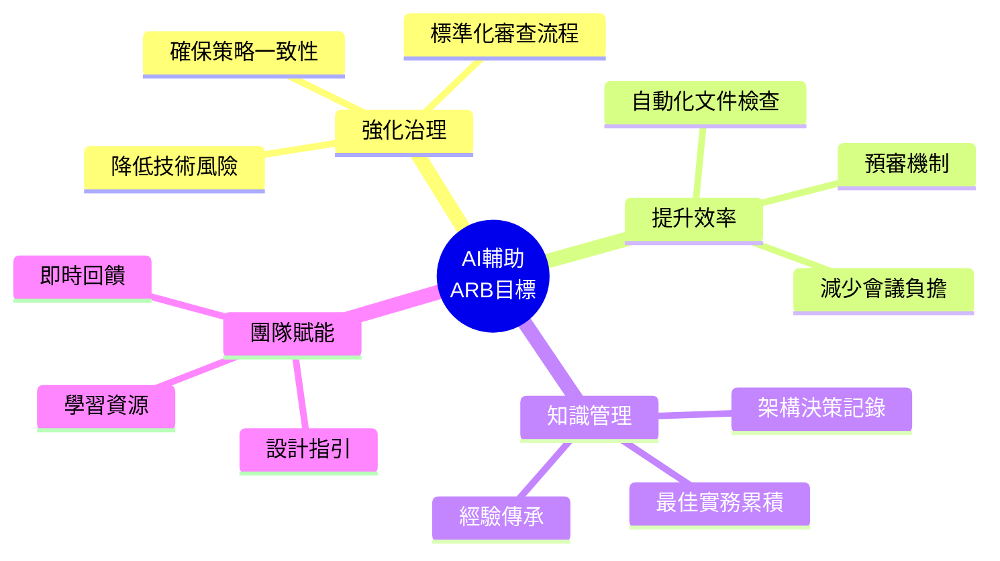
```mermaid
mindmap
  root((AI輔助<br/>ARB目標))
    強化治理
      確保策略一致性
      標準化審查流程
      降低技術風險
    提升效率
      自動化文件檢查
      預審機制
      減少會議負擔
    知識管理
      架構決策記錄
      最佳實務累積
      經驗傳承
    團隊賦能
      設計指引
      即時回饋
      學習資源
```

## 2.2 目標達成指標（KPI）

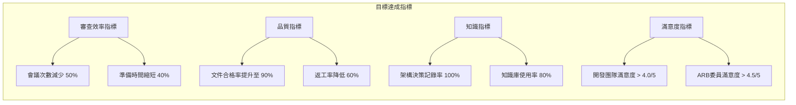
```mermaid
flowchart LR
    subgraph KPI["目標達成指標"]
        direction TB
        
        K1[審查效率指標]
        K1 --> K1_1[會議次數減少 50%]
        K1 --> K1_2[準備時間縮短 40%]
        
        K2[品質指標]
        K2 --> K2_1[文件合格率提升至 90%]
        K2 --> K2_2[返工率降低 60%]
        
        K3[知識指標]
        K3 --> K3_1[架構決策記錄率 100%]
        K3 --> K3_2[知識庫使用率 80%]
        
        K4[滿意度指標]
        K4 --> K4_1[開發團隊滿意度 > 4.0/5]
        K4 --> K4_2[ARB委員滿意度 > 4.5/5]
    end
```

---

# 三、解決方案概念

## 3.1 AI輔助架構治理平台總覽

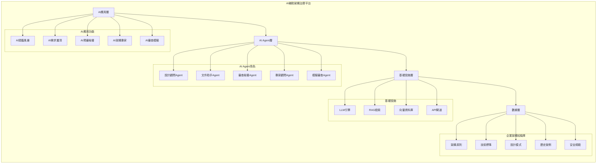
```mermaid
flowchart TB
    subgraph 平台總覽["AI輔助架構治理平台"]
        direction TB
        
        A[AI應用層]
        B[AI Agent層]
        C[基礎設施層]
        D[數據層]
        
        A --> B --> C --> D
        
        subgraph AI應用["AI應用功能"]
            A1[AI頭腦風暴]
            A2[AI需求釐清]
            A3[AI預審秘書]
            A4[AI架構專家]
            A5[AI審查模擬]
        end
        
        subgraph AIAgent["AI Agent角色"]
            B1[設計顧問Agent]
            B2[文件助手Agent]
            B3[審查秘書Agent]
            B4[專家顧問Agent]
            B5[模擬審查Agent]
        end
        
        subgraph 基礎設施["基礎設施"]
            C1[LLM引擎]
            C2[RAG檢索]
            C3[向量資料庫]
            C4[API閘道]
        end
        
        subgraph 數據["企業架構知識庫"]
            D1[架構原則]
            D2[技術標準]
            D3[設計模式]
            D4[歷史案例]
            D5[安全規範]
        end
        
        A --> A1 & A2 & A3 & A4 & A5
        B --> B1 & B2 & B3 & B4 & B5
        C --> C1 & C2 & C3 & C4
        D --> D1 & D2 & D3 & D4 & D5
    end
```

## 3.2 五種AI角色詳細設計

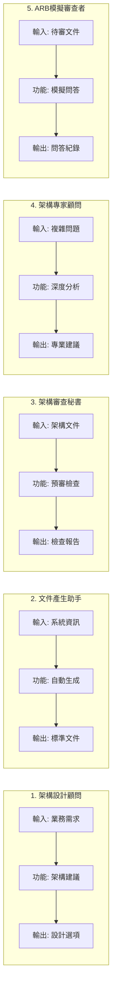
```mermaid
flowchart LR
    subgraph 角色1["1. 架構設計顧問"]
        R1_1[輸入: 業務需求]
        R1_2[功能: 架構建議]
        R1_3[輸出: 設計選項]
        R1_1 --> R1_2 --> R1_3
    end
    
    subgraph 角色2["2. 文件產生助手"]
        R2_1[輸入: 系統資訊]
        R2_2[功能: 自動生成]
        R2_3[輸出: 標準文件]
        R2_1 --> R2_2 --> R2_3
    end
    
    subgraph 角色3["3. 架構審查秘書"]
        R3_1[輸入: 架構文件]
        R3_2[功能: 預審檢查]
        R3_3[輸出: 檢查報告]
        R3_1 --> R3_2 --> R3_3
    end
    
    subgraph 角色4["4. 架構專家顧問"]
        R4_1[輸入: 複雜問題]
        R4_2[功能: 深度分析]
        R4_3[輸出: 專業建議]
        R4_1 --> R4_2 --> R4_3
    end
    
    subgraph 角色5["5. ARB模擬審查者"]
        R5_1[輸入: 待審文件]
        R5_2[功能: 模擬問答]
        R5_3[輸出: 問答紀錄]
        R5_1 --> R5_2 --> R5_3
    end
```

---

# 四、AI輔助架構審查流程

## 4.1 五階段流程總覽

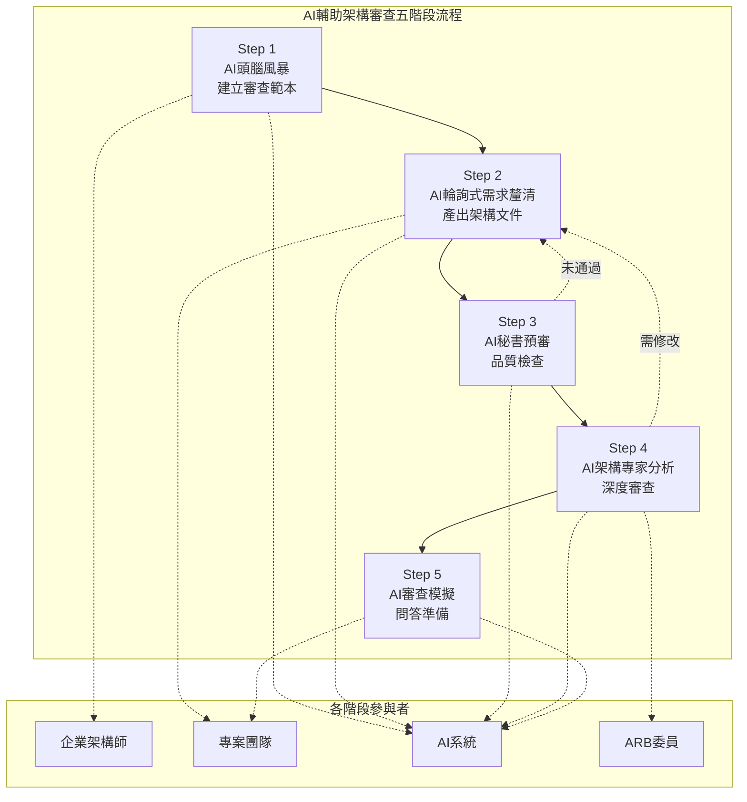
```mermaid
flowchart TB
    subgraph 五階段流程["AI輔助架構審查五階段流程"]
        direction TB
        
        S1[Step 1<br/>AI頭腦風暴<br/>建立審查範本]
        S2[Step 2<br/>AI輪詢式需求釐清<br/>產出架構文件]
        S3[Step 3<br/>AI秘書預審<br/>品質檢查]
        S4[Step 4<br/>AI架構專家分析<br/>深度審查]
        S5[Step 5<br/>AI審查模擬<br/>問答準備]
        
        S1 --> S2 --> S3 --> S4 --> S5
        
        S3 -.->|未通過| S2
        S4 -.->|需修改| S2
    end
    
    subgraph 參與者["各階段參與者"]
        P1[企業架構師]
        P2[專案團隊]
        P3[AI系統]
        P4[ARB委員]
    end
    
    S1 -.-> P1 & P3
    S2 -.-> P2 & P3
    S3 -.-> P3
    S4 -.-> P4 & P3
    S5 -.-> P2 & P3
```

## 4.2 Step 1: AI頭腦風暴 - 詳細流程

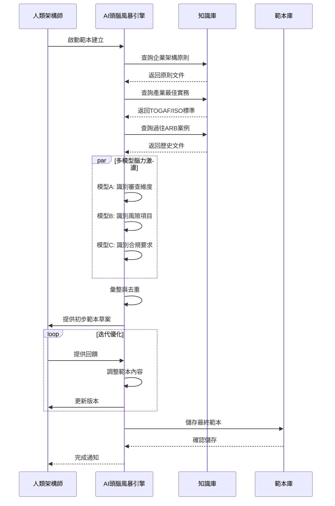
```mermaid
sequenceDiagram
    participant 人類架構師
    participant AI_Brain as AI頭腦風暴引擎
    participant 知識庫
    participant 範本庫
    
    人類架構師->>AI_Brain: 啟動範本建立
    AI_Brain->>知識庫: 查詢企業架構原則
    知識庫-->>AI_Brain: 返回原則文件
    
    AI_Brain->>知識庫: 查詢產業最佳實務
    知識庫-->>AI_Brain: 返回TOGAF/ISO標準
    
    AI_Brain->>知識庫: 查詢過往ARB案例
    知識庫-->>AI_Brain: 返回歷史文件
    
    par 多模型腦力激盪
        AI_Brain->>AI_Brain: 模型A: 識別審查維度
        AI_Brain->>AI_Brain: 模型B: 識別風險項目
        AI_Brain->>AI_Brain: 模型C: 識別合規要求
    end
    
    AI_Brain->>AI_Brain: 彙整與去重
    AI_Brain->>人類架構師: 提供初步範本草案
    
    loop 迭代優化
        人類架構師->>AI_Brain: 提供回饋
        AI_Brain->>AI_Brain: 調整範本內容
        AI_Brain->>人類架構師: 更新版本
    end
    
    AI_Brain->>範本庫: 儲存最終範本
    範本庫-->>AI_Brain: 確認儲存
    AI_Brain-->>人類架構師: 完成通知
```

### Step 1 輸出範本結構

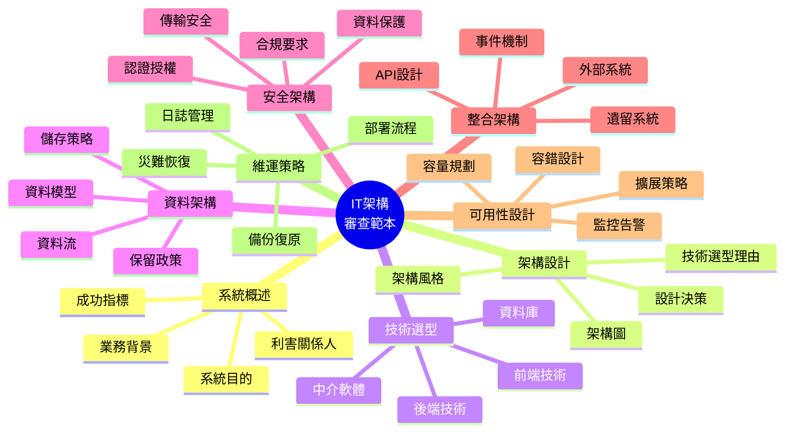
```mermaid
mindmap
  root((IT架構<br/>審查範本))
    系統概述
      業務背景
      系統目的
      利害關係人
      成功指標
    架構設計
      架構圖
      設計決策
      技術選型理由
      架構風格
    技術選型
      前端技術
      後端技術
      資料庫
      中介軟體
    資料架構
      資料模型
      資料流
      儲存策略
      保留政策
    安全架構
      認證授權
      資料保護
      傳輸安全
      合規要求
    整合架構
      API設計
      事件機制
      外部系統
      遺留系統
    可用性設計
      容量規劃
      擴展策略
      容錯設計
      監控告警
    維運策略
      部署流程
      日誌管理
      備份復原
      災難恢復
```

## 4.3 Step 2: AI輪詢式需求釐清 - 互動流程

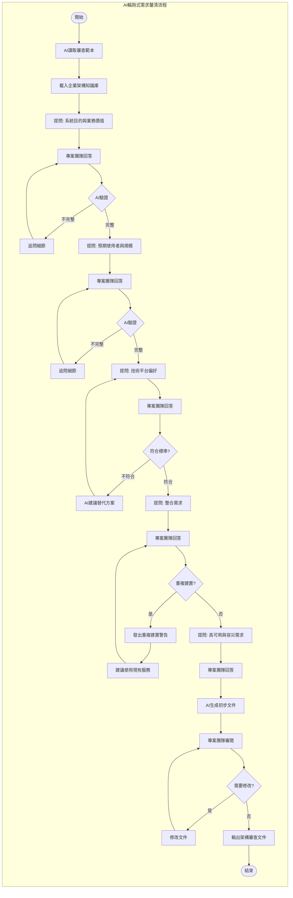
```mermaid
flowchart TB
    subgraph 需求釐清流程["AI輪詢式需求釐清流程"]
        direction TB
        
        Start([開始]) --> Init[AI讀取審查範本]
        Init --> LoadKB[載入企業架構知識庫]
        
        LoadKB --> Q1[提問: 系統目的與業務價值]
        Q1 --> A1[專案團隊回答]
        A1 --> V1{AI驗證}
        V1 -->|不完整| Q1_1[追問細節]
        Q1_1 --> A1
        V1 -->|完整| Q2
        
        Q2[提問: 預期使用者與規模]
        Q2 --> A2[專案團隊回答]
        A2 --> V2{AI驗證}
        V2 -->|不完整| Q2_1[追問細節]
        Q2_1 --> A2
        V2 -->|完整| Q3
        
        Q3[提問: 技術平台偏好]
        Q3 --> A3[專案團隊回答]
        A3 --> CheckStd{符合標準?}
        CheckStd -->|不符合| Suggest[AI建議替代方案]
        Suggest --> Q3
        CheckStd -->|符合| Q4
        
        Q4[提問: 整合需求]
        Q4 --> A4[專案團隊回答]
        A4 --> CheckDup{重複建置?}
        CheckDup -->|是| Warn[發出重複建置警告]
        Warn --> Q4_1[建議使用現有服務]
        Q4_1 --> A4
        CheckDup -->|否| Q5
        
        Q5[提問: 高可用與容災需求]
        Q5 --> A5[專案團隊回答]
        A5 --> GenDoc[AI生成初步文件]
        
        GenDoc --> Review[專案團隊審閱]
        Review --> Revise{需要修改?}
        Revise -->|是| ReviseDoc[修改文件]
        ReviseDoc --> Review
        Revise -->|否| Final[輸出架構審查文件]
        
        Final --> End([結束])
    end
```

### 互動問答範例

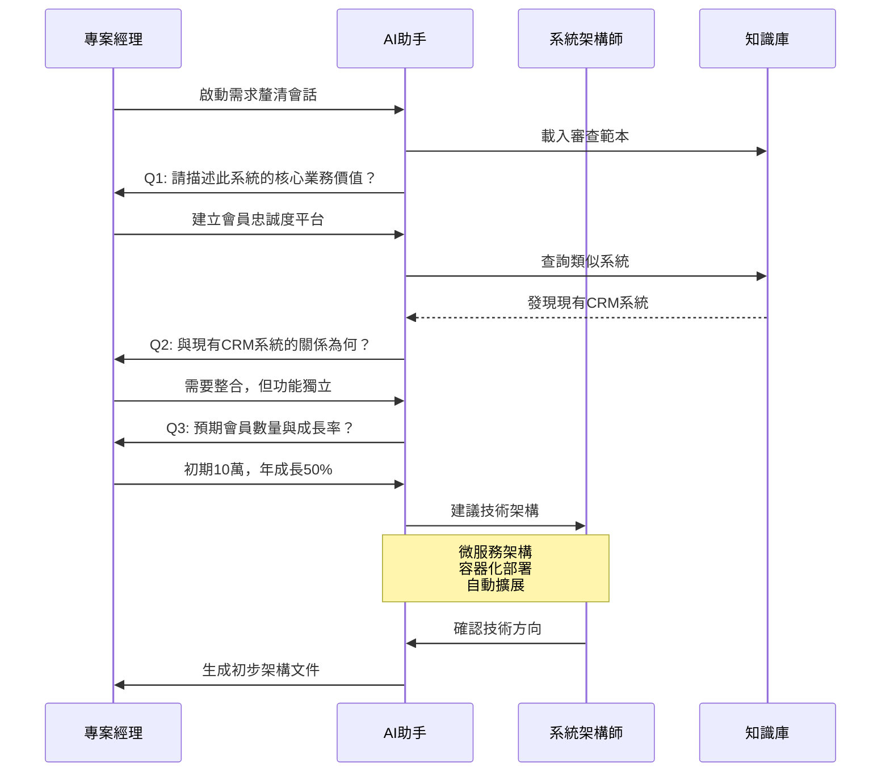
```mermaid
sequenceDiagram
    participant 專案經理
    participant AI助手
    participant 系統架構師
    participant 知識庫
    
    專案經理->>AI助手: 啟動需求釐清會話
    AI助手->>知識庫: 載入審查範本
    
    AI助手->>專案經理: Q1: 請描述此系統的核心業務價值？
    專案經理->>AI助手: 建立會員忠誠度平台
    
    AI助手->>知識庫: 查詢類似系統
    知識庫-->>AI助手: 發現現有CRM系統
    
    AI助手->>專案經理: Q2: 與現有CRM系統的關係為何？
    專案經理->>AI助手: 需要整合，但功能獨立
    
    AI助手->>專案經理: Q3: 預期會員數量與成長率？
    專案經理->>AI助手: 初期10萬，年成長50%
    
    AI助手->>系統架構師: 建議技術架構
    Note over AI助手,系統架構師: 微服務架構<br/>容器化部署<br/>自動擴展
    
    系統架構師->>AI助手: 確認技術方向
    AI助手->>專案經理: 生成初步架構文件
```

## 4.4 Step 3: AI秘書預審 - 檢查機制

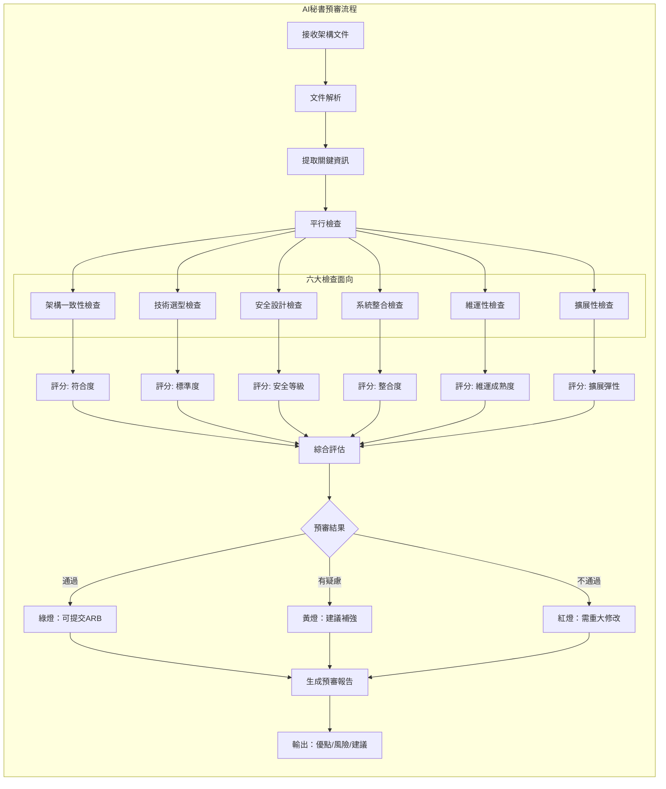
```mermaid
flowchart TB
    subgraph 預審流程["AI秘書預審流程"]
        direction TB
        
        Input[接收架構文件] --> Parse[文件解析]
        Parse --> Extract[提取關鍵資訊]
        
        Extract --> ParallelCheck[平行檢查]
        
        subgraph 檢查項目["六大檢查面向"]
            direction TB
            
            Check1[架構一致性檢查]
            Check2[技術選型檢查]
            Check3[安全設計檢查]
            Check4[系統整合檢查]
            Check5[維運性檢查]
            Check6[擴展性檢查]
        end
        
        ParallelCheck --> Check1 & Check2 & Check3 & Check4 & Check5 & Check6
        
        Check1 --> Score1[評分: 符合度]
        Check2 --> Score2[評分: 標準度]
        Check3 --> Score3[評分: 安全等級]
        Check4 --> Score4[評分: 整合度]
        Check5 --> Score5[評分: 維運成熟度]
        Check6 --> Score6[評分: 擴展彈性]
        
        Score1 & Score2 & Score3 & Score4 & Score5 & Score6 --> Aggregate[綜合評估]
        
        Aggregate --> Decision{預審結果}
        Decision -->|通過| Pass[綠燈：可提交ARB]
        Decision -->|有疑慮| Warning[黃燈：建議補強]
        Decision -->|不通過| Fail[紅燈：需重大修改]
        
        Pass --> Report[生成預審報告]
        Warning --> Report
        Fail --> Report
        
        Report --> Output[輸出：優點/風險/建議]
    end
```

### 檢查項目詳細內容

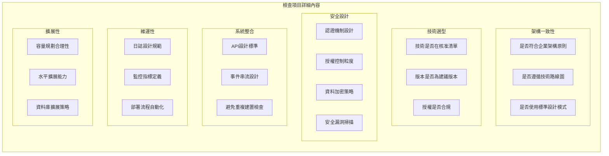
```mermaid
flowchart LR
    subgraph 檢查詳情["檢查項目詳細內容"]
        direction TB
        
        subgraph C1["架構一致性"]
            C1_1[是否符合企業架構原則]
            C1_2[是否遵循技術路線圖]
            C1_3[是否使用標準設計模式]
        end
        
        subgraph C2["技術選型"]
            C2_1[技術是否在核准清單]
            C2_2[版本是否為建議版本]
            C2_3[授權是否合規]
        end
        
        subgraph C3["安全設計"]
            C3_1[認證機制設計]
            C3_2[授權控制粒度]
            C3_3[資料加密策略]
            C3_4[安全漏洞掃描]
        end
        
        subgraph C4["系統整合"]
            C4_1[API設計標準]
            C4_2[事件串流設計]
            C4_3[避免重複建置檢查]
        end
        
        subgraph C5["維運性"]
            C5_1[日誌設計規範]
            C5_2[監控指標定義]
            C5_3[部署流程自動化]
        end
        
        subgraph C6["擴展性"]
            C6_1[容量規劃合理性]
            C6_2[水平擴展能力]
            C6_3[資料庫擴展策略]
        end
    end
```

## 4.5 Step 4: AI架構專家分析 - 多角色模擬

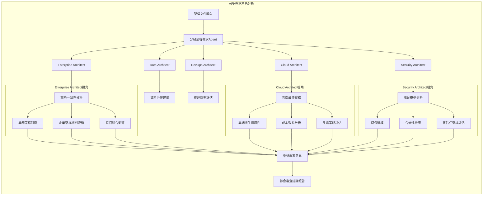
```mermaid
flowchart TB
    subgraph 專家分析["AI多專家角色分析"]
        direction TB
        
        Input[架構文件輸入] --> Distribute[分發至各專家Agent]
        
        Distribute --> EA[Enterprise Architect]
        Distribute --> CA[Cloud Architect]
        Distribute --> SA[Security Architect]
        Distribute --> DA[Data Architect]
        Distribute --> DevOps[DevOps Architect]
        
        EA --> EA_Out[策略一致性分析]
        CA --> CA_Out[雲端最佳實務]
        SA --> SA_Out[威脅模型分析]
        DA --> DA_Out[資料治理建議]
        DevOps --> DevOps_Out[維運效率評估]
        
        subgraph EA分析["Enterprise Architect視角"]
            EA_Out --> EA_1[業務策略對齊]
            EA_Out --> EA_2[企業架構原則遵循]
            EA_Out --> EA_3[投資組合影響]
        end
        
        subgraph CA分析["Cloud Architect視角"]
            CA_Out --> CA_1[雲端原生適用性]
            CA_Out --> CA_2[成本效益分析]
            CA_Out --> CA_3[多雲策略評估]
        end
        
        subgraph SA分析["Security Architect視角"]
            SA_Out --> SA_1[威脅建模]
            SA_Out --> SA_2[合規性檢查]
            SA_Out --> SA_3[零信任架構評估]
        end
        
        EA_1 & EA_2 & EA_3 & CA_1 & CA_2 & CA_3 & SA_1 & SA_2 & SA_3 --> Consolidate[彙整專家意見]
        Consolidate --> FinalReport[綜合審查建議報告]
    end
```

### 專家意見彙整範例

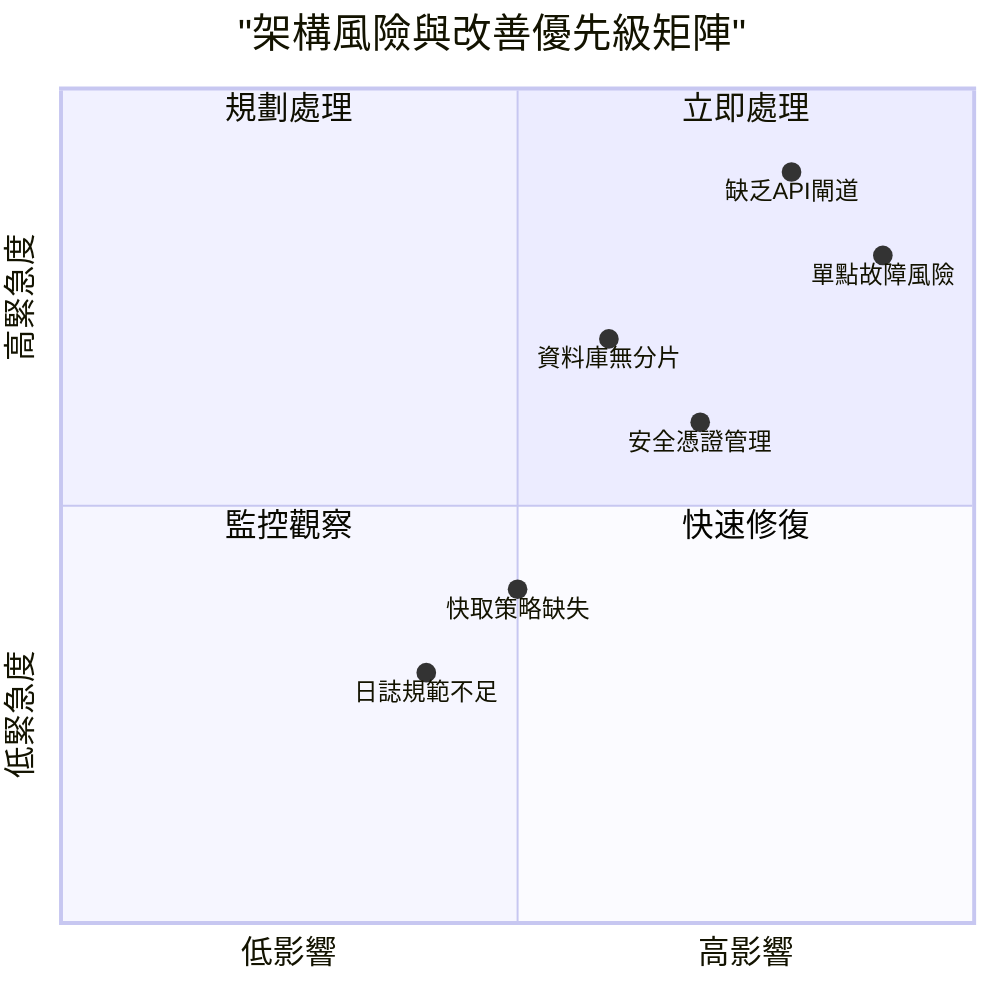
```mermaid
quadrantChart
    title "架構風險與改善優先級矩陣"
    x-axis "低影響" --> "高影響"
    y-axis "低緊急度" --> "高緊急度"
    
    quadrant-1 "立即處理"
    quadrant-2 "規劃處理"
    quadrant-3 "監控觀察"
    quadrant-4 "快速修復"
    
    "缺乏API閘道": [0.8, 0.9]
    "單點故障風險": [0.9, 0.8]
    "資料庫無分片": [0.6, 0.7]
    "日誌規範不足": [0.4, 0.3]
    "快取策略缺失": [0.5, 0.4]
    "安全憑證管理": [0.7, 0.6]
```

## 4.6 Step 5: AI審查模擬 - 問答準備

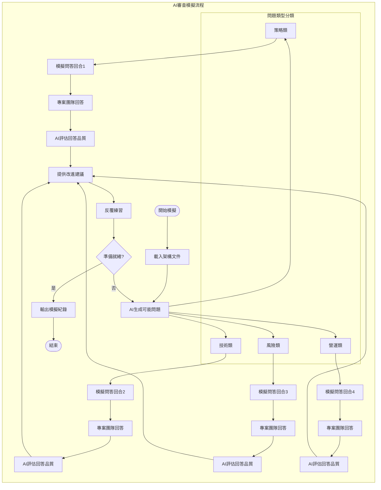
```mermaid
flowchart TB
    subgraph 模擬審查["AI審查模擬流程"]
        direction TB
        
        Start([開始模擬]) --> Load[載入架構文件]
        Load --> GenQ[AI生成可能問題]
        
        subgraph 問題類型["問題類型分類"]
            Q1[策略類]
            Q2[技術類]
            Q3[風險類]
            Q4[營運類]
        end
        
        GenQ --> Q1 & Q2 & Q3 & Q4
        
        Q1 --> Sim1[模擬問答回合1]
        Q2 --> Sim2[模擬問答回合2]
        Q3 --> Sim3[模擬問答回合3]
        Q4 --> Sim4[模擬問答回合4]
        
        Sim1 --> Team1[專案團隊回答]
        Sim2 --> Team2[專案團隊回答]
        Sim3 --> Team3[專案團隊回答]
        Sim4 --> Team4[專案團隊回答]
        
        Team1 --> Eval1[AI評估回答品質]
        Team2 --> Eval2[AI評估回答品質]
        Team3 --> Eval3[AI評估回答品質]
        Team4 --> Eval4[AI評估回答品質]
        
        Eval1 & Eval2 & Eval3 & Eval4 --> Feedback[提供改進建議]
        Feedback --> Practice[反覆練習]
        Practice --> Ready{準備就緒?}
        Ready -->|否| GenQ
        Ready -->|是| FinalPrep[輸出模擬紀錄]
        FinalPrep --> End([結束])
    end
```

### 模擬問答範例

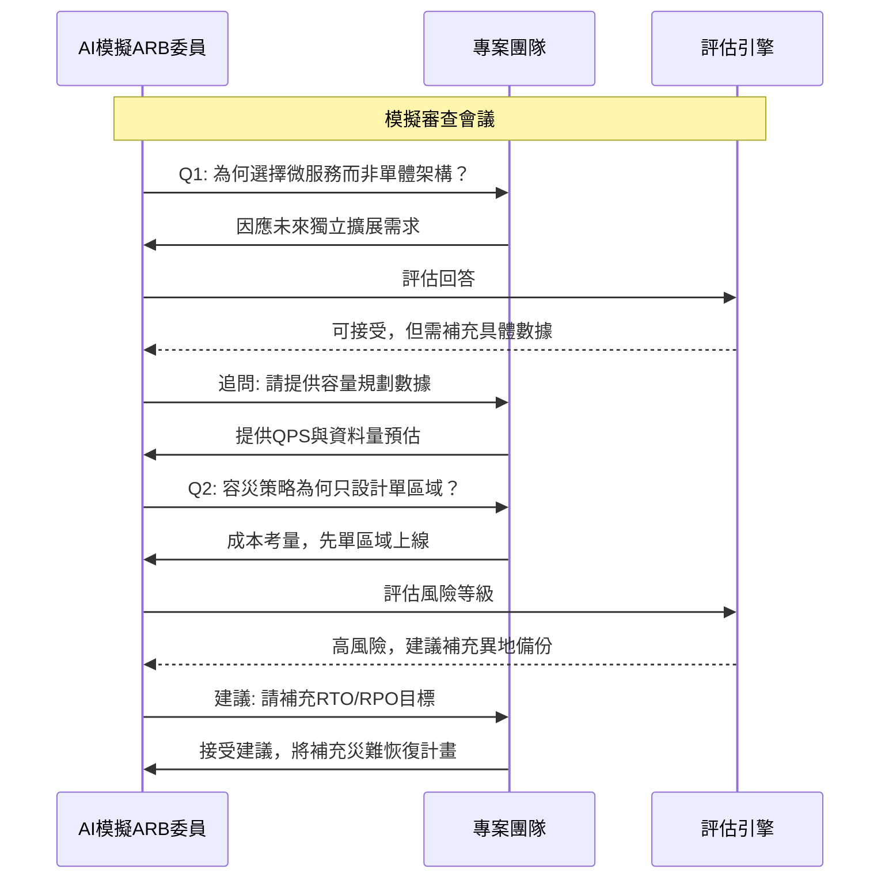
```mermaid
sequenceDiagram
    participant AI_ARB as AI模擬ARB委員
    participant 專案團隊
    participant 評估引擎
    
    Note over AI_ARB,評估引擎: 模擬審查會議
    
    AI_ARB->>專案團隊: Q1: 為何選擇微服務而非單體架構？
    專案團隊->>AI_ARB: 因應未來獨立擴展需求
    AI_ARB->>評估引擎: 評估回答
    評估引擎-->>AI_ARB: 可接受，但需補充具體數據
    
    AI_ARB->>專案團隊: 追問: 請提供容量規劃數據
    專案團隊->>AI_ARB: 提供QPS與資料量預估
    
    AI_ARB->>專案團隊: Q2: 容災策略為何只設計單區域？
    專案團隊->>AI_ARB: 成本考量，先單區域上線
    AI_ARB->>評估引擎: 評估風險等級
    評估引擎-->>AI_ARB: 高風險，建議補充異地備份
    
    AI_ARB->>專案團隊: 建議: 請補充RTO/RPO目標
    專案團隊->>AI_ARB: 接受建議，將補充災難恢復計畫
```

---

# 五、AI系統架構

## 5.1 系統架構圖

```mermaid
flowchart TB
    subgraph 使用者層["使用者層"]
        U1[專案團隊]
        U2[ARB委員]
        U3[企業架構師]
        U4[管理階層]
    end
    
    subgraph 應用層["AI應用層"]
        APP1[網頁介面]
        APP2[API閘道]
        APP3[聊天機器人]
        APP4[文件上傳]
    end
    
    subgraph 服務層["AI服務層"]
        S1[Agent協調器]
        S2[對話管理]
        S3[文件處理]
        S4[報告生成]
    end
    
    subgraph AI引擎層["AI引擎層"]
        AI1[LLM核心]
        AI2[RAG檢索]
        AI3[意圖識別]
        AI4[內容生成]
    end
    
    subgraph 數據層["數據層"]
        D1[(向量資料庫)]
        D2[(文件資料庫)]
        D3[(關聯資料庫)]
        D4[物件儲存]
    end
    
    subgraph 外部整合["外部整合"]
        E1[企業SSO]
        E2[版本控制系統]
        E3[CI/CD管道]
        E4[監控系統]
    end
    
    U1 & U2 & U3 & U4 --> APP1 & APP2 & APP3 & APP4
    APP1 & APP2 & APP3 & APP4 --> S1 & S2 & S3 & S4
    S1 & S2 & S3 & S4 --> AI1 & AI2 & AI3 & AI4
    AI1 & AI2 & AI3 & AI4 --> D1 & D2 & D3 & D4
    S1 & S2 --> E1
    S3 --> E2
    S4 --> E3
    AI1 --> E4
```

## 5.2 LLM + RAG 架構詳細設計

```mermaid
flowchart TB
    subgraph RAG架構["RAG檢索增強生成架構"]
        direction TB
        
        Query[使用者查詢] --> Preprocess[查詢預處理]
        Preprocess --> Embedding[查詢向量化]
        
        Embedding --> VectorSearch[向量相似度搜尋]
        VectorSearch --> Retrieve[檢索相關文件]
        
        subgraph 知識庫索引["知識庫索引"]
            KB1[架構原則文件]
            KB2[技術標準手冊]
            KB3[歷史ARB案例]
            KB4[設計模式庫]
            KB5[安全規範]
        end
        
        KB1 & KB2 & KB3 & KB4 & KB5 --> VectorDB[(向量資料庫<br/>Chroma/Pinecone)]
        VectorDB --> VectorSearch
        
        Retrieve --> Rerank[重排序相關性]
        Rerank --> ContextBuild[建構上下文]
        
        ContextBuild --> PromptEng[提示工程]
        PromptEng --> LLM[大型語言模型]
        
        LLM --> Postprocess[後處理]
        Postprocess --> Output[生成回答]
        
        Output --> Feedback[回饋收集]
        Feedback -->|強化學習| LLM
    end
```

## 5.3 AI Agent 協作架構

```mermaid
flowchart TB
    subgraph Agent系統["多Agent協作系統"]
        direction TB
        
        Orchestrator[Agent協調器<br/>Central Orchestrator]
        
        Orchestrator --> Agent1[設計顧問Agent]
        Orchestrator --> Agent2[文件助手Agent]
        Orchestrator --> Agent3[審查秘書Agent]
        Orchestrator --> Agent4[專家顧問Agent]
        Orchestrator --> Agent5[模擬審查Agent]
        
        subgraph Agent1詳情["設計顧問Agent"]
            A1_1[技能: 架構模式識別]
            A1_2[工具: 架構圖生成]
            A1_3[知識: 設計原則]
        end
        
        subgraph Agent2詳情["文件助手Agent"]
            A2_1[技能: 文件結構化]
            A2_2[工具: 模板套用]
            A2_3[知識: 寫作規範]
        end
        
        subgraph Agent3詳情["審查秘書Agent"]
            A3_1[技能: 合規檢查]
            A3_2[工具: 規則引擎]
            A3_3[知識: 檢查清單]
        end
        
        subgraph Agent4詳情["專家顧問Agent"]
            A4_1[技能: 深度分析]
            A4_2[工具: 風險評估]
            A4_3[知識: 領域專業]
        end
        
        subgraph Agent5詳情["模擬審查Agent"]
            A5_1[技能: 問答生成]
            A5_2[工具: 情境模擬]
            A5_3[知識: 審查經驗]
        end
        
        Agent1 --> A1_1 & A1_2 & A1_3
        Agent2 --> A2_1 & A2_2 & A2_3
        Agent3 --> A3_1 & A3_2 & A3_3
        Agent4 --> A4_1 & A4_2 & A4_3
        Agent5 --> A5_1 & A5_2 & A5_3
        
        Agent1 <--> Agent4
        Agent2 <--> Agent3
        Agent3 <--> Agent5
    end
```

## 5.4 企業架構知識庫結構

```mermaid
mindmap
  root((企業架構<br/>知識庫))
    架構原則
      業務原則
        客戶優先
        敏捷響應
      技術原則
        雲端優先
        API優先
        開放標準
      資料原則
        資料即資產
        隱私保護
    技術標準
      前端標準
        React/Vue
        TypeScript
        設計系統
      後端標準
        Java/Spring
        Node.js
        Python
      資料標準
        PostgreSQL
        MongoDB
        Redis
      雲端標準
        AWS服務
        容器化
        IaC
    設計模式
      微服務模式
        服務發現
        斷路器
        事件溯源
      整合模式
        API閘道
        訊息佇列
        資料同步
      安全模式
        OAuth2/OIDC
        mTLS
        金鑰管理
    歷史案例
      成功案例
        電商平台重構
        核心系統上雲
      失敗教訓
        單體遷移失敗
        資料庫效能問題
      決策記錄
        ADR-001
        ADR-002
    安全規範
      認證授權
      資料加密
      漏洞管理
      合規要求
        ISO27001
        GDPR
        PCI-DSS
```

---

# 六、預期效益

## 6.1 效益實現路徑

```mermaid
flowchart TB
    subgraph 效益實現["預期效益實現路徑"]
        direction TB
        
        E1[導入AI輔助機制]
        
        E1 --> E2[效率提升]
        E1 --> E3[品質提升]
        E1 --> E4[知識累積]
        E1 --> E5[能力建設]
        
        subgraph 效率["效率效益"]
            E2 --> E2_1[審查時間減少50%]
            E2 --> E2_2[會議次數減少40%]
            E2 --> E2_3[文件準備時間減少60%]
        end
        
        subgraph 品質["品質效益"]
            E3 --> E3_1[文件合格率提升至90%]
            E3 --> E3_2[設計缺陷早期發現率80%]
            E3 --> E3_3[返工成本降低70%]
        end
        
        subgraph 知識["知識效益"]
            E4 --> E4_1[架構決策100%記錄]
            E4 --> E4_2[知識查詢效率提升5倍]
            E4 --> E4_3[新進人員上手時間縮短50%]
        end
        
        subgraph 能力["能力效益"]
            E5 --> E5_1[團隊架構設計能力提升]
            E5 --> E5_2[自主遵循標準比率提升]
            E5 --> E5_3[跨團隊協作效率提升]
        end
        
        E2_1 & E2_2 & E2_3 --> ROI[投資回報率: 300%+]
        E3_1 & E3_2 & E3_3 --> ROI
        E4_1 & E4_2 & E4_3 --> ROI
        E5_1 & E5_2 & E5_3 --> ROI
    end
```

## 6.2 效益量化指標

```mermaid
xychart-beta
    title "預期效益量化指標 (導入後12個月)"
    x-axis [ "審查效率", "文件品質", "知識傳承", "團隊滿意度", "成本節省" ]
    y-axis "改善百分比" 0 --> 100
    bar [ 50, 40, 60, 35, 45 ]
    line [ 50, 40, 60, 35, 45 ]
```

---

# 七、導入建議

## 7.1 三階段導入路線圖

```mermaid
gantt
    title AI輔助ARB導入路線圖 (18個月)
    dateFormat YYYY-MM-DD
    axisFormat %Y-%m
    
    section Phase 1: 基礎建設
    架構標準整理       :a1, 2024-01-01, 60d
    知識庫建立         :a2, after a1, 45d
    範本文件設計       :a3, after a2, 30d
    系統環境建置       :a4, 2024-01-15, 90d
    
    section Phase 2: AI輔助上線
    AI需求釐清上線     :b1, after a3, 30d
    AI文件生成上線     :b2, after b1, 30d
    AI預審功能上線     :b3, after b2, 30d
    試點專案驗證       :b4, after b3, 60d
    
    section Phase 3: 全面推廣
    AI專家分析上線     :c1, after b4, 30d
    AI模擬審查上線     :c2, after c1, 30d
    全面推廣教育訓練   :c3, after c2, 45d
    成效評估與優化     :c4, after c3, 60d
    
    section 里程碑
    Phase 1完成        :milestone, m1, after a4, 0d
    Phase 2完成        :milestone, m2, after b4, 0d
    全面上線           :milestone, m3, after c4, 0d
```

## 7.2 各階段詳細活動

```mermaid
flowchart TB
    subgraph Phase1["Phase 1: 架構知識庫建立"]
        P1_1[現況評估]
        P1_2[標準文件收集]
        P1_3[知識萃取]
        P1_4[知識庫建置]
        P1_5[範本設計]
        
        P1_1 --> P1_2 --> P1_3 --> P1_4 --> P1_5
        
        P1_1 -.->|產出| O1_1[現況分析報告]
        P1_3 -.->|產出| O1_2[知識架構圖]
        P1_5 -.->|產出| O1_3[標準審查範本]
    end
    
    subgraph Phase2["Phase 2: AI輔助文件產生"]
        P2_1[AI模型選型]
        P2_2[提示工程設計]
        P2_3[RAG系統建置]
        P2_4[對話流程設計]
        P2_5[試點測試]
        
        P2_1 --> P2_2 --> P2_3 --> P2_4 --> P2_5
        
        P2_1 -.->|產出| O2_1[LLM評估報告]
        P2_3 -.->|產出| O2_2[檢索系統]
        P2_5 -.->|產出| O2_3[試點回饋報告]
    end
    
    subgraph Phase3["Phase 3: AI架構審查輔助"]
        P3_1[專家Agent開發]
        P3_2[審查規則引擎]
        P3_3[模擬系統建置]
        P3_4[整合測試]
        P3_5[全面上線]
        
        P3_1 --> P3_2 --> P3_3 --> P3_4 --> P3_5
        
        P3_1 -.->|產出| O3_1[多Agent系統]
        P3_3 -.->|產出| O3_2[模擬審查平台]
        P3_5 -.->|產出| O3_3[上線評估報告]
    end
    
    Phase1 --> Phase2 --> Phase3
```

## 7.3 組織與治理架構

```mermaid
flowchart TB
    subgraph 治理架構["AI輔助ARB治理架構"]
        direction TB
        
        Sponsor[專案贊助人<br/>CIO/CTO]
        
        Sponsor --> PM[專案經理]
        
        PM --> WG1[技術工作組]
        PM --> WG2[流程工作組]
        PM --> WG3[變革管理組]
        
        subgraph 技術組["技術工作組職責"]
            T1[AI系統開發]
            T2[知識庫建置]
            T3[整合實作]
        end
        
        subgraph 流程組["流程工作組職責"]
            P1[流程重新設計]
            P2[範本制定]
            P3[品質標準]
        end
        
        subgraph 變革組["變革管理組職責"]
            C1[教育訓練]
            C2[溝通計畫]
            C3[採用推動]
        end
        
        WG1 --> T1 & T2 & T3
        WG2 --> P1 & P2 & P3
        WG3 --> C1 & C2 & C3
        
        Sponsor --> Steering[指導委員會]
        Steering --> PM
    end
```

---

# 八、風險與因應（新增章節）

## 8.1 風險識別與因應策略

```mermaid
flowchart TB
    subgraph 風險管理["風險識別與因應"]
        direction TB
        
        Risk1[風險1: AI建議品質不穩定]
        Risk2[風險2: 資料隱私與安全]
        Risk3[風險3: 使用者接受度低]
        Risk4[風險4: 知識庫維護成本]
        Risk5[風險5: 與現有流程衝突]
        
        Risk1 --> M1[因應: 人機協作設計<br/>AI建議需人工確認]
        Risk2 --> M2[因應: 資料脫敏<br/>本地部署選項]
        Risk3 --> M3[因應: 漸進導入<br/>早期成功案例]
        Risk4 --> M4[因應: 自動化更新機制<br/>社群貢獻模式]
        Risk5 --> M5[因應: 流程彈性設計<br/>過渡期安排]
        
        subgraph 風險等級["風險影響矩陣"]
            direction LR
            L[低] --> M[中] --> H[高]
            Risk1 -.-> M
            Risk2 -.-> H
            Risk3 -.-> M
            Risk4 -.-> L
            Risk5 -.-> M
        end
    end
```

## 8.2 風險監控儀表板概念

```mermaid
flowchart LR
    subgraph 監控儀表板["AI輔助ARB風險監控儀表板"]
        direction TB
        
        M1[AI建議準確率監控]
        M2[使用者採用率追蹤]
        M3[知識庫健康度檢查]
        M4[系統效能監控]
        M5[安全稽核日誌]
        
        M1 --> Alert1{< 85%?}
        M2 --> Alert2{< 70%?}
        M3 --> Alert3{過期項目>20%?}
        M4 --> Alert4{延遲>3秒?}
        M5 --> Alert5{異常存取?}
        
        Alert1 -->|是| Action1[觸發模型調優]
        Alert2 -->|是| Action2[啟動推廣活動]
        Alert3 -->|是| Action3[排程更新]
        Alert4 -->|是| Action4[效能優化]
        Alert5 -->|是| Action5[安全通報]
    end
```

---

# 九、結論

## 9.1 價值主張總結

```mermaid
mindmap
  root((AI輔助<br/>ARB價值主張))
    對組織
      降低技術風險
      提升投資報酬
      加速數位轉型
      強化治理合規
    對ARB委員
      減少重複性工作
      聚焦高價值決策
      數據驅動審查
      知識有效傳承
    對專案團隊
      明確設計指引
      即時品質回饋
      縮短準備時間
      提升設計能力
    對企業架構師
      標準化治理流程
      可衡量的成熟度
      知識資產累積
      策略影響力提升
```

## 9.2 下一步行動

```mermaid
flowchart TB
    subgraph 下一步["建議下一步行動"]
        direction TB
        
        Start([開始]) --> A[成立專案籌備小組]
        A --> B[進行現況評估]
        B --> C[制定詳細實施計畫]
        C --> D[爭取預算與資源]
        D --> E[啟動Phase 1]
        
        E --> F[3個月後檢視點]
        F -->|達標| G[進入Phase 2]
        F -->|調整| H[優化調整]
        H --> E
        
        G --> I[6個月後全面評估]
        I --> J[持續優化與擴展]
        J --> End([持續營運])
        
        style A fill:#e1f5fe
        style E fill:#fff3e0
        style G fill:#e8f5e9
    end
```

---

## 附錄：Mermaid 圖表語法參考

本文件使用以下 Mermaid 圖表類型：

1. **flowchart** - 流程圖、系統架構圖
2. **sequenceDiagram** - 序列圖、互動流程
3. **gantt** - 甘特圖、時間規劃
4. **mindmap** - 心智圖、知識結構
5. **pie** - 圓餅圖、比例分析
6. **quadrantChart** - 矩陣圖、風險評估
7. **xychart-beta** - 長條圖/折線圖、量化指標

所有圖表均可直接在支援 Mermaid 的平台上（如 GitHub、Notion、Obsidian、Mermaid Live Editor）渲染使用。

---

*文件版本: 2.0*
*更新日期: 2024年*
*作者: AI輔助架構審查專案團隊*
