# AI輔助 IT架構審查機制建置提案（增強版）
## AI-Assisted Architecture Review Board

---

## 一、提案背景（補充）

### 1.1 現況痛點深度分析

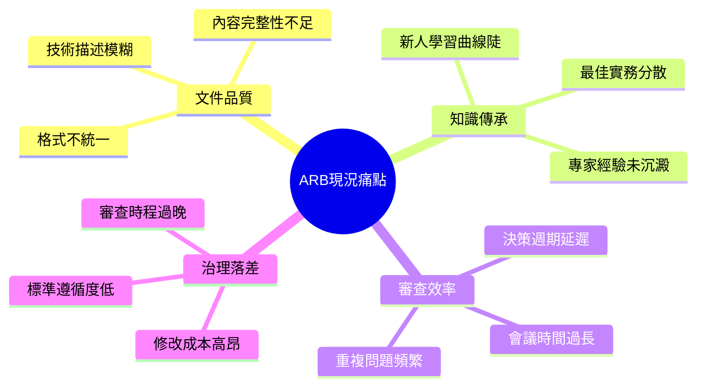

### 1.2 行業對標分析

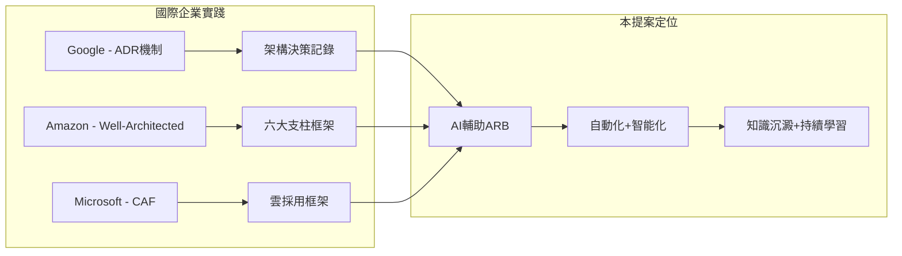

---

## 二、提案目標（修訂與量化）

### 2.1 SMART目標設定

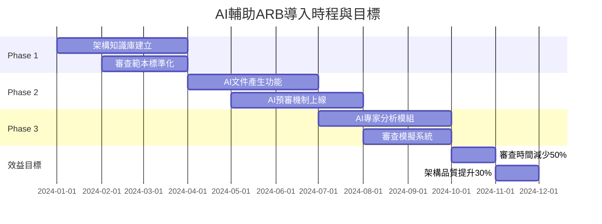

### 2.2 關鍵績效指標(KPI)

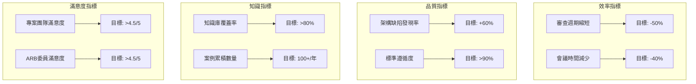

---

## 三、解決方案概念（增強）

### 3.1 整體系統架構圖

```mermaid
flowchart TB
    subgraph 使用者層
        U1[專案團隊]
        U2[ARB委員]
        U3[企業架構師]
        U4[系統管理員]
    end
    
    subgraph AI應用層
        A1[AI頭腦風暴模組]
        A2[AI需求釐清助手]
        A3[AI預審秘書]
        A4[AI架構專家]
        A5[AI審查模擬]
    end
    
    subgraph AI Agent層
        AG1[任務規劃Agent]
        AG2[文件處理Agent]
        AG3[知識檢索Agent]
        AG4[質量評估Agent]
    end
    
    subgraph 核心引擎層
        L1[LLM引擎]
        L2[RAG檢索引擎]
        L3[規則引擎]
        L4[工作流引擎]
    end
    
    subgraph 知識庫層
        KB1[企業架構原則]
        KB2[技術標準規範]
        KB3[過往ARB案例]
        KB4[產業最佳實務]
        KB5[安全合規要求]
    end
    
    U1 & U2 & U3 & U4 --> "AI應用層"
    "AI應用層" --> "AI Agent層"
    "AI Agent層" --> "核心引擎層"
    "核心引擎層" --> "知識庫層"
```

### 3.2 AI角色職能矩陣

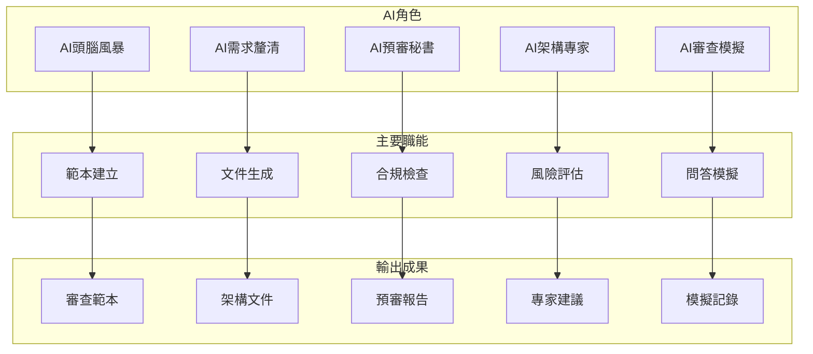

---

## 四、AI輔助架構審查流程（詳細化）

### 4.1 完整流程時序圖

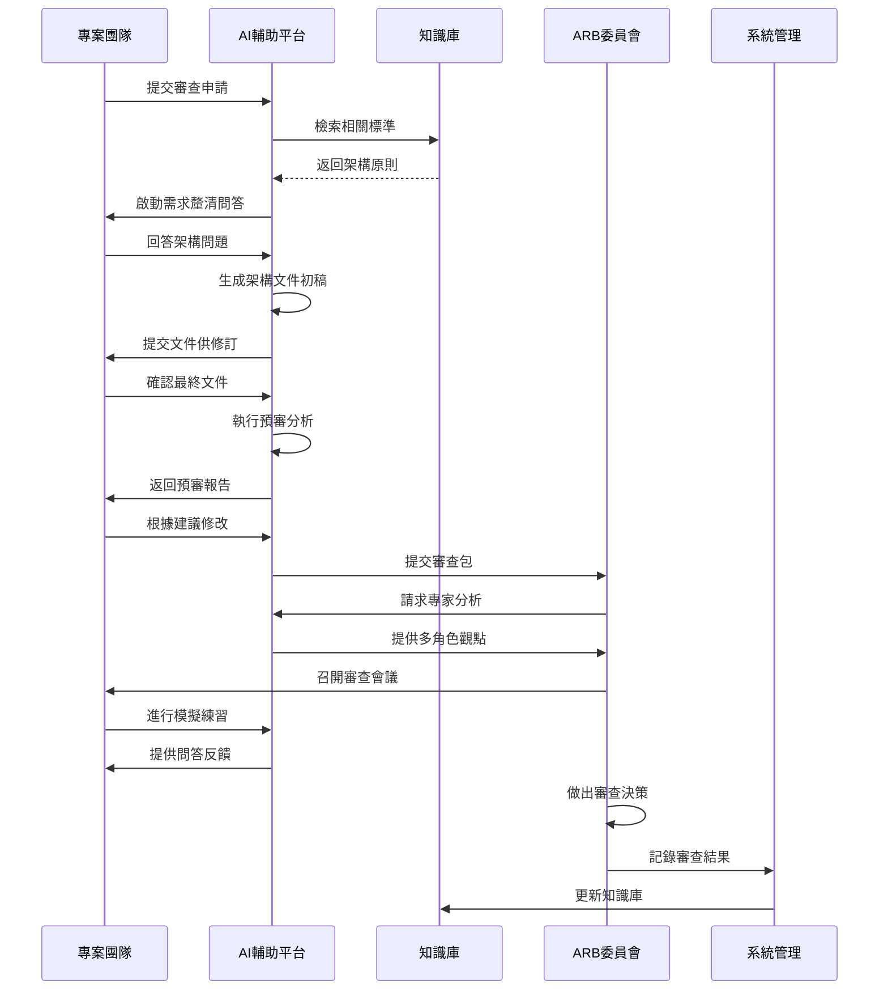

### 4.2 五階段流程詳細圖

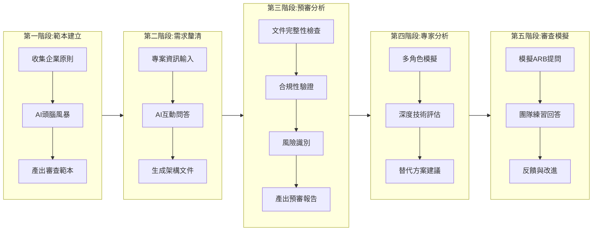

### 4.3 各階段輸入輸出矩陣

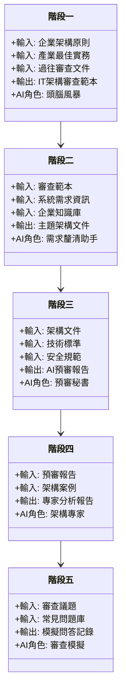

---

## 五、AI系統架構（技術深化）

### 5.1 技術堆疊架構

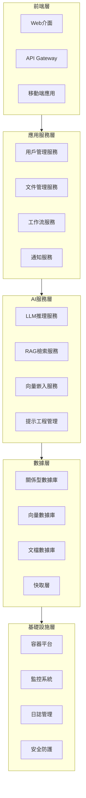

### 5.2 RAG架構詳細設計

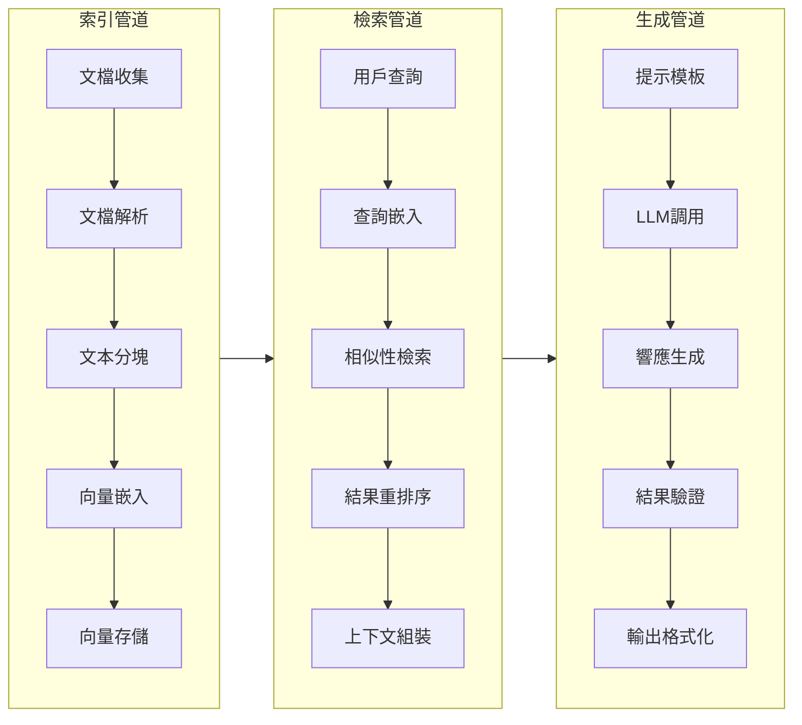

### 5.3 知識庫分類體系

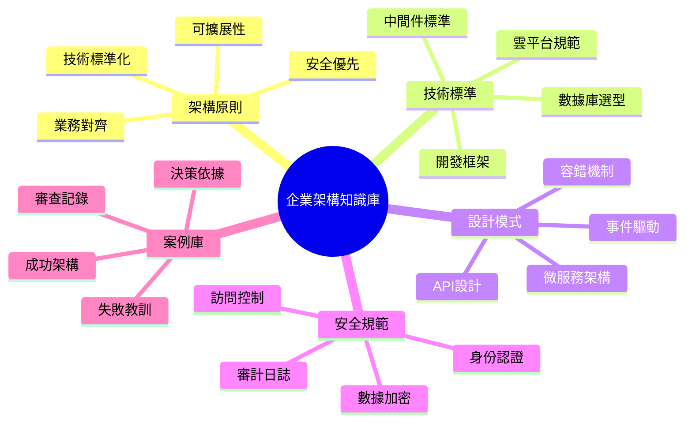

---

## 六、風險評估與應對策略

### 6.1 風險矩陣圖

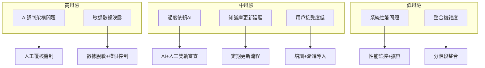

### 6.2 風險應對策略時序

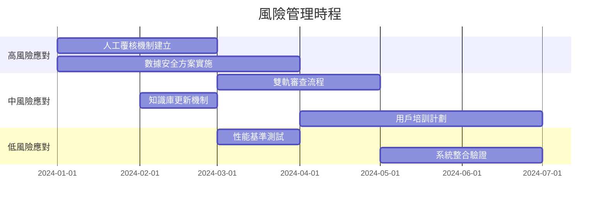

---

## 七、成本效益分析

### 7.1 投資成本結構

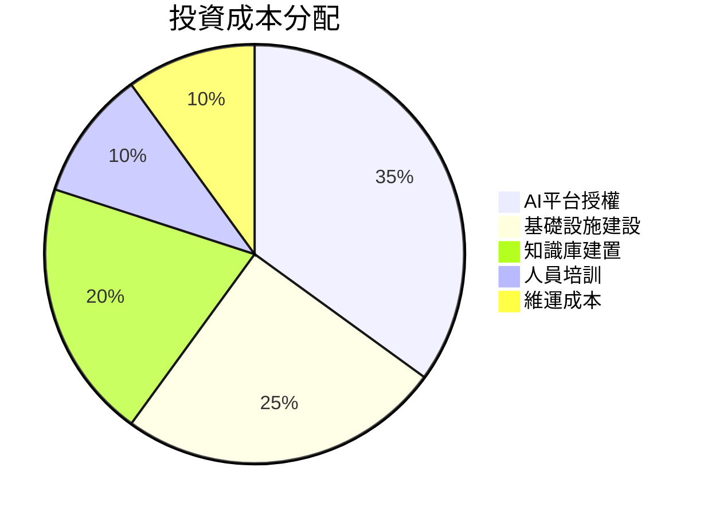

### 7.2 效益回報分析

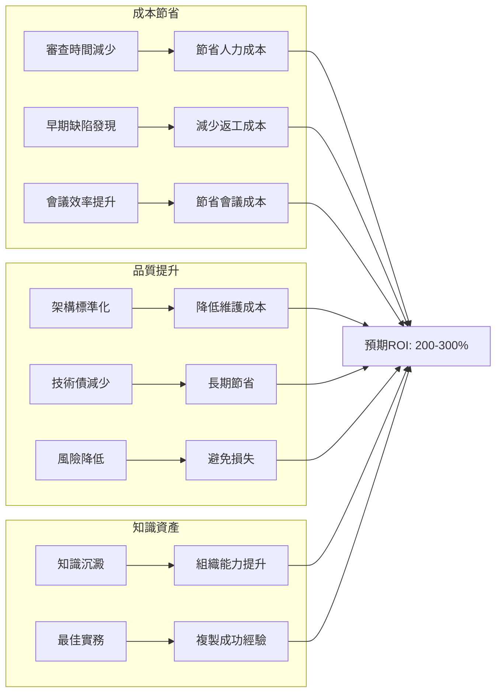

### 7.3 三年效益預測

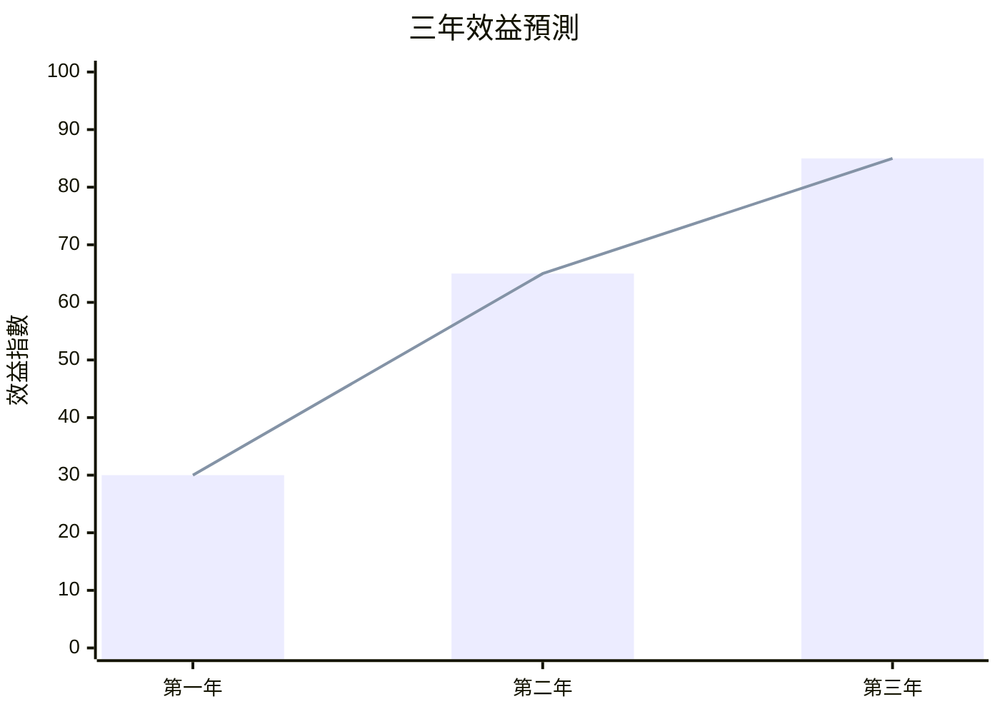

---

## 八、關鍵成功因素(CSF)

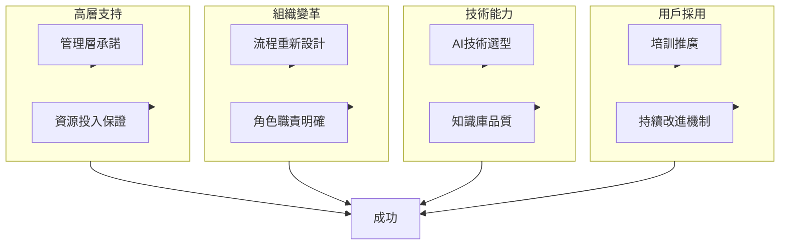

---

## 九、導入實施計劃（詳細化）

### 9.1 三階段導入路線圖

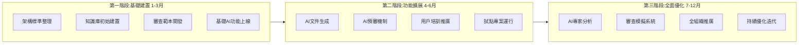

### 9.2 詳細工作分解結構(WBS)

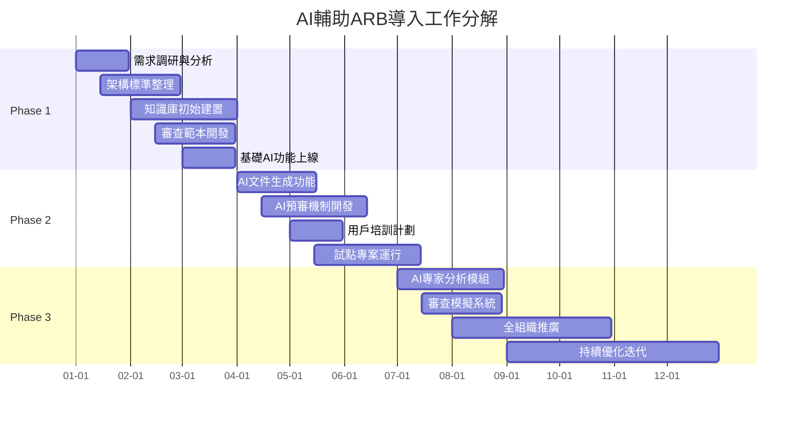

### 9.3 里程碑計劃

```mermaid
flowchart TB
    M1[📍 M1: 知識庫建置完成] --> M2[📍 M2: 範本上線]
    M2 --> M3[📍 M3: AI預審啟用]
    M3 --> M4[📍 M4: 試點成功]
    M4 --> M5[📍 M5: 全面推廣]
    M5 --> M6[📍 M6: 效益達成]
    
    style M1 fill:#e1f5fe
    style M2 fill:#e1f5fe
    style M3 fill:#fff3e0
    style M4 fill:#fff3e0
    style M5 fill:#e8f5e9
    style M6 fill:#e8f5e9
```

---

## 十、組織變革管理

### 10.1 利益相關者分析

```mermaid
quadrantChart
    title 利益相關者影響-支持度分析
    x-axis "低支持度" --> "高支持度"
    y-axis "低影響力" --> "高影響力"
    quadrant-1 "重點管理"
    quadrant-2 "密切參與"
    quadrant-3 "持續關注"
    quadrant-4 "保持滿意"
    "ARB委員": [0.8, 0.9]
    "專案團隊": [0.6, 0.7]
    "高層管理": [0.7, 0.95]
    "IT運維": [0.5, 0.6]
    "外部顧問": [0.4, 0.5]
```

### 10.2 變革溝通計劃

```mermaid
flowchart TB
    subgraph 溝通對象
        G1[高層管理]
        G2[ARB委員]
        G3[專案團隊]
        G4[IT運維]
    end
    
    subgraph 溝通內容
        C1[戰略價值]
        C2[操作指南]
        C3[使用培訓]
        C4[技術支援]
    end
    
    subgraph 溝通方式
        W1[定期匯報]
        W2[工作坊]
        W3[線上培訓]
        W4[幫助文件]
    end
    
    G1 --> C1 --> W1
    G2 --> C2 --> W2
    G3 --> C3 --> W3
    G4 --> C4 --> W4
```

---

## 十一、持續改進機制

### 11.1 PDCA循環

```mermaid
flowchart LR
    P[Plan<br/>計劃] --> D[Do<br/>執行]
    D --> C[Check<br/>檢查]
    C --> A[Act<br/>改進]
    A --> P
    
    subgraph 具體活動
        P1[設定改進目標]
        D1[實施改進措施]
        C1[收集反饋數據]
        A1[優化系統功能]
    end
    
    P --> P1
    D --> D1
    C --> C1
    A --> A1
```

### 11.2 反饋收集機制

```mermaid
sequenceDiagram
    participant 用戶 as 系統用戶
    participant 平台 as AI輔助平台
    participant 分析 as 數據分析
    participant 優化 as 系統優化
    
    用戶->>平台: 使用系統功能
    用戶->>平台: 提交反饋意見
    平台->>分析: 匯總使用數據
    分析->>分析: 識別改進點
    分析->>優化: 生成優化建議
    優化->>平台: 實施系統改進
    平台->>用戶: 通知更新內容
```

---

## 十二、結論與建議

### 12.1 核心價值主張

```mermaid
flowchart TB
    subgraph 短期價值
        SV1[審查效率提升50%]
        SV2[文件品質一致性]
        SV3[早期風險發現]
    end
    
    subgraph 中期價值
        MV1[架構標準化推進]
        MV2[知識資產沉澱]
        MV3[團隊能力提升]
    end
    
    subgraph 長期價值
        LV1[組織架構成熟度]
        LV2[技術債有效控制]
        LV3[數位轉型加速]
    end
    
    SV1 & SV2 & SV3 --> 短期價值
    MV1 & MV2 & MV3 --> 中期價值
    LV1 & LV2 & LV3 --> 長期價值
    
    短期價值 --> 中期價值 --> 長期價值
```

### 12.2 下一步行動建議

```mermaid
gantt
    title 下一步行動計劃
    dateFormat  YYYY-MM-DD
    section 立即行動
    成立專案小組       :2024-01-01, 7d
    確認預算資源       :2024-01-08, 14d
    section 短期行動
    供應商評估選型     :2024-01-15, 30d
    試點專案選定       :2024-02-01, 14d
    section 中期行動
    知識庫初始建置     :2024-02-15, 45d
    用戶培訓準備       :2024-03-01, 30d
```

---

## 附錄：Mermaid圖表類型參考

```mermaid
flowchart TB
    A[本提案使用之Mermaid圖表類型]
    A --> B1[flowchart 流程圖]
    A --> B2[sequence 時序圖]
    A --> B3[gantt 甘特圖]
    A --> B4[mindmap 思維導圖]
    A --> B5[class 類圖]
    A --> B6[pie 餅圖]
    A --> B7[quadrant 象限圖]
    A --> B8[xychart 折線圖]
```

---

## 總結

本增強版提案在原有基礎上進行了以下補充與優化：

| 補充項目 | 內容說明 |
|---------|---------|
| **量化目標** | 增加SMART目標與KPI指標 |
| **風險管理** | 完整風險評估與應對策略 |
| **成本效益** | 投資結構與ROI分析 |
| **實施計劃** | 詳細WBS與里程碑 |
| **變革管理** | 利益相關者與溝通計劃 |
| **持續改進** | PDCA循環與反饋機制 |
| **視覺化** | 15+種Mermaid圖表示例 |
