# Kafka 異步訊息通知平台架構設計文件

## 文件控制資訊

| 屬性 | 內容 |
|:---|:---|
| **文件編號** | IT-ARCH-KAFKA-2026-001 |
| **版本** | v1.0.0 |
| **生效日期** | 2026-02-27 |
| **審查週期** | 年度定期審查 / 重大變更觸發審查 |
| **機密等級** | 機密（Confidential）— 僅限授權人員查閱 |
| **文件擁有者** | 資訊架構管理單位 |
| **核准者** | 資訊長（CIO）/ 資訊安全長（CISO） |

### 版本修訂紀錄

| 版本 | 修訂日期 | 修訂內容摘要 | 修訂者 | 核准者 |
|:---|:---|:---|:---|:---|
| v1.0.0 | 2026-02-27 | 初版發布：Kafka 異步訊息通知平台架構設計 | [姓名] | [姓名] |

### 分發對象

- [ ] 資訊長（CIO）
- [ ] 資訊安全長（CISO）
- [ ] 資訊架構審查委員會（ITARC）
- [ ] 客戶資料管理系統負責人
- [ ] 各下游系統負責人（7 大系統）
- [ ] 維運處
- [ ] 內部稽核單位

---

## 第一章：執行摘要（Executive Summary）

### 1.1 專案背景與目的

客戶資料管理系統（Customer Data Management System, CDMS）係以 **.NET 8** 技術堆疊開發之前後端分離應用（**Blazor WebAssembly** + **.NET Web API**），負責全行客戶資料之新增、修改與維護作業。當客戶資料發生異動時，需即時通知行內 **7 大下游系統**（均以 REST API 介接），以維持各系統間客戶資料之一致性。

現行架構若採用同步直連方式，將面臨以下挑戰：

- **強耦合**：CDMS 需逐一呼叫 7 大系統 API，任一系統異常將影響整體流程
- **效能瓶頸**：同步等待所有系統回應，延長交易處理時間
- **例外處理複雜**：需個別處理每個系統的失敗、重試、逾時邏輯
- **蜘蛛網架構**：隨著通知對象增加，系統間直連關係呈幾何級數成長，維護困難

本專案導入 **Apache Kafka** 作為異步訊息通知中介層，搭配 **Kafka HTTP Connector** 將訊息轉發至各下游系統 REST API，實現系統解耦合、高可用、可擴展的訊息通知機制。

### 1.2 審查結論總覽

| 項目 | 內容 |
|:---|:---|
| **整體架構狀態** | [待審查] |
| **關鍵風險等級** | 中 |
| **審查範圍** | 客戶資料異動通知平台（Kafka 異步訊息架構） |
| **架構願景** | 以事件驅動架構實現客戶資料異動之解耦合通知，支撐全行客戶資料一致性 |

### 1.3 關鍵架構決策摘要

| 決策編號 | 決策項目 | 決策內容 | 主要理由 | 替代方案考慮 |
|:---|:---|:---|:---|:---|
| AD-001 | 訊息中介層技術選型 | Apache Kafka | 高吞吐、持久化、多消費者、事件溯源支援 | RabbitMQ（不適於大量扇出場景）|
| AD-002 | 下游系統介接方式 | Kafka HTTP Sink Connector | 各下游系統已具備 REST API，無需改造 | 自建 Consumer 程式（維護成本高）|
| AD-003 | 部署架構模式 | Active-Active 雙中心 + NLB | 符合現行雙中心架構規範，確保高可用 | 單中心 + 異地備援（不符現行標準）|
| AD-004 | 前後端分離技術 | Blazor WASM + .NET Web API | 統一 .NET 8 技術棧，共用模型與驗證邏輯 | React + .NET API（跨技術棧成本）|
| AD-005 | 訊息格式標準 | JSON + CloudEvents 規範 | 跨系統互通性、Schema 可演進 | Avro（學習成本較高）|
| AD-006 | 訊息可靠性策略 | At-Least-Once + 冪等性設計 | 確保訊息不遺失，下游以冪等處理重複 | Exactly-Once（Kafka 設定複雜度高）|

### 1.4 主要建議事項

1. **[高優先級]** 各下游系統 REST API 須實作冪等性設計，避免重複通知造成資料異常 — 負責單位：各系統開發組
2. **[高優先級]** 建立 Dead Letter Queue（DLQ）機制與告警通知，確保失敗訊息可追蹤 — 負責單位：平台維運組
3. **[中優先級]** 制定 Kafka Topic 命名規範與 Schema 演進策略 — 負責單位：架構組
4. **[中優先級]** 雙中心 Kafka 叢集間資料同步策略須經壓力測試驗證 — 負責單位：基礎設施組

---

## 第二章：審查範圍與目的

### 2.1 審查目的

本文件針對「**客戶資料異動 Kafka 異步訊息通知平台**」進行架構設計審查，確保：

1. **系統解耦合**：CDMS 與 7 大下游系統透過 Kafka 實現鬆散耦合，避免蜘蛛網式直連
2. **高可用性**：依循 Active-Active 雙中心架構，NLB 負載平衡，確保服務不中斷
3. **訊息可靠性**：確保客戶資料異動通知不遺失、不重複（At-Least-Once + 冪等性）
4. **監理合規性**：符合金管會「銀行資訊系統安全及防護基準」相關要求
5. **可擴展性**：未來新增通知對象時，僅需配置 Connector，無需修改 CDMS 程式碼

### 2.2 適用範圍

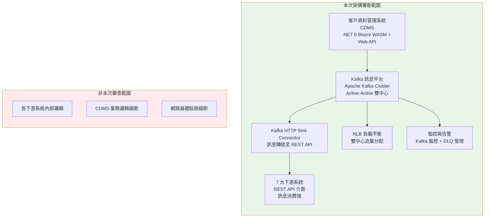

### 2.3 法規與標準對照

| 法規/標準 | 適用條文 | 對應審查章節 | 關鍵控制點 |
|:---|:---|:---|:---|
| **金管會「銀行資訊系統安全及防護基準」** | 第5條（系統發展安全）、第8條（存取控制） | 第七章、第九章 | 雙中心營運、日誌留存、存取控制 |
| **個人資料保護法** | 第27條（安全維護措施） | 第七章 | 訊息加密、資料最小化、傳輸安全 |
| **ISO 27001:2022** | A.8（技術安全控制） | 全文件 | 訊息傳輸加密、存取控制、稽核日誌 |
| **ISO 22301:2019** | 營運持續管理 | 第八章 | BCP、RTO/RPO、雙中心演練 |

---

## 第三章：架構願景與業務目標

### 3.1 現況問題分析（As-Is）

#### 蜘蛛網式直連架構問題

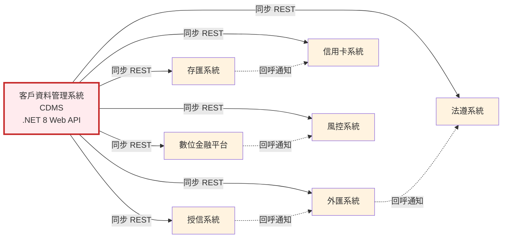

#### 現行問題清單

| 問題編號 | 問題描述 | 影響範圍 | 嚴重度 |
|:---|:---|:---|:---:|
| P-001 | CDMS 同步呼叫 7 個系統，總回應時間為各系統回應時間之和（最差情況 >10 秒） | 使用者體驗、交易效能 | 🟠 |
| P-002 | 任一下游系統異常導致 CDMS 交易失敗或逾時 | 業務連續性 | 🔴 |
| P-003 | 各系統間直連關係呈蜘蛛網狀，新增通知對象需修改 CDMS 程式碼 | 系統維護性 | 🟠 |
| P-004 | 缺乏統一的重試、補償與例外處理機制 | 資料一致性 | 🔴 |
| P-005 | 無法追蹤訊息送達狀態，資料不一致難以排查 | 稽核追蹤 | 🟡 |
| P-006 | 各系統獨立輪詢或回呼通知，架構混亂 | 架構治理 | 🟠 |

### 3.2 目標架構願景（To-Be）

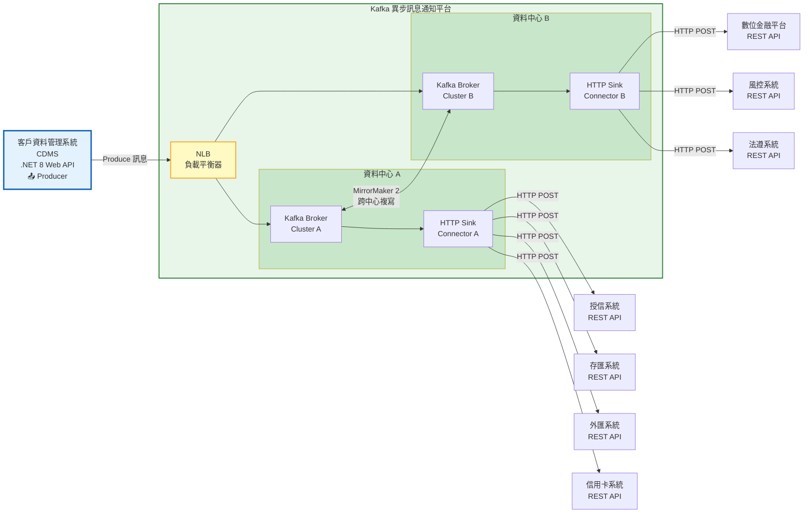

### 3.3 目標能力矩陣

| 領域 | 目標指標 | 現況 | 差距 | 優先級 |
|:---|:---|:---:|:---:|:---:|
| **解耦合（Decoupling）** | CDMS 與下游系統零直連 | 7 個直連 | 100% | 高 |
| **可用性（Availability）** | ≥ 99.95%（年度停機 < 4.38 小時） | 98.5%（受下游影響） | 1.45% | 高 |
| **通知延遲（Latency）** | 異動通知 ≤ 5 秒送達下游系統 | 最差 >10 秒 | >50% | 高 |
| **可擴展性（Scalability）** | 新增通知對象免改程式，僅需設定 Connector | 需修改 CDMS 程式碼 | 100% | 高 |
| **可追蹤性（Traceability）** | 100% 訊息可追蹤送達狀態 | 無追蹤機制 | 100% | 中 |
| **容錯能力（Fault Tolerance）** | 單一下游異常不影響其餘系統通知 | 連鎖失敗 | 100% | 高 |
| **復原力（Resilience）** | RTO ≤ 30 分鐘、RPO ≤ 0（訊息持久化） | 無獨立備援 | 100% | 高 |

---

## 第四章：4+1 架構視圖模型

### 4.1 邏輯視圖（Logical View）— 功能視角

#### 核心服務域與職責

| 服務域 | 職責範圍 | 技術實作 | 關鍵實體 |
|:---|:---|:---|:---|
| **客戶資料管理（CDMS）** | 客戶資料 CRUD、KYC、CDD | .NET 8 Web API | Customer, KYCRecord, ChangeEvent |
| **訊息生產服務（Producer）** | 將資料異動事件發布至 Kafka | .NET Kafka Client (Confluent) | CustomerChangeEvent, EventMetadata |
| **訊息路由服務（Kafka Broker）** | 訊息持久化、分區、複寫 | Apache Kafka 3.6+ | Topic, Partition, ConsumerGroup |
| **HTTP 轉發服務（Connector）** | 訊息轉為 HTTP POST 送至下游 | Kafka HTTP Sink Connector | ConnectorConfig, SinkRecord |
| **死信佇列管理（DLQ）** | 失敗訊息收集、告警、人工重送 | Kafka DLQ Topic + 管理介面 | DeadLetterRecord, RetryPolicy |
| **監控與告警（Monitoring）** | 訊息延遲、吞吐、錯誤監控 | Prometheus + Grafana | Metric, Alert, Dashboard |

#### 領域模型類別圖

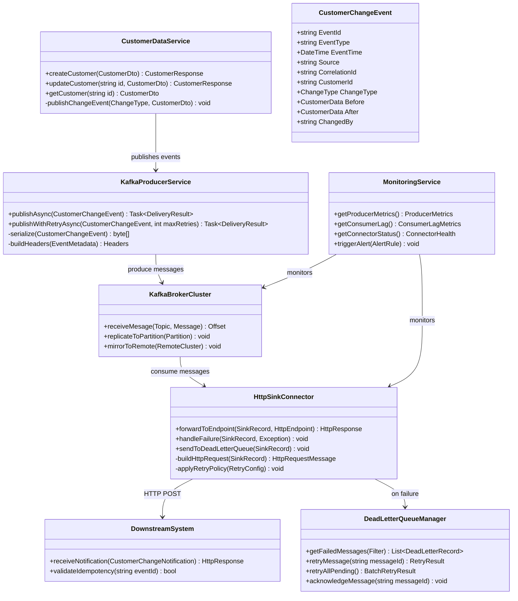

#### 7 大下游系統通知對照

| 系統編號 | 系統名稱 | 通知用途 | REST API Endpoint | HTTP Method | 關鍵性 | SLA |
|:---|:---|:---|:---|:---:|:---:|:---:|
| DS-001 | 授信系統 | 客戶信用資料同步、徵審支援 | `/api/v1/customers/sync` | POST | 高 | ≤ 3s |
| DS-002 | 存匯系統 | 帳戶持有人資料更新 | `/api/v1/customer-updates` | POST | 高 | ≤ 3s |
| DS-003 | 外匯系統 | 外匯客戶身分/AML 資料更新 | `/api/v1/fx-customers/notify` | POST | 高 | ≤ 5s |
| DS-004 | 信用卡系統 | 持卡人資料同步 | `/api/v1/cardholder/update` | POST | 中 | ≤ 5s |
| DS-005 | 數位金融平台 | 網銀/行銀客戶 Profile 更新 | `/api/v1/digital/customer-events` | POST | 高 | ≤ 3s |
| DS-006 | 風控系統 | 客戶風險特徵更新 | `/api/v1/risk/customer-change` | POST | 高 | ≤ 2s |
| DS-007 | 法遵系統 | KYC/CDD/AML 合規資料同步 | `/api/v1/compliance/kyc-update` | POST | 高 | ≤ 5s |

### 4.2 開發視圖（Development View）— 實作視角

#### 技術堆疊

| 層級 | 技術選型 | 版本 | 用途 | 生命週期狀態 |
|:---|:---|:---|:---|:---:|
| **前端展示層** | Blazor WebAssembly | .NET 8 LTS | 客戶資料管理 SPA | 生產級 |
| **後端 API 層** | ASP.NET Core Web API | .NET 8 LTS | 客戶資料 CRUD + 事件發布 | 生產級 |
| **Kafka Client** | Confluent.Kafka (.NET) | 2.3+ | Producer 客戶端 | 生產級 |
| **訊息中介層** | Apache Kafka | 3.6+ | 訊息 Broker 叢集 | 生產級 |
| **Connector 框架** | Kafka Connect | 3.6+ (含 HTTP Sink Connector) | 訊息轉發至 REST API | 生產級 |
| **跨中心複寫** | MirrorMaker 2 | 3.6+ | Active-Active 資料同步 | 生產級 |
| **負載平衡** | NLB (Network Load Balancer) | — | 雙中心流量分配 | 生產級 |
| **容器平台** | Docker / Kubernetes | K8s 1.28+ | Connector / 監控服務部署 | 生產級 |
| **監控** | Prometheus + Grafana | 最新 LTS | Kafka 叢集與 Connector 監控 | 生產級 |
| **日誌管理** | ELK Stack (Elasticsearch + Logstash + Kibana) | 8.x | 集中式日誌管理 | 生產級 |
| **API 文件** | Swagger / OpenAPI 3.0 | — | CDMS API 文件 | 生產級 |
| **ORM** | Entity Framework Core | 8.x | 資料存取層 | 生產級 |
| **資料庫** | SQL Server / PostgreSQL | 2022 / 15+ | CDMS 客戶資料儲存 | 生產級 |

#### .NET 8 專案結構

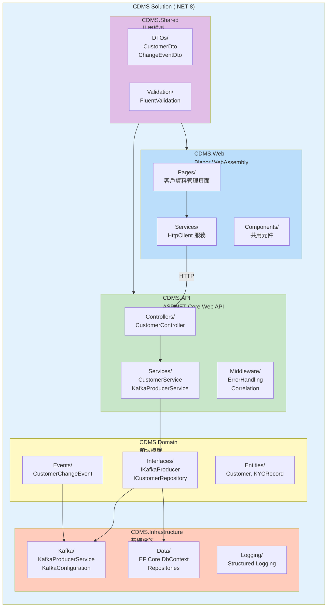

#### Producer 程式碼架構（.NET 8）

```csharp
// CDMS.Domain/Events/CustomerChangeEvent.cs
public record CustomerChangeEvent
{
    public string EventId { get; init; } = Guid.NewGuid().ToString();
    public string EventType { get; init; } = "customer.changed";
    public DateTime EventTime { get; init; } = DateTime.UtcNow;
    public string Source { get; init; } = "cdms";
    public string CorrelationId { get; init; }
    public string CustomerId { get; init; }
    public ChangeType ChangeType { get; init; }       // Created, Updated, Deleted
    public CustomerSnapshot? Before { get; init; }
    public CustomerSnapshot After { get; init; }
    public string ChangedBy { get; init; }
    public List<string> ChangedFields { get; init; } = [];
}

public enum ChangeType { Created, Updated, Deleted }
```

```csharp
// CDMS.Infrastructure/Kafka/KafkaProducerService.cs
public class KafkaProducerService : IKafkaProducer, IDisposable
{
    private readonly IProducer<string, string> _producer;
    private readonly ILogger<KafkaProducerService> _logger;
    private readonly KafkaOptions _options;

    public KafkaProducerService(
        IOptions<KafkaOptions> options,
        ILogger<KafkaProducerService> logger)
    {
        _options = options.Value;
        _logger = logger;

        var config = new ProducerConfig
        {
            BootstrapServers = _options.BootstrapServers,  // NLB endpoint
            Acks = Acks.All,                                // 確保寫入所有副本
            EnableIdempotence = true,                       // 冪等性 Producer
            MaxInFlight = 5,
            MessageSendMaxRetries = 3,
            RetryBackoffMs = 1000,
            LingerMs = 5,                                   // 批次延遲
            BatchSize = 16384,
            CompressionType = CompressionType.Lz4,
            SecurityProtocol = SecurityProtocol.SaslSsl,
            SaslMechanism = SaslMechanism.ScramSha256
        };

        _producer = new ProducerBuilder<string, string>(config)
            .SetErrorHandler((_, e) =>
                _logger.LogError("Kafka Producer Error: {Reason}", e.Reason))
            .Build();
    }

    public async Task<DeliveryResult<string, string>> PublishAsync(
        CustomerChangeEvent changeEvent,
        CancellationToken ct = default)
    {
        var message = new Message<string, string>
        {
            Key = changeEvent.CustomerId,       // 依客戶 ID 分區
            Value = JsonSerializer.Serialize(changeEvent),
            Headers = new Headers
            {
                { "ce-id", Encoding.UTF8.GetBytes(changeEvent.EventId) },
                { "ce-type", Encoding.UTF8.GetBytes(changeEvent.EventType) },
                { "ce-source", Encoding.UTF8.GetBytes(changeEvent.Source) },
                { "ce-time", Encoding.UTF8.GetBytes(changeEvent.EventTime.ToString("O")) },
                { "correlation-id", Encoding.UTF8.GetBytes(changeEvent.CorrelationId) }
            }
        };

        var result = await _producer.ProduceAsync(
            _options.CustomerChangeTopic, message, ct);

        _logger.LogInformation(
            "Published event {EventId} to {Topic}[{Partition}]@{Offset}",
            changeEvent.EventId,
            result.Topic,
            result.Partition.Value,
            result.Offset.Value);

        return result;
    }

    public void Dispose() => _producer?.Dispose();
}
```

```csharp
// CDMS.API/Services/CustomerService.cs
public class CustomerService : ICustomerService
{
    private readonly ICustomerRepository _repository;
    private readonly IKafkaProducer _kafkaProducer;
    private readonly ILogger<CustomerService> _logger;

    public async Task<CustomerResponse> UpdateCustomerAsync(
        string customerId,
        UpdateCustomerDto dto,
        string operatorId)
    {
        // 1. 取得更新前快照
        var before = await _repository.GetByIdAsync(customerId);

        // 2. 執行資料庫更新
        var after = await _repository.UpdateAsync(customerId, dto);

        // 3. 發布異動事件至 Kafka（非同步，不阻塞回應）
        var changeEvent = new CustomerChangeEvent
        {
            CorrelationId = Activity.Current?.Id ?? Guid.NewGuid().ToString(),
            CustomerId = customerId,
            ChangeType = ChangeType.Updated,
            Before = CustomerSnapshot.FromEntity(before),
            After = CustomerSnapshot.FromEntity(after),
            ChangedBy = operatorId,
            ChangedFields = DetectChangedFields(before, after)
        };

        // 使用 Background Channel 非同步發送，不影響 API 回應時間
        await _kafkaProducer.PublishAsync(changeEvent);

        _logger.LogInformation(
            "Customer {CustomerId} updated, change event {EventId} published",
            customerId, changeEvent.EventId);

        return CustomerResponse.FromEntity(after);
    }
}
```

#### CI/CD 流程

```mermaid
flowchart LR
    subgraph Dev["開發階段"]
        Code["程式碼提交<br/>Git Push"]
        PR["Pull Request<br/>Code Review"]
    end

    subgraph CI["持續整合 (CI)"]
        Build["dotnet build<br/>.NET 8 編譯"]
        Test["dotnet test<br/>單元測試 + 整合測試"]
        SAST["SonarQube<br/>靜態掃描"]
        Docker["Docker Build<br/>映像建置"]
        Scan["Trivy<br/>映像弱掃"]
    end

    subgraph CD["持續部署 (CD)"]
        SIT["SIT 環境<br/>整合測試"]
        UAT["UAT 環境<br/>使用者驗收"]
        Staging["Staging<br/>預生產驗證"]
        Prod["Production<br/>雙中心部署"]
    end

    Code --> PR --> Build --> Test --> SAST --> Docker --> Scan
    Scan --> SIT --> UAT --> Staging --> Prod

    style Dev fill:#e3f2fd
    style CI fill:#e8f5e9
    style CD fill:#fff3e0
```

### 4.3 物理視圖（Physical View）— 部署視角

#### Active-Active 雙中心部署架構

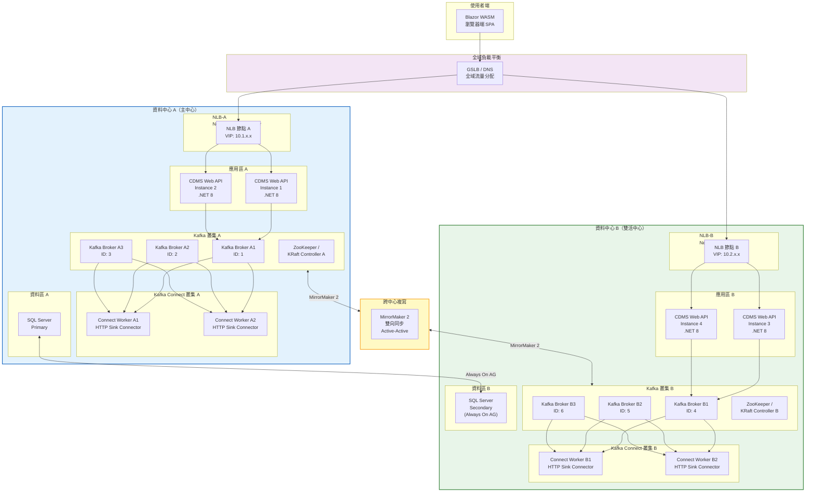

#### 硬體與資源配置

| 組件 | 資料中心 A | 資料中心 B | 規格（每台） | 備註 |
|:---|:---:|:---:|:---|:---|
| **NLB** | 1 台（HA Pair） | 1 台（HA Pair） | L4 負載平衡 | Active-Active 流量分配 |
| **CDMS Web API** | 2 台 | 2 台 | 4 vCPU / 8GB RAM / .NET 8 | 可依負載水平擴展 |
| **Kafka Broker** | 3 台 | 3 台 | 8 vCPU / 32GB RAM / 1TB SSD | Replication Factor = 3 |
| **Kafka Connect Worker** | 2 台 | 2 台 | 4 vCPU / 8GB RAM | HTTP Sink Connector |
| **MirrorMaker 2** | 1 台 | 1 台 | 4 vCPU / 8GB RAM | 雙向複寫 |
| **ZooKeeper / KRaft** | 3 台（Quorum） | 3 台（Quorum） | 2 vCPU / 4GB RAM | 建議升級 KRaft |
| **Prometheus + Grafana** | 1 台 | 1 台 | 4 vCPU / 16GB RAM | 監控告警 |
| **SQL Server** | 1 台 Primary | 1 台 Secondary | 依現行 CDMS 規格 | Always On AG |

#### 網路安全分區

| 區域 | 組件 | 安全等級 | 網路隔離 | 存取控制 |
|:---|:---|:---:|:---:|:---|
| **DMZ 區** | NLB、WAF | 高 | 物理隔離 | 僅開放 443、Kafka 9093 |
| **應用區** | CDMS Web API、Blazor Host | 高 | VLAN 隔離 | 僅允許 NLB 來源 IP |
| **訊息區** | Kafka Broker、Connect Worker | 極高 | VLAN 隔離 | SASL/SSL 認證、ACL |
| **資料區** | SQL Server、ZooKeeper | 極高 | 邏輯隔離 | 資料庫防火牆、加密連線 |
| **管理區** | Prometheus、Grafana、ELK | 高 | 獨立網段 | 堡壘機、MFA |

### 4.4 進程視圖（Process View）— 執行視角

#### 客戶資料異動通知完整流程序列圖

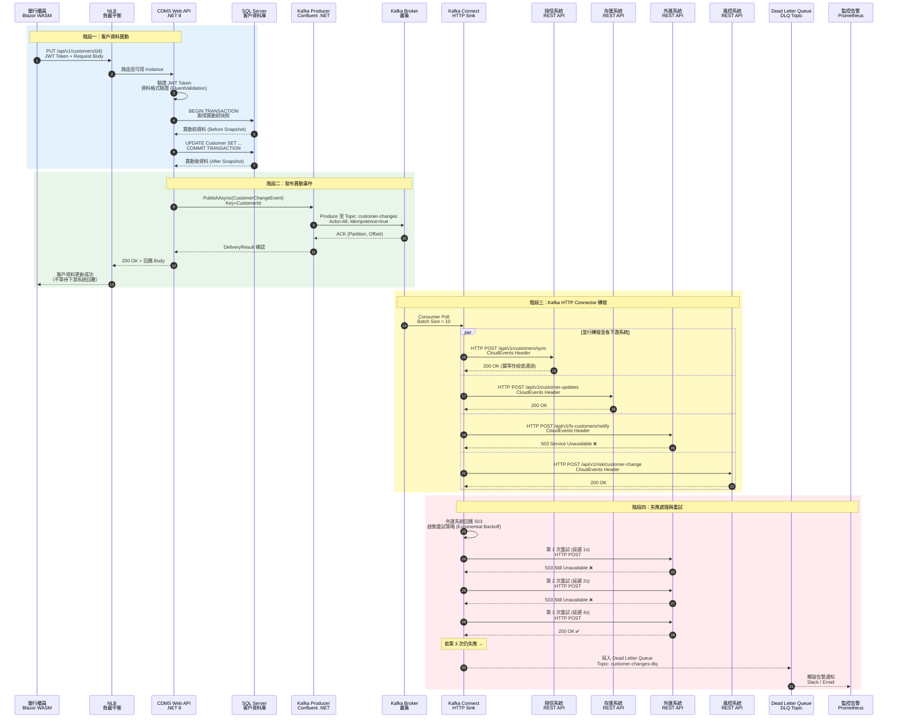

#### 事件驅動架構（Event-Driven Architecture）

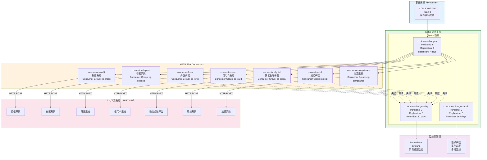

#### Kafka HTTP Sink Connector 配置範例

```json
{
  "name": "http-sink-connector-credit",
  "config": {
    "connector.class": "io.confluent.connect.http.HttpSinkConnector",
    "tasks.max": "2",
    "topics": "customer-changes",
    "http.api.url": "https://credit-system.internal/api/v1/customers/sync",
    "request.method": "POST",
    "headers": "Content-Type:application/json|X-Source:cdms-kafka",
    "request.body.format": "json",
    "batch.max.size": "1",
    "retry.on.status.codes": "408,429,500,502,503,504",
    "max.retries": "5",
    "retry.backoff.ms": "3000",
    "errors.tolerance": "all",
    "errors.deadletterqueue.topic.name": "customer-changes-dlq",
    "errors.deadletterqueue.topic.replication.factor": "3",
    "errors.deadletterqueue.context.headers.enable": "true",
    "errors.log.enable": "true",
    "errors.log.include.messages": "true",
    "behavior.on.null.values": "ignore",
    "auth.type": "OAUTH2",
    "oauth2.token.url": "https://auth.internal/oauth2/token",
    "oauth2.client.id": "${CONNECTOR_CLIENT_ID}",
    "oauth2.client.secret": "${CONNECTOR_CLIENT_SECRET}",
    "reporter.bootstrap.servers": "${KAFKA_BOOTSTRAP_SERVERS}",
    "reporter.result.topic.name": "connector-delivery-reports",
    "reporter.result.topic.replication.factor": "3",
    "ssl.endpoint.identification.algorithm": "https",
    "connection.timeout.ms": "5000",
    "read.timeout.ms": "10000"
  }
}
```

### 4.5 場景視圖（Scenario View）— 用例視角

| 場景編號 | 場景名稱 | 參與者 | 觸發條件 | 預期結果 | 非功能需求 |
|:---|:---|:---|:---|:---|:---|
| UC-001 | 新增客戶通知 | 櫃員 / CDMS | 新增客戶資料完成 | 7 大系統均收到 Created 事件 | 通知延遲 ≤ 5s、可用率 99.95% |
| UC-002 | 客戶資料變更通知 | 櫃員 / CDMS | 修改客戶基本資料 | 7 大系統均收到 Updated 事件含 Before/After | 通知延遲 ≤ 5s |
| UC-003 | 下游系統暫時不可用 | HTTP Connector | 目標系統回應 503 | 自動重試 → 最終成功或進入 DLQ | 重試 5 次、指數退避 |
| UC-004 | 重複訊息處理 | 下游系統 | 同一 EventId 被重複送達 | 下游系統冪等處理，不重複執行 | 冪等性設計 |
| UC-005 | 單一中心故障 | 維運團隊 | 資料中心 A 完全離線 | 流量自動切至中心 B，通知不中斷 | RTO ≤ 30min、RPO = 0 |
| UC-006 | DLQ 訊息重送 | 維運人員 | DLQ 有積壓訊息 | 人工審查後批次重送至原 Topic | 可視化管理介面 |
| UC-007 | 新增通知對象 | 架構師 | 第 8 個系統需要客戶異動通知 | 僅新增 Connector 設定，不修改 CDMS | 零程式碼變更 |
| UC-008 | 大量客戶批次異動 | 批次程序 | 批次更新 10,000 筆客戶 | Kafka 正常消化，各系統依序接收 | 吞吐 ≥ 1,000 msg/s |

---

## 第五章：應用架構審查

### 5.1 應用系統組合盤點

| 系統編號 | 系統名稱 | 技術平台 | 角色 | 關鍵性 | 維護狀態 |
|:---|:---|:---|:---:|:---:|:---:|
| APP-001 | 客戶資料管理系統 (CDMS) | .NET 8 (Blazor WASM + Web API) | **Producer** | 關鍵 | 持續開發 |
| APP-002 | Apache Kafka 叢集 | Kafka 3.6+ / KRaft | **Broker** | 關鍵 | 原廠支援 |
| APP-003 | Kafka Connect (HTTP Sink) | Kafka Connect 3.6+ | **Connector** | 關鍵 | 原廠支援 |
| APP-004 | MirrorMaker 2 | Kafka 3.6+ | **Replication** | 高 | 原廠支援 |
| APP-005 | 授信系統 | 既有平台 | **Consumer** | 高 | 持續開發 |
| APP-006 | 存匯系統 | 既有平台 | **Consumer** | 高 | 持續開發 |
| APP-007 | 外匯系統 | 既有平台 | **Consumer** | 高 | 持續開發 |
| APP-008 | 信用卡系統 | 既有平台 | **Consumer** | 中 | 持續開發 |
| APP-009 | 數位金融平台 | 既有平台 | **Consumer** | 高 | 持續開發 |
| APP-010 | 風控系統 | 既有平台 | **Consumer** | 高 | 持續開發 |
| APP-011 | 法遵系統 | 既有平台 | **Consumer** | 高 | 持續開發 |

### 5.2 系統整合架構圖（C4 Container Level）

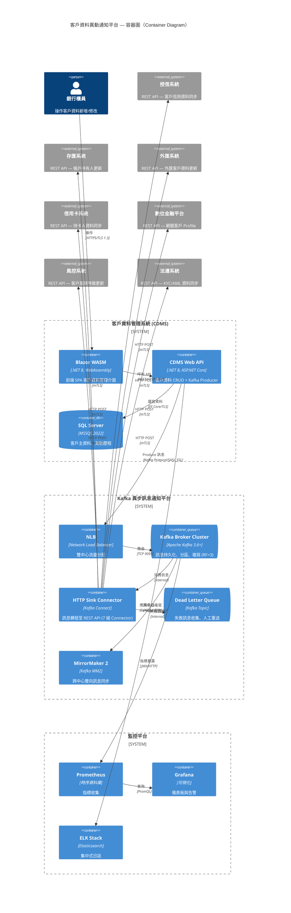

### 5.3 介面與整合風險評估

| 介面編號 | 來源 | 目標 | 傳輸方式 | 頻率 | 關鍵性 | 風險評級 | 控制措施 |
|:---|:---|:---|:---:|:---:|:---:|:---:|:---|
| INT-001 | CDMS API | Kafka Broker | Kafka Protocol (SASL_SSL) | 即時 | 關鍵 | 中 | 冪等 Producer、Acks=All、NLB 雙中心 |
| INT-002 | Kafka Broker | HTTP Connector | Internal | 即時 | 關鍵 | 低 | Consumer Group、自動再平衡 |
| INT-003 | HTTP Connector | 授信系統 | HTTPS (mTLS) | 即時 | 高 | 中 | 重試 5 次、DLQ、連線逾時 5s |
| INT-004 | HTTP Connector | 存匯系統 | HTTPS (mTLS) | 即時 | 高 | 中 | 重試 5 次、DLQ、連線逾時 5s |
| INT-005 | HTTP Connector | 外匯系統 | HTTPS (mTLS) | 即時 | 高 | 中 | 重試 5 次、DLQ、連線逾時 5s |
| INT-006 | HTTP Connector | 信用卡系統 | HTTPS (mTLS) | 即時 | 中 | 中 | 重試 5 次、DLQ、連線逾時 5s |
| INT-007 | HTTP Connector | 數位金融平台 | HTTPS (mTLS) | 即時 | 高 | 中 | 重試 5 次、DLQ、連線逾時 5s |
| INT-008 | HTTP Connector | 風控系統 | HTTPS (mTLS) | 即時 | 高 | 高 | 重試 5 次、DLQ、連線逾時 2s |
| INT-009 | HTTP Connector | 法遵系統 | HTTPS (mTLS) | 即時 | 高 | 中 | 重試 5 次、DLQ、連線逾時 5s |
| INT-010 | Kafka A | Kafka B | MirrorMaker 2 (SSL) | 即時 | 關鍵 | 高 | 雙向同步、Offset 翻譯、監控延遲 |

---

## 第六章：資料架構審查

### 6.1 訊息資料模型（CloudEvents 格式）

#### 客戶異動事件 Schema

```json
{
  "$schema": "https://json-schema.org/draft/2020-12/schema",
  "title": "CustomerChangeEvent",
  "description": "客戶資料異動通知事件（遵循 CloudEvents v1.0 規範）",
  "type": "object",
  "required": ["specversion", "id", "type", "source", "time", "data"],
  "properties": {
    "specversion": { "const": "1.0" },
    "id": {
      "type": "string",
      "format": "uuid",
      "description": "事件唯一識別碼（冪等性依據）"
    },
    "type": {
      "type": "string",
      "enum": [
        "com.bank.cdms.customer.created",
        "com.bank.cdms.customer.updated",
        "com.bank.cdms.customer.deleted"
      ]
    },
    "source": { "const": "urn:bank:cdms" },
    "time": { "type": "string", "format": "date-time" },
    "datacontenttype": { "const": "application/json" },
    "correlationid": { "type": "string" },
    "data": {
      "type": "object",
      "properties": {
        "customerId": { "type": "string" },
        "changeType": { "enum": ["Created", "Updated", "Deleted"] },
        "changedFields": {
          "type": "array",
          "items": { "type": "string" }
        },
        "changedBy": { "type": "string" },
        "before": { "$ref": "#/$defs/CustomerSnapshot" },
        "after": { "$ref": "#/$defs/CustomerSnapshot" }
      }
    }
  },
  "$defs": {
    "CustomerSnapshot": {
      "type": "object",
      "properties": {
        "customerId": { "type": "string" },
        "customerName": { "type": "string" },
        "idType": { "type": "string" },
        "idNumber": { "type": "string", "description": "已遮罩" },
        "phoneNumber": { "type": "string", "description": "已遮罩" },
        "email": { "type": "string" },
        "address": { "type": "string" },
        "riskLevel": { "type": "string" },
        "kycStatus": { "type": "string" },
        "lastUpdated": { "type": "string", "format": "date-time" }
      }
    }
  }
}
```

### 6.2 Topic 設計與分區策略

| Topic 名稱 | 分區數 | 複寫因子 | 保留策略 | Key 策略 | 用途 |
|:---|:---:|:---:|:---|:---|:---|
| `customer-changes` | 6 | 3 | 7 天（168 小時） | CustomerId | 主要異動通知 Topic |
| `customer-changes-dlq` | 3 | 3 | 30 天 | 原始 Key | 失敗訊息 Dead Letter Queue |
| `customer-changes-audit` | 3 | 3 | 365 天 | CustomerId | 稽核軌跡（長期保留） |
| `connector-delivery-reports` | 3 | 3 | 7 天 | ConnectorId | Connector 送達狀態報告 |

#### 分區策略說明

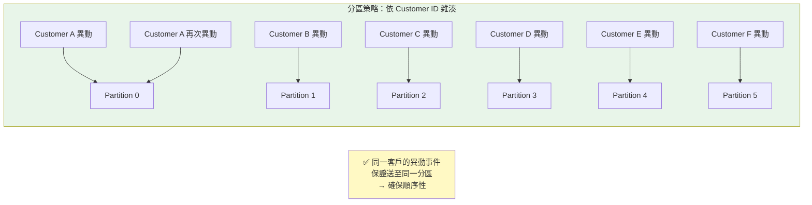

### 6.3 資料安全與隱私保護

| 資料欄位 | 分類等級 | 保護措施 | Kafka 層處理 | 備註 |
|:---|:---:|:---|:---|:---|
| **客戶 ID** | 內部 | 不遮罩（作為 Key） | 明文傳輸 | 用於分區與路由 |
| **客戶姓名** | 機密 | 傳輸加密 (TLS) | Broker 端加密儲存 | — |
| **身分證字號** | 高度機密 | 前 3 後 4 遮罩 | 遮罩後傳輸 | 如：A12****789 |
| **電話號碼** | 機密 | 後 4 碼遮罩 | 遮罩後傳輸 | 如：0912***456 |
| **地址** | 機密 | 傳輸加密 (TLS) | Broker 端加密儲存 | — |
| **Email** | 內部 | 傳輸加密 (TLS) | Broker 端加密儲存 | — |
| **風險等級** | 機密 | 傳輸加密 (TLS) | Broker 端加密儲存 | — |
| **KYC 狀態** | 機密 | 傳輸加密 (TLS) | Broker 端加密儲存 | — |

### 6.4 資料流生命週期

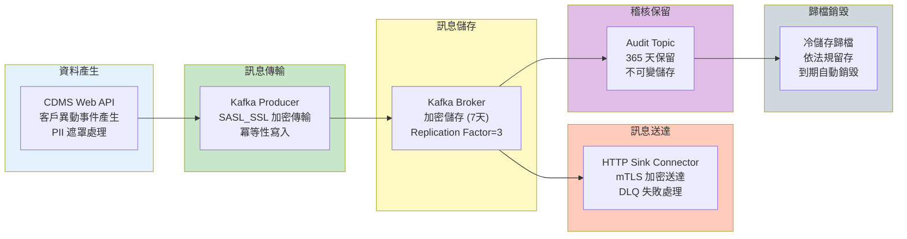

---

## 第七章：技術架構審查

### 7.1 Kafka 叢集架構設計

#### 雙中心 Kafka 叢集拓撲

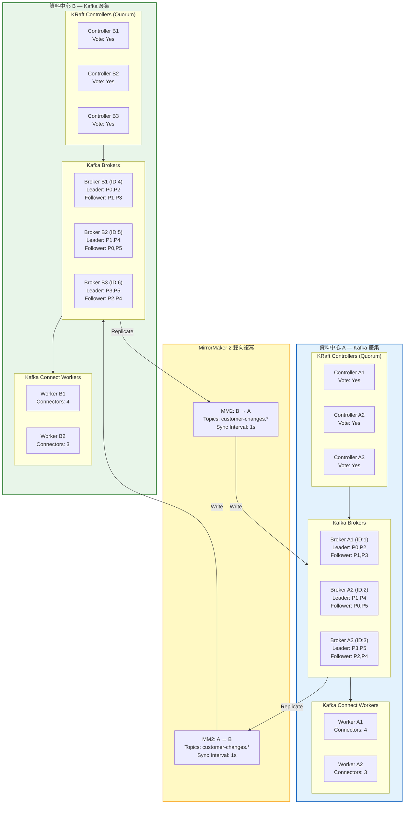

### 7.2 Kafka Broker 關鍵配置

| 配置項目 | 設定值 | 說明 |
|:---|:---|:---|
| `broker.id` | 1-6（各中心 3 台） | 全局唯一 Broker 識別 |
| `num.partitions` | 6 | 預設分區數（依 Topic 調整） |
| `default.replication.factor` | 3 | 預設複寫因子 |
| `min.insync.replicas` | 2 | 最小同步副本數（搭配 acks=all） |
| `log.retention.hours` | 168 (7 天) | 訊息保留時間 |
| `log.segment.bytes` | 1073741824 (1GB) | 日誌段大小 |
| `message.max.bytes` | 1048576 (1MB) | 單一訊息最大尺寸 |
| `compression.type` | lz4 | 訊息壓縮演算法 |
| `auto.create.topics.enable` | false | 禁止自動建立 Topic |
| `delete.topic.enable` | true | 允許刪除 Topic |
| `listeners` | SASL_SSL://:9093 | 監聽協定與埠號 |
| `inter.broker.listener.name` | SASL_SSL | Broker 間通訊協定 |
| `ssl.keystore.location` | /etc/kafka/ssl/kafka.keystore.jks | SSL 證書儲存 |
| `sasl.mechanism.inter.broker.protocol` | SCRAM-SHA-256 | Broker 間認證機制 |
| `log.dirs` | /data/kafka-logs | 資料儲存路徑（SSD） |
| `unclean.leader.election.enable` | false | 禁止非同步副本選為 Leader |

### 7.3 NLB 負載平衡設計

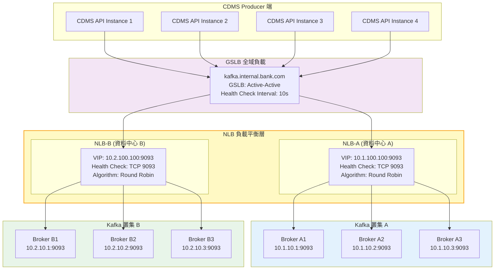

#### NLB 配置要點

| 配置項目 | 設定值 | 說明 |
|:---|:---|:---|
| **負載平衡演算法** | Least Connections | 依連線數分配流量 |
| **健康檢查協定** | TCP | 探測 Kafka Broker 9093 埠 |
| **健康檢查間隔** | 10 秒 | 每 10 秒檢查一次 |
| **失敗閾值** | 3 次 | 連續 3 次失敗標記不健康 |
| **恢復閾值** | 2 次 | 連續 2 次成功標記健康 |
| **連線逾時** | 60 秒 | 長連線逾時 |
| **Session Persistence** | Source IP | 同一 Producer 黏著同一 Broker |
| **跨中心切換** | GSLB DNS | DNS TTL = 30s |

### 7.4 MirrorMaker 2 跨中心同步策略

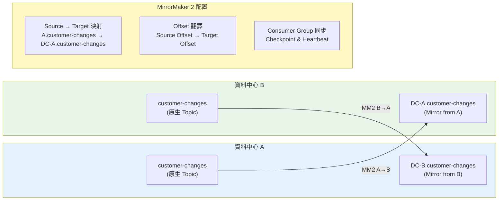

#### MirrorMaker 2 配置

```properties
# mm2.properties
clusters = DC-A, DC-B

DC-A.bootstrap.servers = kafka-a1:9093,kafka-a2:9093,kafka-a3:9093
DC-B.bootstrap.servers = kafka-b1:9093,kafka-b2:9093,kafka-b3:9093

# 雙向複寫
DC-A->DC-B.enabled = true
DC-B->DC-A.enabled = true

# 複寫 Topic 過濾
DC-A->DC-B.topics = customer-changes, customer-changes-dlq, customer-changes-audit
DC-B->DC-A.topics = customer-changes, customer-changes-dlq, customer-changes-audit

# 同步設定
replication.factor = 3
sync.topic.configs.enabled = true
sync.topic.acls.enabled = true
emit.heartbeats.enabled = true
emit.checkpoints.enabled = true
emit.checkpoints.interval.seconds = 10
refresh.topics.interval.seconds = 30

# 安全設定
security.protocol = SASL_SSL
sasl.mechanism = SCRAM-SHA-256
```

### 7.5 失敗處理與重試策略

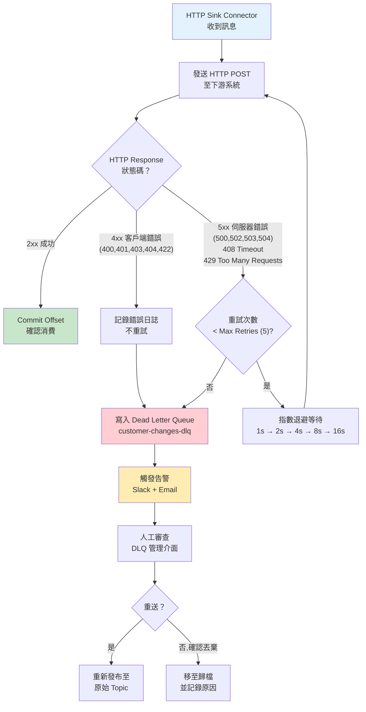

#### 重試策略參數

| 參數 | 設定值 | 說明 |
|:---|:---|:---|
| `max.retries` | 5 | 最大重試次數 |
| `retry.backoff.ms` | 3000 | 初始退避時間 (3 秒) |
| `retry.backoff.max.ms` | 60000 | 最大退避時間 (60 秒) |
| `retry.on.status.codes` | 408,429,500,502,503,504 | 可重試的 HTTP 狀態碼 |
| `errors.tolerance` | all | 容錯模式：所有錯誤寫入 DLQ |
| `errors.deadletterqueue.topic.name` | customer-changes-dlq | DLQ Topic 名稱 |
| `connection.timeout.ms` | 5000 | HTTP 連線逾時 |
| `read.timeout.ms` | 10000 | HTTP 讀取逾時 |

---

## 第八章：災難復原與業務連續性

### 8.1 高可用架構層次

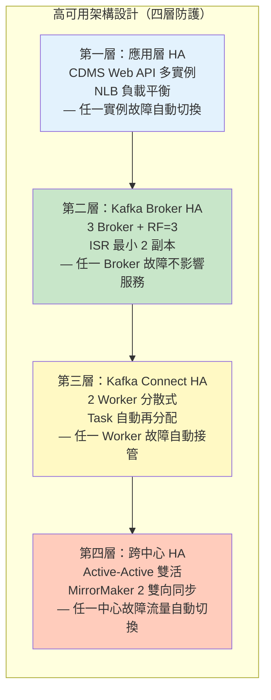

### 8.2 故障場景分析與復原策略

| 場景編號 | 故障場景 | 影響範圍 | RTO | RPO | 復原策略 | 自動化 |
|:---|:---|:---|:---:|:---:|:---|:---:|
| F-001 | 單一 CDMS API 實例故障 | 部分請求 | ~0 | 0 | NLB 自動摘除，流量分至健康實例 | ✅ |
| F-002 | 單一 Kafka Broker 故障 | 無 | ~0 | 0 | 副本自動選舉新 Leader | ✅ |
| F-003 | 單一 Connect Worker 故障 | 部分 Connector 暫停 | < 1min | 0 | Task 自動再分配至存活 Worker | ✅ |
| F-004 | 單一下游系統不可用 | 該系統通知延遲 | 依重試 | 0 | 自動重試 → DLQ → 人工重送 | ✅ |
| F-005 | 資料中心 A 完全離線 | 中心 A 流量 | < 30min | ~0 | GSLB 切至中心 B + MM2 資料同步 | ⚠ |
| F-006 | NLB 故障 | 該中心 Kafka 不可達 | < 5min | 0 | GSLB 切至另一中心 NLB | ✅ |
| F-007 | MirrorMaker 2 故障 | 跨中心同步中斷 | < 5min | ≤ 10s | MM2 自動重連 + Offset checkpoint | ✅ |
| F-008 | SQL Server 故障 | CDMS 資料讀寫 | < 1min | ~0 | Always On AG 自動容錯移轉 | ✅ |

### 8.3 災難復原切換流程

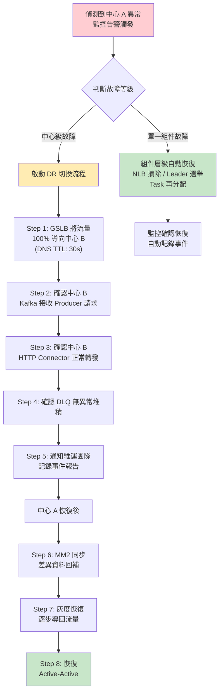

### 8.4 業務連續性要求

| 業務功能 | RTO | RPO | 備援策略 | 演練頻率 | 狀態 |
|:---|:---:|:---:|:---|:---:|:---:|
| 客戶資料異動通知 | ≤ 30 分鐘 | ≤ 0（訊息持久化） | Active-Active + MM2 | 半年 | ✓ 計畫 |
| DLQ 人工重送 | ≤ 4 小時 | N/A | 管理介面 | 季度 | ✓ 計畫 |
| 監控告警服務 | ≤ 15 分鐘 | N/A | 雙中心 Prometheus | 半年 | ✓ 計畫 |

---

## 第九章：資訊安全架構審查

### 9.1 安全架構總覽

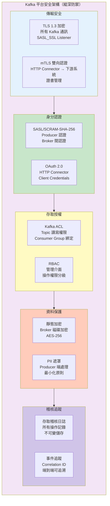

### 9.2 Kafka ACL 存取控制矩陣

| Principal | 資源類型 | 資源名稱 | 操作 | 允許/拒絕 | 說明 |
|:---|:---:|:---|:---:|:---:|:---|
| `User:cdms-producer` | Topic | `customer-changes` | Write, Describe | ✅ 允許 | CDMS 寫入異動事件 |
| `User:cdms-producer` | Topic | `customer-changes-*` | Write | ❌ 拒絕 | 禁止寫入 DLQ、Audit |
| `User:connect-worker` | Topic | `customer-changes` | Read, Describe | ✅ 允許 | Connector 消費訊息 |
| `User:connect-worker` | Topic | `customer-changes-dlq` | Write | ✅ 允許 | 寫入失敗訊息 |
| `User:connect-worker` | Group | `connect-cluster-*` | Read | ✅ 允許 | Connect Consumer Group |
| `User:mm2-replicator` | Topic | `customer-changes*` | Read, Write, Create | ✅ 允許 | 跨中心複寫 |
| `User:monitoring` | Topic | `*` | Describe | ✅ 允許 | 監控用唯讀 |
| `User:admin` | Cluster | `kafka-cluster` | All | ✅ 允許 | 管理員完整權限 |

### 9.3 安全檢核項目

| 控制項目 | 設計要求 | 實作方式 | 風險評級 | 狀態 |
|:---|:---|:---|:---:|:---:|
| **傳輸加密** | 所有通訊 TLS 1.3 | SASL_SSL Listener, mTLS for HTTP | 低 | ✅ |
| **身分認證** | 所有連線需認證 | SCRAM-SHA-256 + OAuth 2.0 | 低 | ✅ |
| **授權控制** | 最小權限原則 | Kafka ACL + Topic 層級控制 | 中 | ✅ |
| **靜態加密** | Broker 磁碟加密 | 作業系統層 LUKS / BitLocker | 低 | ✅ |
| **PII 保護** | 敏感資料遮罩 | Producer 端遮罩處理 | 中 | ✅ |
| **稽核日誌** | 所有操作可追溯 | Kafka Audit Log + ELK | 低 | ✅ |
| **金鑰管理** | 證書定期輪換 | HashiCorp Vault / 內部 PKI | 中 | ⚠ 規劃中 |
| **網路隔離** | Kafka 專屬 VLAN | 防火牆規則 + 微分段 | 低 | ✅ |

---

## 第十章：監控與可觀測性

### 10.1 監控架構

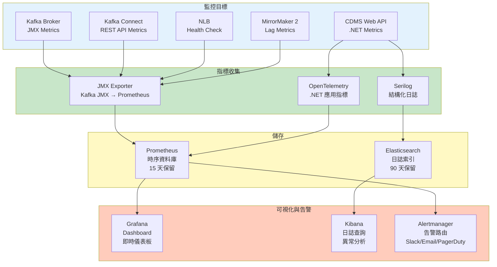

### 10.2 關鍵監控指標（KPI）

| 監控指標 | 指標名稱 | 告警閾值 | 嚴重度 | 通知管道 |
|:---|:---|:---|:---:|:---|
| **Producer 發送速率** | `kafka_producer_record_send_rate` | < 1 msg/s（持續 5min） | Warning | Slack |
| **Producer 錯誤率** | `kafka_producer_record_error_rate` | > 0.1% | Critical | Slack + PagerDuty |
| **Broker Under-Replicated** | `kafka_server_ReplicaManager_UnderReplicatedPartitions` | > 0（持續 3min） | Critical | Slack + PagerDuty |
| **Consumer Lag** | `kafka_consumer_group_lag` | > 1000 messages | Warning | Slack |
| **Consumer Lag** | `kafka_consumer_group_lag` | > 5000 messages | Critical | Slack + PagerDuty |
| **Connector 狀態** | `kafka_connect_connector_status` | status ≠ RUNNING | Critical | Slack + PagerDuty |
| **Connector Task 狀態** | `kafka_connect_task_status` | status = FAILED | Critical | Slack + PagerDuty |
| **HTTP 送達錯誤率** | `http_sink_request_error_rate` | > 1% | Warning | Slack |
| **DLQ 訊息堆積** | `kafka_consumer_group_lag{topic=dlq}` | > 0 | Warning | Slack + Email |
| **DLQ 訊息堆積** | `kafka_consumer_group_lag{topic=dlq}` | > 50 | Critical | Slack + PagerDuty |
| **MM2 複寫延遲** | `kafka_connect_mirror_record_age_ms` | > 5000ms | Warning | Slack |
| **NLB 健康節點數** | `nlb_healthy_host_count` | < total_hosts | Warning | Slack |
| **CDMS API 回應時間** | `http_request_duration_seconds{p99}` | > 2s | Warning | Slack |
| **Kafka 磁碟使用率** | `node_filesystem_avail_percent` | < 20% | Warning | Slack |
| **Kafka 磁碟使用率** | `node_filesystem_avail_percent` | < 10% | Critical | Slack + PagerDuty |

### 10.3 Grafana Dashboard 設計

| Dashboard 名稱 | 包含面板 | 更新頻率 | 存取角色 |
|:---|:---|:---:|:---|
| **Kafka Cluster Overview** | Broker 狀態、分區分佈、ISR、網路 IO、磁碟使用 | 10s | 維運/架構 |
| **Producer Metrics** | 發送速率、延遲分佈、錯誤率、批次大小 | 10s | 開發/維運 |
| **HTTP Connector Health** | 各 Connector 狀態、HTTP 回應碼分佈、延遲、重試次數 | 10s | 維運 |
| **Consumer Lag Monitor** | 各 Consumer Group 延遲、消費速率、偏移量趨勢 | 10s | 維運 |
| **DLQ Dashboard** | DLQ 訊息數量、趨勢、來源系統分佈、失敗原因統計 | 30s | 維運/業務 |
| **Cross-DC Replication** | MM2 複寫延遲、吞吐量、Checkpoint 進度 | 10s | 維運/架構 |
| **CDMS API Metrics** | API 回應時間、錯誤率、請求量、Kafka 發送統計 | 10s | 開發/維運 |

---

## 第十一章：架構治理與變更管理

### 11.1 Kafka Topic 命名規範

| 規則 | 格式 | 範例 | 說明 |
|:---|:---|:---|:---|
| 主要 Topic | `{domain}-{event-type}` | `customer-changes` | 領域-事件類型 |
| DLQ Topic | `{domain}-{event-type}-dlq` | `customer-changes-dlq` | Dead Letter Queue |
| Audit Topic | `{domain}-{event-type}-audit` | `customer-changes-audit` | 稽核追蹤 |
| Connector Report | `connector-delivery-reports` | — | 送達狀態報告 |
| MM2 Heartbeat | `heartbeats` | — | MirrorMaker 2 心跳 |
| MM2 Checkpoint | `{source}.checkpoints.internal` | `DC-A.checkpoints.internal` | 偏移量檢查點 |

### 11.2 Schema 演進策略

```mermaid
flowchart LR
    subgraph Evolution["Schema 演進規則"]
        direction TB
        R1["✅ 向後相容 (Backward)<br/>新版 Consumer 可讀舊版訊息"]
        R2["✅ 新增可選欄位<br/>設定預設值"]
        R3["❌ 禁止移除必要欄位"]
        R4["❌ 禁止變更欄位類型"]
        R5["⚠️ 重大變更需新 Topic<br/>customer-changes-v2"]
    end

    subgraph Process["變更流程"]
        P1["1. Schema 變更申請<br/>Architecture Decision Record"]
        P2["2. 相容性測試<br/>Consumer 端驗證"]
        P3["3. 灰度部署<br/>新舊版本共存"]
        P4["4. 全面切換<br/>舊版本退役"]
    end

    Evolution --> Process

    style Evolution fill:#e8f5e9
    style Process fill:#e3f2fd
```

### 11.3 容量規劃與擴展策略

| 指標 | 初始規劃 | 半年預估 | 一年預估 | 擴展方式 |
|:---|:---:|:---:|:---:|:---|
| **日均異動筆數** | 5,000 | 8,000 | 15,000 | 自然成長 |
| **尖峰每秒訊息數** | 50 msg/s | 80 msg/s | 150 msg/s | 增加 Partition |
| **單一訊息大小** | ~2 KB | ~2 KB | ~3 KB | Schema 演進 |
| **日均資料量** | ~70 MB | ~112 MB | ~315 MB | 增加磁碟 |
| **Partition 數** | 6 | 6 | 12 | 動態擴展 |
| **Broker 數（每中心）** | 3 | 3 | 3~5 | 水平擴展 |
| **Connector 數** | 7 | 7 | 8~10 | 依通知對象增加 |
| **Connect Worker 數** | 2 | 2 | 3 | 水平擴展 |

---

## 第十二章：審查發現與改善追蹤

### 12.1 審查發現總表

| 項次 | 發現編號 | 架構領域 | 發現標題 | 風險等級 | 負責單位 | 預計完成日 | 狀態 |
|:---:|:---|:---:|:---|:---:|:---|:---:|:---:|
| 1 | KAFKA-2026-001 | 應用架構 | 7 大下游系統需實作冪等性 API，確保重複消費不造成副作用 | **重大** | 各系統開發組 | 2026-Q2 | 規劃中 |
| 2 | KAFKA-2026-002 | 技術架構 | DLQ 管理介面尚未建置，缺乏失敗訊息可視化與重送機制 | **重大** | 平台維運組 | 2026-Q2 | 規劃中 |
| 3 | KAFKA-2026-003 | 安全架構 | Kafka SSL 證書輪換尚未自動化，需建立自動化輪換機制 | 輕微 | 資安處 | 2026-Q3 | 規劃中 |
| 4 | KAFKA-2026-004 | 技術架構 | MirrorMaker 2 雙向同步需完成壓力測試與故障恢復演練 | 輕微 | 基礎設施組 | 2026-Q2 | 規劃中 |
| 5 | KAFKA-2026-005 | 資料架構 | PII 遮罩規則需與法遵單位確認，確保符合個資法要求 | 輕微 | 法遵處/資訊處 | 2026-Q2 | 規劃中 |

### 12.2 風險等級分佈

```mermaid
pie title 風險等級分佈（Findings by Risk Level）
    "重大不符合（Major）" : 2
    "輕微不符合（Minor）" : 3
```

### 12.3 改善路徑圖

```mermaid
gantt
    title Kafka 異步訊息通知平台建置路徑圖 (2026)
    dateFormat YYYY-MM-DD
    section 基礎建設
    Kafka 叢集建置（雙中心）           :a1, 2026-03-01, 30d
    NLB 配置與驗證                     :a2, 2026-03-15, 14d
    MirrorMaker 2 部署                 :a3, after a1, 14d
    監控平台建置 (Prometheus+Grafana)  :a4, 2026-03-15, 21d

    section 應用開發
    CDMS Kafka Producer 開發           :b1, 2026-03-01, 21d
    CloudEvents Schema 設計            :b2, 2026-03-01, 7d
    HTTP Sink Connector 配置 (7組)     :b3, after a1, 14d
    DLQ 管理介面開發                   :b4, after b1, 21d

    section 下游系統改造
    下游系統冪等性 API 開發            :c1, 2026-03-15, 30d
    下游系統整合測試                   :c2, after c1, 14d

    section 測試驗證
    SIT 整合測試                       :d1, after b3, 14d
    效能與壓力測試                     :d2, after d1, 7d
    雙中心 DR 演練                     :d3, after d2, 7d
    UAT 使用者驗收                     :d4, after d3, 14d

    section 上線
    Staging 預生產驗證                 :e1, after d4, 7d
    Production 正式上線                :e2, after e1, 3d
    上線後觀察期                       :e3, after e2, 14d
```

---

## 第十三章：審查簽署與批准

本文件經審查委員會確認，Kafka 異步訊息通知平台架構設計符合銀行業資訊系統安全與穩健經營原則，所有發現均已記錄並排定改善計畫。

| 角色 | 姓名 | 職稱 | 簽署 | 日期 | 備註 |
|:---|:---|:---|:---:|:---:|:---|
| **專案架構師** | [姓名] | 企業架構師 | ☐ | YYYY-MM-DD | 技術內容完整性負責 |
| **資安架構師** | [姓名] | 資安架構師 | ☐ | YYYY-MM-DD | 安全控制有效性評估 |
| **資料架構師** | [姓名] | 資料架構師 | ☐ | YYYY-MM-DD | 資料架構與隱私審查 |
| **CDMS 系統負責人** | [姓名] | .NET 技術主管 | ☐ | YYYY-MM-DD | Producer 端實作確認 |
| **基礎設施主管** | [姓名] | 基礎設施架構師 | ☐ | YYYY-MM-DD | 雙中心部署與 NLB 審查 |
| **資安長（CISO）** | [姓名] | 資訊安全長 | ☐ | YYYY-MM-DD | 資安風險把關 |
| **資訊長（CIO）** | [姓名] | 資訊長 | ☐ | YYYY-MM-DD | 技術策略決策 |
| **架構審查委員會主席** | [姓名] | 資訊架構長 | ☐ | YYYY-MM-DD | 最終審查核准 |

---

## 附錄

### 附錄 A：術語定義

| 術語 | 英文 | 定義 |
|:---|:---|:---|
| **CDMS** | Customer Data Management System | 客戶資料管理系統 |
| **Kafka** | Apache Kafka | 分散式事件串流平台 |
| **NLB** | Network Load Balancer | 網路負載平衡器 |
| **DLQ** | Dead Letter Queue | 死信佇列：無法處理的訊息存放處 |
| **MM2** | MirrorMaker 2 | Kafka 跨叢集複寫工具 |
| **HTTP Sink Connector** | Kafka Connect HTTP Sink | Kafka 訊息轉 HTTP REST API 的連接器 |
| **CloudEvents** | CloudEvents Specification | CNCF 標準化事件格式規範 |
| **Blazor WASM** | Blazor WebAssembly | .NET 前端 SPA 框架（WebAssembly 執行） |
| **SASL** | Simple Authentication and Security Layer | 簡單認證與安全層 |
| **ACL** | Access Control List | 存取控制清單 |
| **ISR** | In-Sync Replica | 同步副本集合 |
| **RF** | Replication Factor | 複寫因子 |
| **KRaft** | Kafka Raft | Kafka 內建共識協定（取代 ZooKeeper） |
| **CDC** | Change Data Capture | 變更資料捕捉 |
| **mTLS** | Mutual TLS | 雙向 TLS 認證 |
| **At-Least-Once** | — | 至少一次送達語意，訊息可能重複但不遺失 |
| **冪等性** | Idempotency | 多次執行產生與單次相同結果的特性 |
| **Active-Active** | — | 雙活架構：兩中心同時提供服務 |
| **GSLB** | Global Server Load Balancing | 全域伺服器負載平衡 |

### 附錄 B：參考標準

| 標準/框架 | 版本 | 適用範圍 |
|:---|:---|:---|
| TOGAF Standard | 10th Edition | 企業架構方法論 |
| ISO 27001:2022 | 2022 | 資訊安全管理 |
| ISO 22301:2019 | 2019 | 業務持續管理 |
| CloudEvents Specification | 1.0 | 事件格式標準 |
| Apache Kafka Documentation | 3.6+ | Kafka 技術規範 |
| Confluent HTTP Sink Connector | Latest | HTTP Connector 配置 |
| 金管會「銀行資訊系統安全及防護基準」 | 最新版 | 銀行業監理要求 |
| 個人資料保護法 | 最新版 | 個資保護 |
| OWASP API Security Top 10 | 2023 | API 安全風險 |

### 附錄 C：架構審查檢核清單（快速版）

| 檢核類別 | 檢核項目 | 符合 | 不符合 | N/A | 備註 |
|:---|:---|:---:|:---:|:---:|:---|
| **解耦合設計** | CDMS 與下游系統透過 Kafka 解耦 | ☐ | ☐ | ☐ | |
| | 新增通知對象無需修改 CDMS 程式碼 | ☐ | ☐ | ☐ | |
| **訊息可靠性** | Producer 冪等性設計（EnableIdempotence=true） | ☐ | ☐ | ☐ | |
| | Acks=All + ISR ≥ 2 | ☐ | ☐ | ☐ | |
| | DLQ 機制建置 | ☐ | ☐ | ☐ | |
| | 下游系統冪等性 API | ☐ | ☐ | ☐ | |
| **高可用** | Active-Active 雙中心部署 | ☐ | ☐ | ☐ | |
| | NLB 雙中心負載平衡 | ☐ | ☐ | ☐ | |
| | MirrorMaker 2 跨中心同步 | ☐ | ☐ | ☐ | |
| **安全架構** | SASL_SSL 傳輸加密 | ☐ | ☐ | ☐ | |
| | Kafka ACL 最小權限 | ☐ | ☐ | ☐ | |
| | PII 資料遮罩 | ☐ | ☐ | ☐ | |
| | mTLS HTTP Connector → 下游系統 | ☐ | ☐ | ☐ | |
| **監控告警** | Kafka Broker 監控 | ☐ | ☐ | ☐ | |
| | Consumer Lag 監控 | ☐ | ☐ | ☐ | |
| | DLQ 堆積告警 | ☐ | ☐ | ☐ | |
| | Connector 狀態監控 | ☐ | ☐ | ☐ | |
| **合規性** | 個資保護法符合性 | ☐ | ☐ | ☐ | |
| | 稽核日誌留存 | ☐ | ☐ | ☐ | |
| | DR 演練計畫 | ☐ | ☐ | ☐ | |
