# 銀行業IT架構審查文件範本（終極整合版）

## 文件控制資訊

| 屬性 | 內容 |
|:---|:---|
| **文件編號** | IT-ARCH-AUDIT-YYYY-NNN |
| **版本** | v2.0.0（整合版） |
| **生效日期** | YYYY-MM-DD |
| **審查週期** | 年度定期審查 / 重大變更觸發審查 |
| **機密等級** | 極機密（Strictly Confidential）— 僅限授權人員查閱 |
| **文件擁有者** | 資訊架構管理單位 / 資訊安全處 |
| **核准者** | 資訊長（CIO）/ 資訊安全長（CISO）/ 風險長（CRO）|

### 版本修訂紀錄

| 版本 | 修訂日期 | 修訂內容摘要 | 修訂者 | 核准者 |
|:---|:---|:---|:---|:---|
| v2.0.0 | YYYY-MM-DD | 終極整合版：融合TOGAF ADM、C4模型、4+1視圖與風險導向審查方法論 | [姓名] | [姓名] |
| v1.0.0 | YYYY-MM-DD | 初版發布 | [姓名] | [姓名] |

### 分發對象

- [ ] 董事會 / 審計委員會
- [ ] 資訊長（CIO）
- [ ] 資訊安全長（CISO）
- [ ] 風險長（CRO）
- [ ] 資訊架構審查委員會（ITARC）
- [ ] 內部稽核單位
- [ ] 外部監理機關（如適用）

---

## 背景說明與範本用途

### 金融業 IT 架構審查之重要性

隨著金融機構數位轉型加速，銀行業正面臨前所未有的技術複雜度與威脅組合。根據 IBM X-Force 2025 威脅情報報告，金融服務業已連續第三年位居全球最常受攻擊的產業前三名，平均每次資料外洩事件造成遨54萬美元損失。同時，監理機關對 IT 架構治理的要求日益嚴格，從金管會「金融機構資通安全管理辦法」到歐盟 DORA（Digital Operational Resilience Act），均要求金融機構建立健全的架構審查機制。

本範本將架構審查結構化為可重複執行的標準流程，確保每次審查涵蓋完整的諿估維度。

### 2025–2026 年金融業關鍵威脅地景

| 威脅類型 | 趨勢描述 | 影響風險 | 本文件對應章節 |
|:---|:---|:---:|:---|
| **勒索軟體攻擊** | 金融業勒索攻擊年增 27%，雙重勒索（加密+洩漏）成為主流，平均贖金超過 150 萬美元 | 極高 | §10.1 縱深防禦、§9.4 災備、§9.7 混沌工程 |
| **供應鏈攻擊** | SolarWinds、MOVEit 等事件後，針對第三方元件與服務的攻擊持續上升，SBOM 管理成為必要 | 高 | §10.1、§11 委外架構 |
| **API 濫用與攻擊** | Open Banking 擴展受攻擊面，OWASP API Top 10 威脅持續演化，BOLA/BFLA 攻擊頻繁 | 高 | §7.4 介面風險、§7.5 開放銀行 |
| **生成式 AI 武器化** | Deepfake 詐騙、AI 生成釣魚郵件、自動化漏洞探勘工具降低攻擊門檻 | 高 | §10.4 AI/ML 治理 |
| **零日漏洞利用** | 2024–25 年金融相關零日攻擊顯著增加，特別針對 VPN/防火牆設備（Ivanti, Palo Alto, Fortinet） | 極高 | §9.3 網路架構、§10.1 |
| **雲端設定錯誤** | 雲端資源暴露、IAM 權限過大、S3 Bucket 公開存取等設定缺失 | 高 | §9.1 雲端策略、§11 委外 |
| **內部威脅** | 特權帳號濫用、離職人員資料外洩、第三方協力廠商意外存取 | 中 | §10.2 IAM、§10.3 UEBA |

### EOS/LTS 生命週期管理的重要性

組件生命週期管理是架構審查的核心議題之一。使用已達 **EOS（End of Support）** 或 **EOL（End of Life）** 的組件，意味著原廠不再提供安全修補，任何新發現的漏洞將無法獲得修復，造成持續性的安全風險。以下為關鍵定義：

| 生命週期狀態 | 定義 | 原廠支援範圍 | 架構審查建議 |
|:---|:---|:---|:---|
| **GA（General Availability）** | 正式發布、全功能可用 | 完整功能更新 + 安全修補 | 建議採用，持續評估穩定性 |
| **LTS（Long Term Support）** | 長期支援版本，持續收到安全修補 | 安全修補 + 重大錯誤修正（無新功能） | **優先採用**，適合生產環境 |
| **主流支援（Mainstream）** | 原廠持續提供功能更新與修補 | 完整支援（功能+安全+效能） | 安全採用，注意版本路線圖 |
| **延伸支援（Extended）** | 僅提供安全修補，無功能更新 | 僅安全修補（可能需額外付費） | **規劃遷移**，納入技術債清單 |
| **EOS（End of Support）** | 原廠停止所有支援（含安全修補） | **無** | **立即遷移**，列為重大風雛 |
| **EOL（End of Life）** | 產品完全停止開發與提供 | **無** | **禁止使用**，最高優先汰換 |

#### 2025–2028 年金融業常見技術組件 EOS/LTS 時程表

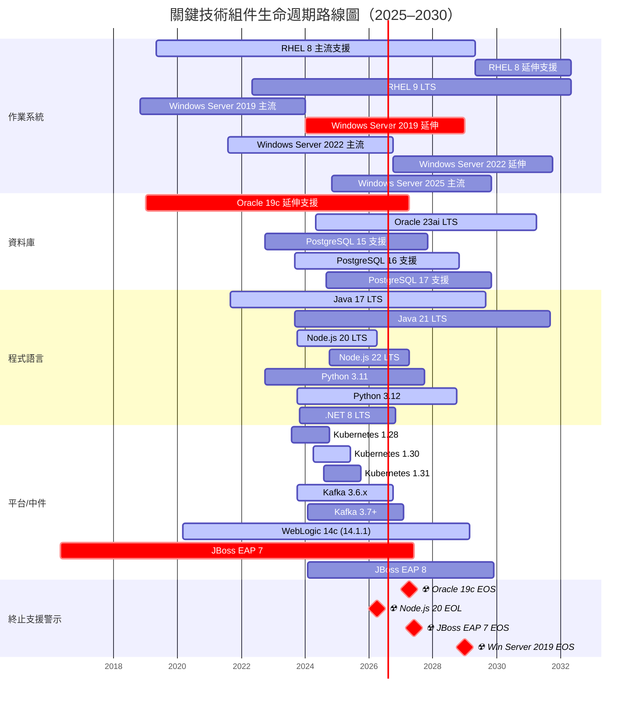

> **閱讀指引**：上圖中標示 `crit`（紅色）的區段代表已進入或即將進入延伸支援或 EOS 階段，需優先規劃遷移。各組件營運中實際使用版本請參照 §9.2 技術標準表。

### 常見弱點與漏洞風險統計（2024–2025）

以下統計反映金融業常見技術塊近年重大 CVE 與安全事件趨勢，作為架構審查時的風險評估參考：

| 技術領域 | 代表性重大漏洞/事件 | CVSS 評分 | 影響範圍 | 架構審查啟示 |
|:---|:---|:---:|:---|:---|
| **網路邊界設備** | Ivanti Connect Secure CVE-2024-21887（指令注入）、Palo Alto PAN-OS CVE-2024-3400（零日）、Fortinet CVE-2024-47575 | 9.1–10.0 | VPN/防火牆全面接管 | 縮小 VPN 暴露面、推動 ZTNA、建立VPN修補 SLA < 24H |
| **軟體供應鏈** | MOVEit Transfer CVE-2023-34362（SQL注入、Cl0p勒索）、XZ Utils 後門（CVE-2024-3094） | 9.8 | 檔案傳輸、開源組件 | 強制 SBOM、第三方組件掃描（SCA）、供應商安全評估 |
| **身分認證** | Okta 支援系統外洩（2023）、Microsoft Entra ID Token 認證繞過 | 8.5–9.8 | IAM、SSO、MFA | 多因子認證不依賴單一供應商、Conditional Access |
| **容器平台** | K8s 權限提升 CVE-2024-21626（runc、容器逃逸）、Leaky Vessels | 8.6 | 容器化微服務全面 | Container Image 簽章、runtime 安全政策、受限 Pod |
| **資料庫** | PostgreSQL CVE-2024-10979、Oracle Critical Patch Update（季度 100+ CVE） | 7.0–9.8 | 資料庫全面 | 定期修補（月度）、資料庫活動監控（DAM） |
| **Web/API** | Log4Shell 餘波、Spring4Shell、OWASP API Top 10（BOLA/SSRF） | 7.5–10.0 | 應用層全面 | WAF 規則更新、SAST/DAST/IAST 整合 CI/CD、API 細粒度權限控制 |
| **AI/ML** | Prompt Injection、Training Data Poisoning、Model Inversion Attack | 未定義（新興） | GenAI 應用 | Prompt Guardrails、模型輸入/輸出過濾、人為監督 |

### 本範本的範圍與使用方式

本文件採用 **TOGAF ADM + C4 模型 + 4+1 視圖** 整合框架，結合金管會監理要求與國際標準（ISO 27001/27701、PCI DSS 4.0、BCBS 239），提供以下審查維度：

1. **業務架構**：數位轉型策略對齊、成本效益分析
2. **應用架構**：微服務治理、介面整合、開放銀行
3. **資料架構**：資料治理、隱私保護、監理申報
4. **技術架構**：雲端策略、可觀測性、效能容量、混沌工程
5. **安全架構**：縱深防禦、零信任、AI 治理、事件回應
6. **治理架構**：技術債管理、架構成熟度、變更管理

---

## 第一章：執行摘要（Executive Summary）

### 1.1 審查結論總覽

| 項目 | 內容 |
|:---|:---|
| **整體架構狀態** | [通過 / 條件通過 / 不通過] |
| **關鍵風險等級** | [高 / 中 / 低] |
| **審查範圍** | [核心帳務系統 / 數位銀行平台 / 全行基礎設施 / 雲端遷移專案] |
| **架構願景** | 支撐全通路金融服務、即時交易處理、風險可控的開放金融生態 |

### 1.2 關鍵架構決策摘要

| 決策編號 | 決策項目 | 決策內容 | 主要理由 | 替代方案考慮 |
|:---|:---|:---|:---|:---|
| AD-001 | 系統架構模式 | 微服務架構（Microservices）+ 事件驅動（EDA） | 支援快速迭代、業務解耦、水平擴展 | 模組化單體架構（Modular Monolith）|
| AD-002 | 資料儲存策略 | 混合資料庫策略（Polyglot Persistence） | 依資料特性選擇最適技術，優化效能與成本 | 統一關聯式資料庫 |
| AD-003 | 雲端部署策略 | 混合雲架構（Hybrid Cloud）— 核心地端、周邊雲端 | 敏感資料主權保障 + 彈性創新速度 | 全雲端或全地端部署 |
| AD-004 | 身份認證機制 | 多因素認證（MFA）+ OAuth 2.0/OIDC + FIDO2 | 符合金管會網路銀行安全控管準則 | 單一靜態密碼（已排除）|
| AD-005 | API治理策略 | 集中式API閘道（Kong/AWS API Gateway）+ 服務網格 | 統一安全政策、流量管理、可觀測性 | 分散式或無API閘道 |

### 1.3 主要建議事項

1. **[高優先級]** 需補強資料庫加密機制以符合PCI DSS v4.0要求 — 負責單位：資安處 / 預計完成：YYYY-MM-DD
2. **[高優先級]** 災難復原RTO需從4小時縮短至2小時以符合監理要求 — 負責單位：維運處 / 預計完成：YYYY-MM-DD
3. **[中優先級]** 第三方雲端服務需簽署資料駐留協議並建立退出策略 — 負責單位：採購處 / 預計完成：YYYY-MM-DD

---

## 第二章：審查範圍與目的

### 2.1 審查目的

本文件建立系統化之資訊科技架構審查機制，確保銀行資訊系統架構符合以下目標：

1. **監理合規性**：符合金管會「銀行資訊系統安全及防護基準」、「金融機構作業委託他人處理內部作業制度及程序辦法」、個人資料保護法、洗錢防制法等法規要求
2. **風險控管**：識別並降低架構層面之技術債務、單點故障及資安風險
3. **營運韌性**：確保業務連續性（Business Continuity）與災難復原（Disaster Recovery）能力
4. **策略對齊**：驗證架構投資與業務策略、數位轉型目標之一致性

### 2.2 適用範圍

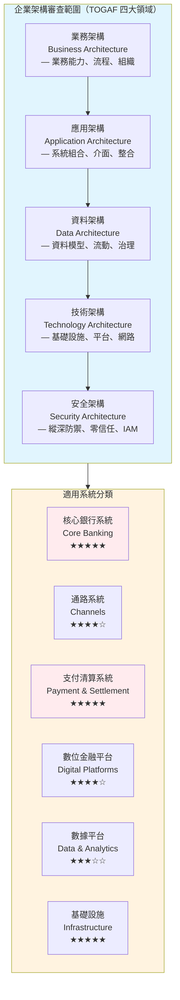

### 2.3 法規與標準對照矩陣

| 法規/標準 | 適用條文/版本 | 對應審查章節 | 驗證頻率 | 關鍵控制點 |
|:---|:---|:---|:---:|:---|
| **金管會「銀行資訊系統安全及防護基準」** | 第5條（系統發展安全）、第8條（存取控制）、第12條（業務連續性） | 第四章、第六章、第八章 | 年度 | 雙中心營運、日誌留存5年、存取控制 |
| **金融機構作業委外內部作業制度** | 第4條（委外風險評估）、第9條（資料安全） | 第五章、第七章、第九章 | 委外變更時 | SLA、資料駐留、稽核權利 |
| **個人資料保護法** | 第27條（安全維護措施）、第6條（特種資料保護） | 第六章（資料架構）、第七章 | 年度 | 資料分類、加密、去識別化 |
| **洗錢防制法** | 第7條（客戶審查資料保存） | 第六章（資料留存策略） | 年度 | 資料留存年限、軌跡追蹤 |
| **PCI DSS** | v4.0（Requirement 3: 保護儲存資料、Req 4: 傳輸加密） | 第六章、第七章 | 年度 | 欄位加密、TLS 1.3、HSM |
| **ISO 27001:2022** | A.8（技術安全控制措施）、A.5（組織控制） | 全文件 | 年度 | 資安政策、風險評估、存取控制 |
| **ISO 22301:2019** | 營運持續管理 | 第八章 | 年度 | BCP、RTO/RPO、演練紀錄 |
| **Basel III / BCBS 239** | 風險數據彙整與報告原則 | 第六章 | 半年度 | 資料品質、可追蹤性、時效性 |
| **金管會「金融科技發展與創新實驗條例」** | 創新實驗資安要求 | 第九章 | 實驗申請時 | 沙盒隔離、風險控管 |
| **SWIFT CSCF** | 客戶安全控制框架 | 第七章 | 年度 | 網路隔離、交易簽章、入侵偵測 |
| **金融機構資通安全管理辦法** | 第6條（安全監控）、第10條（通報機制）、第14條（資安演練） | 第十章、第九章 | 年度 | 資安事件通報、SOC/SIEM、紅隊演練 |
| **電子支付機構管理條例** | 第18條（資訊安全）、第22條（資料保護） | 第六章、第十章 | 年度 | 電子支付資安、儲值款項保障 |
| **資通安全管理法** | 第16條（通報義務）、第18條（稽核） | 第十章 | 年度 | 資安事件1小時內通報、年度稽核 |
| **金管會「金融業運用人工智慧(AI)核心原則與相關推動政策」** | AI 治理、模型風險管理、公平性 | 第十章（10.4 AI/ML治理） | 年度 | 模型可解釋性、偏差監控、人為監督 |
| **DORA（歐盟數位營運韌性法案）** | ICT風險管理、韌性測試、第三方風險（若有歐洲業務適用） | 第九章、第十一章 | 年度 | ICT事件管理、TLPT、集中風險 |

### 2.4 章程審查重點與文件章節對照表

下表對照「架構審查委員會章程」第五條審查重點，確保本文件完整覆蓋所有章程要求：

| 章程審查重點 | 章程條文 | 對應本文件章節 | 覆蓋狀態 | 備註 |
|:---|:---|:---|:---:|:---|
| **架構是否符合公司 IT 策略及長期藍圖** | 第五條第1項 | 第四章（架構願景與業務目標）、第五章（4+1視圖） | ✓ | 含目標能力矩陣與策略對齊 |
| **是否符合資訊安全及內外部法規要求** | 第五條第2項 | 第二章（§2.3法規矩陣）、第十章（資安架構）、第十一章（委外） | ✓ | 含法規對照矩陣 |
| **架構設計之可用性、效能、可擴充性與維護性** | 第五條第3項 | 第四章（§4.2目標能力）、第九章（§9.5可觀測性、§9.6效能容量規劃） | ✓ | 含SLO/SLI定義 |
| **成本效益及資源配置合理性** | 第五條第4項 | 第四-A章（成本效益與資源配置審查） | ✓ | 含TCO分析、授權模型 |
| **風險評估與因應措施之完整性** | 第五條第5項 | 第七章（§7.4介面風險）、第十章（§10.1縱深防禦）、第十三章（發現追蹤） | ✓ | 含風險熱點地圖 |
| **災難復原與持續營運計畫之可行性** | 第五條第6項 | 第六章（§6.3 BCP）、第九章（§9.4災備、§9.7混沌工程） | ✓ | 含RTO/RPO驗證與韌性測試 |

---

## 第三章：審查方法論與治理流程

### 3.1 審查架構方法論（TOGAF ADM + ISO/IEC/IEEE 42010）

本審查採用**TOGAF Architecture Development Method (ADM)** 為核心方法論，結合 **ISO/IEC/IEEE 42010** 架構描述標準，確保審查的系統性與可追溯性。

```mermaid
flowchart LR
    subgraph Phases["審查階段（Phases）"]
        direction TB
        P0["P0: 預備審查<br/>Preliminary<br/>— 審查範圍確認、團隊組建"]
        P1["P1: 架構願景<br/>Architecture Vision<br/>— 目標能力定義、差距分析"]
        P2["P2: 業務架構<br/>Business Architecture<br/>— 業務流程、能力映射"]
        P3["P3: 資訊系統架構<br/>IS Architecture<br/>— 應用+資料架構"]
        P4["P4: 技術架構<br/>Technology Architecture<br/>— 基礎設施、平台、安全"]
        P5["P5: 機會與解決方案<br/>Opportunities & Solutions<br/>— 風險評估、改善方案"]
        P6["P6: 移轉規劃<br/>Migration Planning<br/>— 路徑圖、資源配置"]
        P7["P7: 實作治理<br/>Implementation Governance<br/>— 開發監理、合規驗證"]
        P8["P8: 架構變更管理<br/>Change Management<br/>— 持續監控、變更控制"]
    end
    
    subgraph Inputs["輸入資料"]
        direction TB
        I1["現行架構文件<br/>As-Is Architecture"]
        I2["業務策略藍圖<br/>Business Strategy"]
        I3["監理要求清單<br/>Regulatory Requirements"]
        I4["風險評估報告<br/>Risk Assessment"]
        I5["技術債務清單<br/>Technical Debt"]
    end
    
    subgraph Outputs["輸出成果"]
        direction TB
        O1["架構差距分析<br/>Gap Analysis"]
        O2["風險熱點地圖<br/>Risk Heat Map"]
        O3["改善路徑圖<br/>Roadmap（Gantt）"]
        O4["合規聲明書<br/>Compliance Statement"]
        O5["審查發現清單<br/>Findings & Remediation"]
    end
    
    Inputs --> Phases --> Outputs
    
    style Phases fill:#e8f5e9
    style Inputs fill:#e3f2fd
    style Outputs fill:#fff3e0
```

### 3.2 審查治理流程（Governance Process）

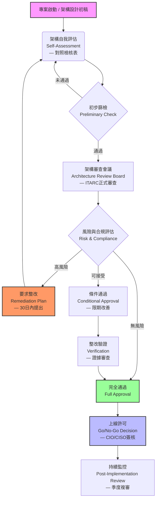

### 3.3 審查評分準則

| 評分等級 | 定義 | 量化標準 | 處理時限 | 升級機制 | 文件標示 |
|:---|:---|:---|:---:|:---|:---:|
| **符合（Compliant）** | 完全符合法規與內部標準，無須改善 | 風險評分 < 2，無控制缺口 | 無 | 無 | 🟢 |
| **輕微不符合（Minor）** | 存在輕微偏差，不影響整體安全或營運 | 風險評分 2–4，單一控制點偏差 | 90日內改善 | 追蹤至結案 | 🟡 |
| **重大不符合（Major）** | 存在重大風險缺口，可能影響安全或合規 | 風險評分 5–7，多個控制點失效或監理要求未達標 | 30日內提出計畫，180日內完成 | 呈報資訊安全長 | 🟠 |
| **嚴重不符合（Critical）** | 存在立即性風險，可能導致系統中斷或資料外洩 | 風險評分 8–10，墪破性影響或監理裁罰風險 | 立即處理，7日內提出計畫 | 呈報總經理/董事會 | 🔴 |

> **風險評分方法**：採用「影響度（Impact）1–5」×「可能性（Likelihood）1–2」矩陣，總分 1–10。此評分體系適用於本文件所有審查發現（§13.1）。

### 3.4 架構審查委員會（ITARC）運作機制

> **對齊依據**：本節依據「架構審查委員會章程」第三條至第四條訂定。

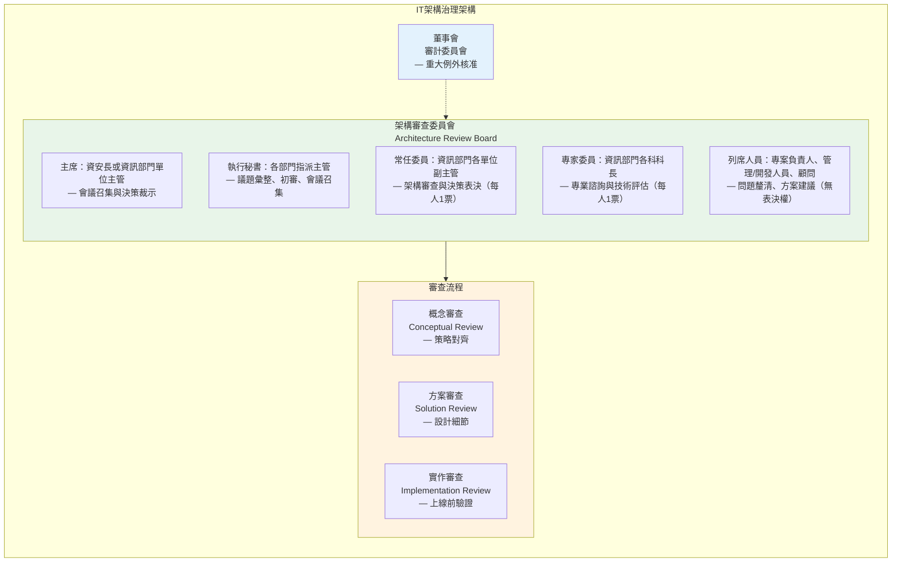

#### 委員會職掌

| 角色 | 職掌 | 權限 |
|:---|:---|:---|
| **主席** | 會議召集與決策裁示 | 最終裁決權 |
| **執行秘書** | 議題彙整、報告初審、會議通知（三日前發送）、邀請相關團隊 | 初審篩選權 |
| **常任委員** | 架構審查與表決、專業監督、標準政策維護、跨部門協調、合規確認 | 每人 1 票表決權 |
| **專家委員** | 專業諮詢建議、技術可行性評估、風險與合規檢視、顧問溝通協調 | 每人 1 票表決權 |
| **列席人員** | 問題釐清、方案建議、提供領域專業知識 | 無表決權 |

### 3.5 議決規則（依章程第九條）

| 項目 | 規定 |
|:---|:---|
| **出席門檻** | 三分之二（含）以上委員出席，會議方為有效 |
| **表決門檻** | 到席委員之四分之三（含）以上同意，議案方為通過 |
| **代理限制** | **不得代理**，委員須親自出席並行使表決權 |
| **表決權人** | 常任委員（每人 1 票）+ 專家委員（每人 1 票）|
| **利益迴避** | 與議案有直接利害關係之委員，應主動揭露並迴避表決 |

#### 決議分類

| 決議類型 | 定義 | 後續處理 |
|:---|:---|:---|
| **通過** | 架構方案符合所有審查標準 | 依計畫執行，進入實作階段 |
| **有條件通過** | 架構方案大致符合，但有待改善項目 | 須依決議改善事項補強後方可執行，由召集單位追蹤改善完成情形 |
| **不通過** | 存在重大缺失，架構方案需根本調整 | 須重新設計並再次提報審查 |

### 3.6 變更管理流程（Architecture Change Management）

#### 變更分級與處理

| 變更等級 | 定義 | 核准層級 | 評估要求 | 回滾要求 |
|:---|:---|:---:|:---|:---|
| **標準變更（Standard）** | 已預先核准之低風險變更（如修補更新、設定調整） | 變更經理 | 依標準作業程序執行 | 自動化回滾腳本 |
| **一般變更（Normal）** | 需評估影響之中風險變更（如功能更新、介面調整） | ITARC 執行秘書 | 變更影響評估（CIA）+ 回滾計畫 | 經驗證之回滾計畫 |
| **重大變更（Major）** | 影響核心系統或跨部門之高風險變更 | ITARC 正式審查 | 完整架構審查 + 壓力測試 + 安全評估 | 完整回滾演練 |
| **緊急變更（Emergency）** | 因資安事件或重大故障之緊急處置 | 主席緊急核准 | 事後補提變更影響評估與根因分析（30日內） | 即時回滾能力 |

#### 變更影響評估（Change Impact Assessment）

| 評估維度 | 評估內容 | 評估方法 |
|:---|:---|:---|
| **業務影響** | 受影響業務流程、使用者數量、交易量 | 業務衝擊分析（BIA） |
| **技術影響** | 相依系統、介面變更、資料異動 | 依賴關係矩陣分析 |
| **安全影響** | 新增攻擊面、存取控制變更、資料流變更 | 威脅建模（STRIDE） |
| **合規影響** | 法規要求變更、監理申報影響 | 法遵檢核清單 |
| **效能影響** | 回應時間、吞吐量、資源使用率 | 效能基線比對 |

#### 與 ITSM 整合

- 所有架構變更須於 **ServiceNow（或同級 ITSM 平台）** 建立變更單
- 變更紀錄與架構審查決議交叉連結，確保可追溯性
- 重大變更之回滾計畫須於變更實施前 **完成桌面演練（Tabletop Exercise）**
- 緊急變更事後須召開 **事後檢討會議（Post-Incident Review）**，30 日內完成根因分析報告

---

## 第四章：架構願景與業務目標（Architecture Vision）

### 4.1 銀行數位化戰略與目標能力

本架構旨在支撐：

* **全通路金融服務（Omni-channel）**：無縫整合實體分行、網銀、行動銀行、開放API
* **即時交易處理（Real-time）**：7×24小時不間斷服務，毫秒級回應
* **風險可控的開放金融生態**：Open Banking安全合規，第三方生態整合

### 4.2 目標能力矩陣

| 領域 | 目標指標 | 現況 | 差距 | 優先級 |
|:---|:---|:---:|:---:|:---:|
| **可用性（Availability）** | ≥ 99.99%（年度停機<52分鐘） | 99.95% | 0.04% | 高 |
| **安全性（Security）** | 零信任存取（Zero Trust）、零重大資安事件 | 部分實施 | 架構完整度 | 高 |
| **擴展性（Scalability）** | 水平彈性擴展、尖峰處理10,000 TPS | 5,000 TPS | 100% | 高 |
| **可觀測性（Observability）** | 全鏈路監控、<3分鐘故障定位 | 部分覆蓋 | 涵蓋率 | 中 |
| **復原力（Resilience）** | RTO ≤ 2小時、RPO ≤ 15分鐘 | RTO 4H | 50% | 高 |
| **合規性（Compliance）** | 100%監理要求符合、零重大不合規 | 95% | 5% | 高 |

### 4.3 核心系統定位（C4 Context Diagram）

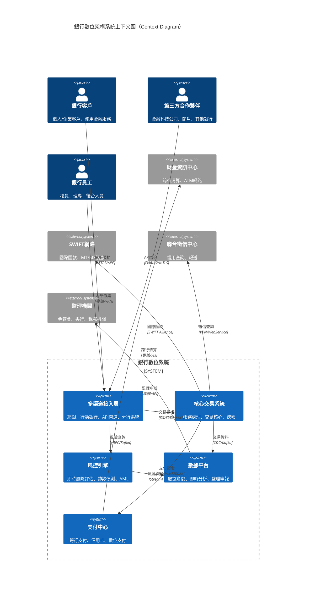

---

## 第四-A章：成本效益與資源配置審查（Cost-Benefit & Resource Allocation Review）

> **章程依據**：本章對應「架構審查委員會章程」第五條第 4 項「成本效益及資源配置合理性」。

### 4A.1 總擁有成本分析（Total Cost of Ownership, TCO）

| 成本項目 | 第1年（建置期） | 第2\~5年（營運期/年） | 5年TCO | 佔比 | 備註 |
|:---|---:|---:|---:|:---:|:---|
| **硬體/基礎設施** | [金額] | [金額] | [金額] | [%] | 含伺服器、網路設備、HSM、儲存 |
| **軟體授權** | [金額] | [金額] | [金額] | [%] | 含中介軟體、資料庫、監控工具 |
| **雲端服務費用** | [金額] | [金額] | [金額] | [%] | IaaS/PaaS/SaaS，含預估流量成長 |
| **系統開發/整合** | [金額] | [金額] | [金額] | [%] | 含內部人力與委外開發 |
| **維運人力** | [金額] | [金額] | [金額] | [%] | 含DBA、SRE、資安、監控 |
| **教育訓練** | [金額] | [金額] | [金額] | [%] | 含技術轉移、認證取得 |
| **災備/備援** | [金額] | [金額] | [金額] | [%] | 含異地備援中心、雲端DR |
| **合規/稽核** | [金額] | [金額] | [金額] | [%] | 含滲透測試、合規認證、外部稽核 |
| **技術債利息** | [金額] | [金額] | [金額] | [%] | 因延遲技術汰換所增加的維護成本 |
| **合計** | **[總額]** | **[總額]** | **[總額]** | **100%** | — |

### 4A.2 授權模式分析

| 技術組件 | 授權模式 | 單位成本 | 成長彈性 | 廠商鎖定風險 | 替代方案 | 建議 |
|:---|:---|---:|:---:|:---:|:---|:---|
| **資料庫（Oracle）** | Named User Plus / Processor | [金額] | 低（成本隨CPU線性成長） | 高 | PostgreSQL（開源） | 評估遷移至PostgreSQL |
| **容器平台（EKS）** | 按用量 | [金額]/節點/月 | 高（彈性擴縮） | 中 | AKS/GKE/OpenShift | 多雲策略降低鎖定 |
| **監控（Datadog/Splunk）** | 按資料量 | [金額]/GB/日 | 中（日誌量成長受控） | 中 | Prometheus+Grafana+Loki（開源） | 混合策略 |
| **SIEM（Splunk ES）** | 按資料量 | [金額]/GB/日 | 低（資安日誌持續成長） | 高 | Azure Sentinel | 評估雲原生替代 |

### 4A.3 投資報酬分析

| 評估指標 | 定義 | 目標值 | 計算方式 | 目前狀態 |
|:---|:---|:---:|:---|:---:|
| **投資報酬率（ROI）** | 架構投資之財務回報 | ≥ 150%（5年） | (淨效益 / 投資總額) × 100% | [待計算] |
| **投資回收期（Payback Period）** | 投資回本所需時間 | ≤ 3年 | 累積淨效益首次轉正之時間 | [待計算] |
| **淨現值（NPV）** | 折現後之專案淨價值 | > 0 | Σ(淨現金流 / (1+r)^n) | [待計算] |
| **單位交易成本** | 每筆交易之IT成本 | 逐年遞減 5% | 年度IT總成本 / 年度交易總數 | [待計算] |

### 4A.4 人力資源配置審查

| 技術領域 | 現有人力 | 需求人力 | 缺口 | 補強策略 | 優先級 |
|:---|:---:|:---:|:---:|:---|:---:|
| **雲端架構（Cloud Architect）** | [N] 人 | [N] 人 | [N] 人 | 內部培訓 + 認證取得（AWS SAP/Azure SA） | 高 |
| **資安工程（Security Engineer）** | [N] 人 | [N] 人 | [N] 人 | 外部招募 + CISSP/CEH 認證 | 高 |
| **資料工程（Data Engineer）** | [N] 人 | [N] 人 | [N] 人 | 內部轉型 + Spark/Kafka 培訓 | 中 |
| **SRE/DevOps** | [N] 人 | [N] 人 | [N] 人 | 外部招募 + K8s/Terraform 認證 | 高 |
| **AI/ML 工程師** | [N] 人 | [N] 人 | [N] 人 | 產學合作 + 外部招募 | 中 |
| **COBOL/大型主機** | [N] 人 | [N] 人 | — | 關鍵人才保留計畫 + 知識傳承文件化 | 高 |

---

## 第五章：4+1 架構視圖模型（4+1 Architectural View Model）

本節採用Philippe Kruchten的4+1視圖模型，結合C4模型層次，提供多維度架構描述。

### 5.1 邏輯視圖（Logical View）— 功能視角

**描述重點**：業務服務拆分、領域驅動設計（DDD）、交易流程抽象

#### 核心服務域（Domain Services）

| 服務域 | 職責範圍 | 關鍵實體 | 業務規則範例 |
|:---|:---|:---|:---|
| **客戶管理（Customer）** | KYC/CDD、客戶分級、偏好管理 | Customer, Account, KYCRecord | 高風險客戶需強化盡職調查 |
| **帳務管理（Account）** | 帳戶生命週期、餘額管理、凍結/解凍 | Account, LedgerEntry, Balance | 帳戶餘額不得為負（信用卡除外）|
| **支付清算（Payment）** | 轉帳、繳費、代收付、跨境支付 | PaymentOrder, SettlementBatch | 大額交易需雙人覆核 |
| **風險控制（Risk）** | 即時評分、規則引擎、黑名單 | RiskScore, RuleExecution, Alert | 風險分數>80自動攔截 |
| **通知服務（Notification）** | 推播、簡訊、Email、信件 | NotificationTemplate, DeliveryRecord | 交易通知需即時發送（<5秒）|
| **法遵申報（Compliance）** | AML、CRS、監理申報 | AMLReport, RegulatoryFiling | 大額交易需24小時內申報 |

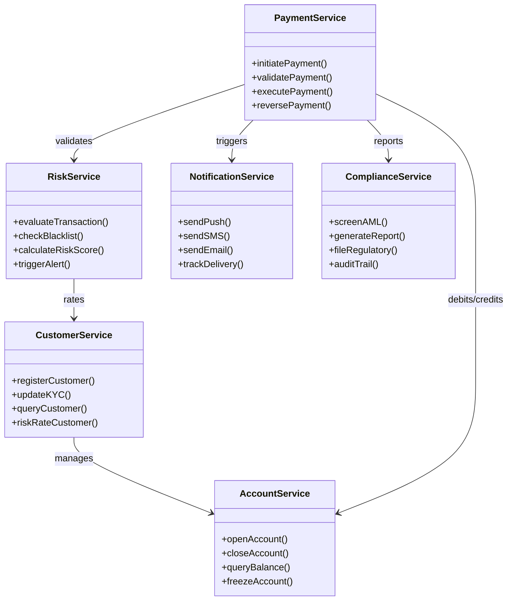

### 5.2 開發視圖（Development View）— 實作視角

**描述重點**：程式碼組織、技術堆疊、微服務治理、CI/CD流程

#### 微服務治理策略

| 治理領域 | 策略 | 工具/標準 | 負責團隊 |
|:---|:---|:---|:---|
| **服務拆分** | 領域驅動設計（DDD）、界限上下文 | Event Storming工作坊 | 架構師+業務分析師 |
| **API契約** | API First、OpenAPI 3.0規範 | Swagger/OpenAPI、Postman | 開發團隊 |
| **服務通訊** | 同步REST/gRPC + 非同步Kafka | Kong Gateway、Istio Service Mesh | 平台工程團隊 |
| **資料一致性** | Saga Pattern、最終一致性 | Temporal/Camunda（編排式）| 開發團隊 |
| **版本管理** | 語意化版本（SemVer）、向後相容 | GitFlow、API版本控制策略 | 開發團隊 |
| **品質閘道** | 單元測試>80%、整合測試、SAST/DAST | SonarQube、Checkmarx、OWASP ZAP | QA/資安團隊 |

#### 技術堆疊建議（Technology Stack）

> **生命週期說明**：欄位「生命週期狀態」反映截至本文件編寫時（2026 Q1）的狀態。審查人員應參照原廠官方路線圖、CVE 資料庫及 §9.2 技術標準表（含 EOS 日期與已知漏洞）確認最新狀態。

| 層級 | 標準技術 | 替代方案 | 生命週期狀態 | EOS/EOL 風雚與安全注意事項 |
|:---|:---|:---|:---:|:---|
| **前端展示** | React/Vue.js (Web)、React Native/Flutter (Mobile) | Angular | 活躍開發 | npm 依賴供應鏈風雚高，要求定期 SCA 掃描（Snyk/Dependabot） |
| **API閘道** | Kong Enterprise / AWS API Gateway | Apigee、Azure APIM | 生產級 | Kong 定期修補；需注意速率限制、JWT 驗證配置安全 |
| **身分認證** | Keycloak / Auth0 / AWS Cognito | Ping Identity | 生產級 | Keycloak 需追蹤 Red Hat 支援狀態；Okta/Auth0 注意 2023 年支援系統外洩類似事件 |
| **服務網格** | Istio / Linkerd | Consul Connect | 試行/採用 | K8s 版本相容性、mTLS 憑證輪換策略需維護 |
| **容器平台** | Kubernetes (EKS/AKS/GKE) | OpenShift、Rancher | 生產級 | 各版支援僅14個月，N-2政策；runc 逃逸漏洞 (CVE-2024-21626) 需持續修補 |
| **服務框架** | Spring Boot 3.x (Java)、FastAPI (Python) | Quarkus、Node.js | 生產級 | Spring Boot 3.x 需 Java 17+（LTS 至 2029）；Log4j/Spring4Shell 配置確認 |
| **訊息佇列** | Apache Kafka / AWS MSK | RabbitMQ、Pulsar | 生產級 | 無明確 EOL（社群支援）；確保 SASL/ACL 正確配置 |
| **快取層** | Redis Cluster / AWS ElastiCache | Memcached、Hazelcast | 生產級 | Redis 基金會與 Redis Ltd. 掌版分裂，注意授權變動；設定需禁用危雚指令 |
| **交易資料庫** | PostgreSQL 15+ / Oracle 19c | DB2、SQL Server | 生產級 | ☢ **Oracle 19c EOS: 2027-04**，優先評估遷移；PG 15 EOL: 2027-11 |
| **分析資料庫** | Snowflake / BigQuery / Redshift | Teradata、ClickHouse | 生產級 | SaaS 模式無 EOS 問題，但需注意資料駐留與廠商鎖定 |
| **時序資料** | InfluxDB / TimescaleDB | Prometheus (監控用) | 生產級 | InfluxDB 3.x 架構重大變更，評估相容性 |
| **搜尋引擎** | Elasticsearch / OpenSearch | Solr | 生產級 | Elastic 授權變更（SSPL），推薦 OpenSearch（Apache 2.0）避免許可證風雚 |
| **監控可觀測** | Prometheus + Grafana + Jaeger + ELK | Datadog、New Relic | 生產級 | Prometheus TSDB 儲存限制，需 Thanos/Cortex 長期儲存方案 |
| **CI/CD** | GitLab CI / GitHub Actions / Jenkins | ArgoCD (GitOps) | 生產級 | Jenkins LTS 定期更新；插件供應鏈風雚需 SCA 掃描 |
| **IaC** | Terraform / Pulumi | CloudFormation、ARM | 生產級 | Terraform BSL 授權變更，評估 OpenTofu fork 作為替代 |

### 5.3 物理視圖（Physical View）— 部署視角

**描述重點**：部署拓撲、網路分區、硬體配置、多中心策略

#### 部署模式：Active-Active 雙活架構

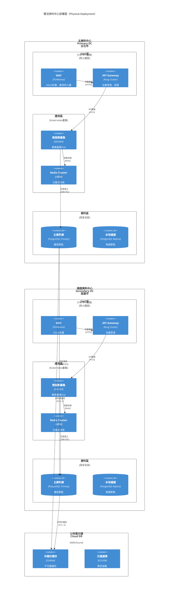

#### 網路安全分區（Security Zoning）

| 區域 | 功能描述 | 安全等級 | 網路隔離 | 存取控制 |
|:---|:---|:---:|:---:|:---|
| **網際網路邊界（Internet DMZ）** | 對外服務、WAF、DNS、DDoS防護 | 高 | 物理隔離 | 僅開放80/443，雙向TLS |
| **通路區（Channel Zone）** | 網銀、行銀、API閘道、開放銀行 | 極高 | VLAN隔離 | MFA、速率限制、Bot管理 |
| **應用區（Application Zone）** | 微服務、容器叢集、業務邏輯 | 高 | 微分段 | 服務網格mTLS、RBAC |
| **資料區（Data Zone）** | 資料庫、快取、訊息佇列 | 極高 | 物理/邏輯隔離 | 資料庫防火牆、欄位加密 |
| **核心區（Core Zone）** | 核心帳務、支付清算、總帳 | 最高 | 專屬網段、實體隔離 | 特權存取管理（PAM）、全程側錄 |
| **管理區（Management Zone）** | 跳板機、監控、備份、維運 | 高 | 獨立網段 | 堡壘機、多因素認證、IP限制 |
| **開發測試區（Dev/Test Zone）** | 開發、測試、UAT環境 | 中 | 與生產邏輯隔離 | 與生產資料脫敏隔離 |

### 5.4 進程視圖（Process View）— 執行視角

**描述重點**：執行時行為、並行處理、交易流程、效能瓶頸

#### 關鍵交易序列圖（跨行轉帳範例）

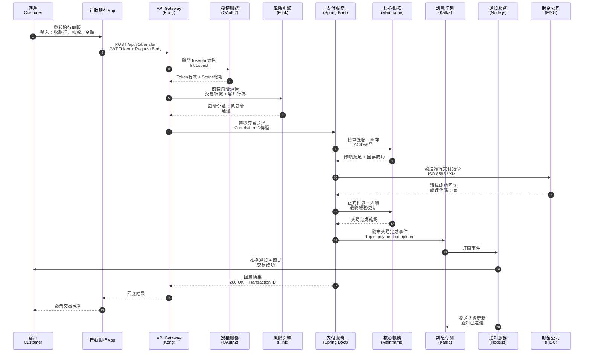

#### 事件驅動架構（Event-Driven Architecture）

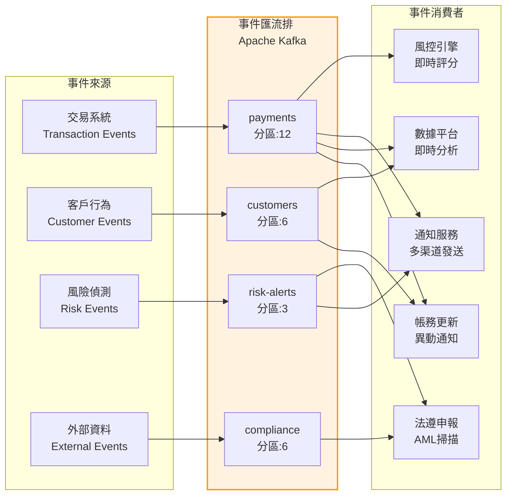

### 5.5 場景視圖（Scenario View）— 用例視角

**描述重點**：關鍵業務場景、使用者故事、驗收標準

| 場景編號 | 場景名稱 | 參與者 | 關鍵成功因素 | 非功能需求 |
|:---|:---|:---|:---|:---|
| UC-001 | 網銀跨行轉帳 | 個人客戶 | 即時到帳、7×24可用、風險可控 | 回應<3秒、可用率99.99% |
| UC-002 | 大額企業支付 | 企業客戶 | 雙人覆核、軌跡完整、即時到帳 | 支援單筆5億、審計追蹤 |
| UC-003 | 開放銀行帳戶查詢 | 第三方TSP | OAuth2授權、資料最小化、速率限制 | API回應<500ms、Quota管理 |
| UC-004 | 即時風險攔截 | 風控系統 | 低誤報率、即時決策、可追溯 | 評分<100ms、日誌完整 |
| UC-005 | 監理申報自動化 | 法遵單位 | 資料正確、準時申報、可稽核 | T+1日產出、資料品質>99% |
| UC-006 | 災難復原切換 | 維運團隊 | RTO達標、資料零遺失、業務無感知 | RTO<2H、RPO<15min |

---

## 第六章：業務架構審查（Business Architecture Review）

### 6.1 業務能力映射（Business Capability Mapping）

| 業務領域 | 關鍵業務能力 | 支援系統/應用 | 架構成熟度 | 風險評級 | 改善建議 |
|:---|:---|:---|:---:|:---:|:---|
| 客戶管理 | 客戶資料管理（KYC/CDD）、身分驗證、分級管理 | CRM、核心系統客戶主檔、MDM | ⭐⭐⭐⭐☆ | 中 | 強化MDM覆蓋率至100% |
| 存款業務 | 活存/定存/支票存款處理、利息計算 | 核心銀行系統 | ⭐⭐⭐⭐⭐ | 低 | 持續優化 |
| 放款業務 | 徵審、撥貸、催收、債權管理、擔保品管理 | 授信系統、催收系統、估價系統 | ⭐⭐⭐⭐☆ | 高 | 強化與外部徵信即時整合 |
| 財富管理 | 投資組合管理、信託作業、基金申購贖回 | 信託系統、基金平台、證券交割 | ⭐⭐⭐☆☆ | 高 | 建置統一財富管理平台 |
| 支付清算 | 跨行轉帳、票據交換、信用卡清算、數位支付 | 支付中心、票據系統、卡系統 | ⭐⭐⭐⭐⭐ | 高 | 導入ISO 20022訊息標準 |
| 數位金融 | 行動銀行、網銀、開放銀行API、數位帳戶 | 數位平台、API閘道、TSP平台 | ⭐⭐⭐⭐☆ | 高 | 強化API安全與監控 |
| 風險管理 | 信用風險、市場風險、作業風險、流動性風險 | 風險資料倉儲、ALM、壓力測試平台 | ⭐⭐⭐⭐☆ | 中 | 符合BCBS 239資料品質要求 |
| 法遵與稽核 | 洗錢防制、內部稽核、監理申報、資訊透明 | 法遵系統、稽核系統、申報平台 | ⭐⭐⭐⭐☆ | 中 | 自動化申報比例提升至90% |
| 財務會計 | 總帳、分類帳、財務報表、成本分析 | 總帳系統、財報系統、管理會計 | ⭐⭐⭐⭐⭐ | 低 | 持續優化 |

### 6.2 業務流程與IT支援對應審查

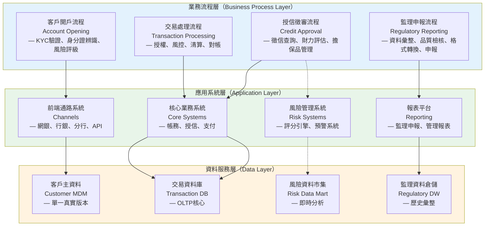

### 6.3 業務連續性要求審查（BCP Requirements）

| 業務功能 | 復原時間目標（RTO） | 復原點目標（RPO） | 目前架構支援度 | 差距分析 | 改善計畫 |
|:---|:---:|:---:|:---:|:---:|:---|
| 櫃檯交易服務 | ≤ 4小時 | ≤ 1小時 | ✓ 符合 | 無 | — |
| ATM/刷卡服務 | ≤ 2小時 | ≤ 30分鐘 | ⚠ 部分符合 | 備援機制需強化 | Q2強化異地備援 |
| 網路/行動銀行 | ≤ 4小時 | ≤ 1小時 | ✓ 符合 | 無 | — |
| 大額支付系統 | ≤ 1小時 | ≤ 15分鐘 | ✗ 不符合 | 需建置雙活架構 | Q3完成雙活部署 |
| 信託投資交易 | ≤ 8小時 | ≤ 4小時 | ✓ 符合 | 無 | — |
| 開放銀行API | ≤ 2小時 | ≤ 30分鐘 | ⚠ 部分符合 | 雲端多區部署 | Q2完成AWS多區 |

---

## 第七章：應用架構審查（Application Architecture Review）

### 7.1 應用系統組合盤點（Application Portfolio Inventory）

| 系統編號 | 系統名稱 | 系統類型 | 關鍵性等級 | 技術平台 | 維護狀態 | 汰換計畫 | 風險評級 |
|:---|:---|:---:|:---:|:---|:---:|:---:|
| APP-001 | 核心銀行系統 | 套裝軟體（Temenos T24/Infosys Finacle） | 關鍵（Critical） | Mainframe/開放平台 | 原廠支援中 | 20XX年評估雲端化 | 中 |
| APP-002 | 授信管理系統 | 套裝+客製（內部開發+委外） | 關鍵 | Java EE/Oracle/WebLogic | 原廠支援中 | 無 | 中 |
| APP-003 | 數位銀行平台 | 自建微服務 | 高 | Kubernetes/Spring Boot/PostgreSQL | 持續開發 | 持續迭代 | 高 |
| APP-004 | 資料倉儲 | 套裝（Snowflake/Teradata） | 高 | MPP資料庫/雲端 | 原廠支援中 | 評估雲端原生 | 中 |
| APP-005 | 支付中心 | 混合（套裝核心+自建閘道） | 關鍵 | Java/Kafka/Oracle | 持續優化 | ISO 20022升級 | 高 |
| APP-006 | 風險資料平台 | 自建+開源 | 高 | Hadoop/Spark/Python | 持續開發 | 遷移至雲端 | 中 |
| APP-007 | 舊版網路銀行 | 客製遺留系統（Legacy） | 中 | ASP.NET/Windows Server 2012 | 僅維護不開發 | 20XX年功能移轉後汰除 | 高 |
| APP-008 | 報表平台 | 套裝（Tableau/PowerBI） | 中 | 雲端SaaS | 原廠支援中 | 無 | 低 |

### 7.2 應用架構原則符合性檢核

| 架構原則 | 原則描述 | 檢核項目 | 符合度 | 佐證文件 | 改善建議 |
|:---|:---|:---|:---:|:---|:---|
| **模組化與鬆散耦合** | 系統間應透過標準介面整合，降低相依性 | API標準化程度、服務間依賴關係、直接DB連結數量 | 75% | API目錄、依賴矩陣圖 | 建立API治理機制，導入服務網格（Service Mesh），移除剩餘15個直接DB連結 |
| **單一資料來源（SSOT）** | 關鍵資料實體應有明確主系統 | 客戶主資料、產品主資料、帳戶主資料管理 | 85% | MDM系統架構圖 | 強化MDM系統覆蓋率至100%，整合剩餘5個孤島系統 |
| **分層架構** | 清楚區分展示層、應用層、資料層 | 層間依賴關係、直接資料庫存取情況、跨層呼叫 | 60% | 分層架構規範 | 移除繞過應用層的直接DB連結，強化分層治理 |
| **高可用設計** | 關鍵系統應具備容錯與自動故障轉移 | 負載平衡、叢集配置、健康檢查、熔斷機制 | 80% | HA架構設計文件 | 強化非關鍵路徑的熔斷機制，導入混沌工程測試 |
| **資安內建（Security by Design）** | 安全控制內建於應用架構 | 身分驗證、授權、稽核日誌、輸入驗證、機密管理 | 70% | 安全編碼規範、SDL流程 | 導入零信任架構（ZTA），實施DevSecOps自動化安全掃描 |
| **雲端原生就緒** | 應用程式具備容器化、無狀態、可觀測特性 | 容器化比例、狀態外置、健康檢查端點、指標暴露 | 65% | K8s部署清單 | 推動剩餘35%應用容器化，導入Service Mesh |

### 7.3 系統整合架構審查（C4 Container Diagram）

```mermaid
C4Container
    title 應用系統整合架構圖（Container Diagram）
    
    Person(customer, "銀行客戶", "使用網銀App或Web進行交易")
    Person(tsp, "第三方服務提供者", "TSP、金融科技公司")
    
    System_Boundary(digital_platform, "數位銀行平台") {
        Container(mobile_app, "行動網銀App", "React Native", "iOS/Android應用")
        Container(web_app, "網路銀行Web", "React/Angular", "響應式網頁應用")
        
        Container(api_gateway, "API Gateway", "Kong Enterprise", "統一API入口，負責驗證、流量管理、速率限制")
        Container(waf, "WAF", "AWS WAF/Akamai", "DDoS防護、Bot管理")
        
        Container(auth_svc, "授權服務", "Java Spring Boot", "OAuth2/OIDC、MFA、Token管理")
        Container(customer_svc, "客戶服務", "Java Spring Boot", "客戶資料、KYC、偏好管理")
        Container(account_svc, "帳戶服務", "Java Spring Boot", "帳戶查詢、餘額、交易歷史")
        Container(payment_svc, "支付服務", "Java Spring Boot", "核心支付邏輯：轉帳、繳費、代收代付")
        Container(settlement_svc, "清算服務", "Java Spring Boot", "跨行清算與結算處理")
        Container(risk_svc, "風險偵測服務", "Python/Flink", "即時風控規則引擎與異常偵測")
        Container(notification_svc, "通知服務", "Node.js", "推播、簡訊、Email通知")
        Container(compliance_svc, "法遵服務", "Java Spring Boot", "AML掃描、申報資料產生")
        
        ContainerDb(customer_db, "客戶資料庫", "PostgreSQL", "客戶主資料、KYC記錄")
        ContainerDb(account_db, "帳戶資料庫", "PostgreSQL", "帳戶資料、餘額、狀態")
        ContainerDb(payment_db, "支付資料庫", "PostgreSQL", "交易記錄、支付狀態")
        ContainerDb(risk_db, "風險資料庫", "MongoDB", "風險事件、模型特徵")
        ContainerDb(redis_cache, "快取資料庫", "Redis Cluster", "Session快取、效能優化、速率限制計數")
        ContainerDb(timeseries_db, "時序資料庫", "InfluxDB", "效能監控指標、業務指標")
        
        ContainerQueue(kafka, "事件匯流排", "Apache Kafka", "非同步訊息處理、事件驅動、稽核軌跡")
    }
    
    System_Ext(core_banking, "核心帳務系統", "Temenos T24/Mainframe", "帳務最終確認、總帳")
    System_Ext(iam_system, "企業IAM", "Azure AD/ADFS", "員工認證、SSO")
    System_Ext(fisc, "財金公司", "FISC Network", "跨行清算、ATM網路")
    System_Ext(card_network, "卡組織", "Visa/Master/JCB", "信用卡交易處理")
    System_Ext(credit_bureau, "聯合徵信中心", "JCIC", "信用查詢")
    
    Rel(customer, mobile_app, "使用", "HTTPS/TLS 1.3")
    Rel(customer, web_app, "使用", "HTTPS/TLS 1.3")
    Rel(tsp, waf, "API呼叫", "mTLS/OAuth2")
    
    Rel(mobile_app, api_gateway, "呼叫API", "REST/HTTPS/JWT")
    Rel(web_app, api_gateway, "呼叫API", "REST/HTTPS/JWT")
    
    Rel(api_gateway, waf, "流量檢查", "")
    Rel(waf, auth_svc, "認證請求", "REST")
    Rel(api_gateway, customer_svc, "客戶相關", "REST")
    Rel(api_gateway, account_svc, "帳戶相關", "REST")
    Rel(api_gateway, payment_svc, "支付請求", "REST")
    
    Rel(auth_svc, iam_system, "驗證企業帳號", "LDAP/SAML")
    Rel(auth_svc, redis_cache, "Token儲存", "Redis")
    
    Rel(payment_svc, risk_svc, "風險評估", "gRPC < 100ms")
    Rel(payment_svc, settlement_svc, "清算處理", "REST/Kafka")
    Rel(payment_svc, kafka, "發布事件", "Avro格式")
    
    Rel(customer_svc, customer_db, "讀寫", "JDBC/SSL")
    Rel(account_svc, account_db, "讀寫", "JDBC/SSL")
    Rel(account_svc, redis_cache, "快取", "Redis")
    Rel(payment_svc, payment_db, "讀寫", "JDBC/SSL")
    Rel(risk_svc, risk_db, "讀寫", "MongoDB協定")
    
    Rel(settlement_svc, core_banking, "帳務請求", "MQ/ISO8583")
    Rel(settlement_svc, fisc, "跨行清算", "專線/FIX")
    Rel(payment_svc, card_network, "信用卡交易", "ISO8583")
    Rel(customer_svc, credit_bureau, "信用查詢", "VPN/WebService")
    
    Rel(kafka, notification_svc, "消費事件", "Consumer Group")
    Rel(kafka, compliance_svc, "消費事件", "Consumer Group")
    Rel(kafka, timeseries_db, "寫入指標", "")
    
    UpdateLayoutConfig($c4ShapeInRow="3", $c4BoundaryInRow="1")
```

### 7.4 介面與整合風險評估

| 介面編號 | 來源系統 | 目標系統 | 傳輸方式 | 頻率 | 關鍵性 | 風險評級 | 控制措施 | 狀態 |
|:---|:---|:---|:---:|:---:|:---:|:---:|:---|:---:|
| INT-001 | 核心系統 | 總帳系統 | 批次檔案（加密） | 日終 | 高 | 中 | 檔案加密（AES-256）、簽章驗證、雙重確認機制 | ✓ |
| INT-002 | 行動銀行 | 核心系統 | 即時API（REST） | 即時 | 關鍵 | 高 | API閘道（Kong）、速率限制（1000req/s）、斷路器（Hystrix）、mTLS | ✓ |
| INT-003 | 外部票交 | 票據系統 | MQ訊息（IBM MQ） | 即時 | 高 | 中 | 訊息加密（TLS）、交易追蹤（Correlation ID）、重送機制、冪等性設計 | ✓ |
| INT-004 | 徵信中心 | 授信系統 | Web Service（SOAP） | 即時 | 高 | 高 | 雙向TLS、IP限制、連線逾時控制（5秒）、備援線路 | ⚠ |
| INT-005 | 舊版報表系統 | 資料倉儲 | 直接DB連結（JDBC） | 批次 | 中 | **高** | **需移除直接連結，改以API介接或CDC模式** — 計畫Q2完成 | 🔴 |
| INT-006 | 支付閘道 | 卡組織 | ISO 8583 | 即時 | 關鍵 | 高 | 專線備援、HSM簽章、端到端加密、3DES/AES | ✓ |
| INT-007 | 開放銀行API | 第三方TSP | REST API（OAuth2） | 即時 | 高 | 高 | OAuth2 + PKCE、速率限制、範圍控制（Scope）、FAPI標準 | ✓ |

### 7.5 開放銀行與 Open Finance 架構審查

#### 開放銀行階段性演進

| 階段 | 範圍 | 現況 | 目標時程 | 架構要求 |
|:---|:---|:---:|:---:|:---|
| **Phase 1：Open Data** | 產品資訊、網點資訊、匯率等公開資料 | 已完成 | — | REST API + API 目錄服務 |
| **Phase 2：Open Payment** | 轉帳、繳費、支付等交易功能 | 實施中 | 20XX-Q2 | FAPI 合規、強認證（SCA）、交易簽章 |
| **Phase 3：Open Finance** | 投資、保險、貸款等跨業資料共享 | 規劃中 | 20XX+ | 去中心化身分驗證、Consent Hub、跨業標準 |

#### TSP 合作廠商兆入評估標準

| 評估面向 | 評估項目 | 最低要求 | 驗證方法 |
|:---|:---|:---|:---|
| **資安能力** | 滲透測試報告、SOC 2 Type II | 最近 12 個月內有效報告 | 書面審查 + 技術評估 |
| **資料保護** | GDPR/個資法合規證明 | 隱私政策、DPO 指定 | 書面審查 |
| **API 規格** | OpenAPI 3.0+、FAPI 合規 | 提供 API 規格文件、Sandbox 環境 | 技術測試 |
| **營運穩定** | 公司資本、營運歷史、BCP | 資本額 [N] 萬以上、營運超過 2 年 | 賬調報告 + BCP 審查 |
| **保險覆蓋** | 專業責任險、資安保險 | 最低保額 [N] 萬 | 保單審查 |

#### 客戶同意機制架構（Consent Management）

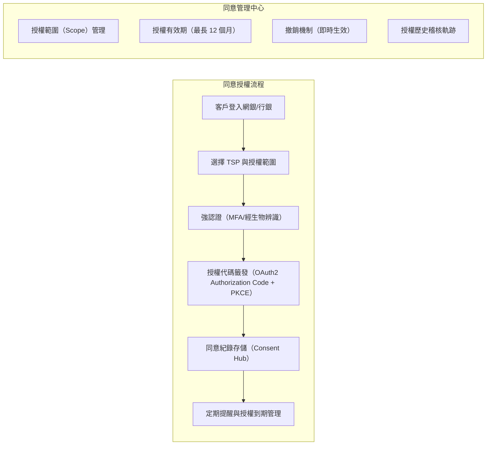

#### FAPI 合規性驗證清單

| 檢查項目 | FAPI 1.0 要求 | 現況 | 合規 | 改善計畫 |
|:---|:---|:---:|:---:|:---|
| **認證流程** | OAuth 2.0 Authorization Code + PKCE | 已實作 | ✓ | — |
| **客戶端認證** | private_key_jwt 或 tls_client_auth | 部分實作 | ⚠ | Q2 完成全面導入 |
| **簽章機制** | 請求/回應 JWS 簽章（PS256） | 已實作 | ✓ | — |
| **MTLS 綁定** | Certificate-Bound Access Token | 開發中 | ✖ | Q3 上線 |
| **許可範圍控制** | 細粒度 Scope（帳戶/交易/信用） | 已實作 | ✓ | — |
| **ID Token 驗證** | c_hash、s_hash、at_hash 必要欄位 | 已實作 | ✓ | — |
| **請求物件** | Request Object (JAR) 強制使用 | 未實作 | ✖ | Q3 開始導入 |

---

## 第八章：資料架構審查（Data Architecture Review）

### 8.1 資料域（Data Domain）分類與所有權

| 資料域 | 資料所有者 | 資料管理者 | 儲存位置 | 保留政策 | 分類等級 | 保護措施 |
|:---|:---|:---|:---|:---|:---:|:---|
| **客戶主資料（Customer MDM）** | 客戶資料管理處 | 資訊處 | PostgreSQL（主）、Redis（快取） | 客戶關係存續期間+7年 | 機密 | TDE加密、欄位級加密（PII）、動態資料遮罩 |
| **帳戶與交易資料（Transaction）** | 各業務單位 | 資訊處 | PostgreSQL（分區表） | 依法規要求（通常10年） | 機密 | TDE加密、WORM儲存、不可變備份 |
| **信用與風險資料（Credit/Risk）** | 風險管理處 | 資訊處 | MongoDB（風險特徵）、Snowflake（風險倉儲） | 授信合約期間+7年 | 機密 | 欄位加密、存取稽核、差分隱私 |
| **個人敏感資料（特種）** | 法遵處 | 資訊處 | 加密隔離儲存（HSM保護） | 特種資料特別管理 | **高度機密** | AES-256應用層加密、HSM金鑰管理、雙人控制 |
| **日誌與稽核軌跡（Audit Trail）** | 資訊安全處 | 資訊處 | Elasticsearch（熱）、S3 Glacier（冷） | 至少5年（法遵系統7年） | 內部 | WORM、雜湊驗證、防竄改 |
| **分析與模型資料（Analytics）** | 數據分析處 | 資訊處 | Snowflake（倉儲）、S3（資料湖） | 依專案需求，通常3年 | 內部/機密 | 去識別化、k-匿名化、使用政策控制 |

### 8.2 資料流與生命週期架構

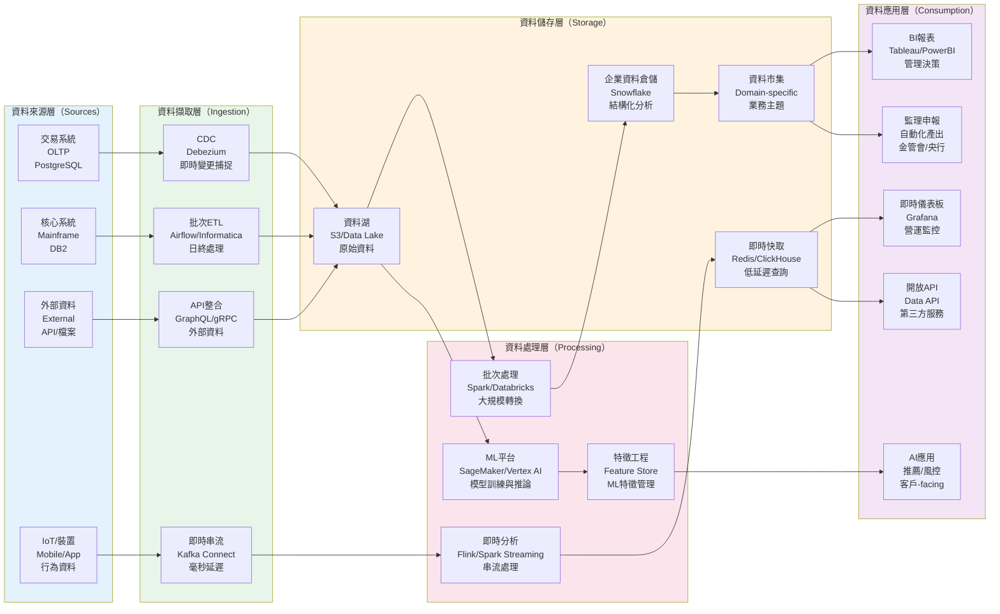

### 8.3 資料治理與品質檢核

| 檢核項目 | 檢核標準 | 目前狀態 | 差距 | 優先級 | 改善計畫 |
|:---|:---|:---:|:---:|:---:|:---|
| 資料字典與詮釋資料管理 | 100%關鍵資料元素具備詮釋資料（Metadata） | 70% | 30% | 高 | Q2導入Data Catalog（Alation/Collibra），完成剩餘30% |
| 資料品質規則自動化 | 關鍵資料域導入DQM自動監控 | 40% | 60% | 高 | Q3部署Great Expectations，覆蓋核心交易資料 |
| 個資盤點與影響評估（PIA） | 100%個資蒐集點完成PIA | 85% | 15% | 中 | Q2完成剩餘15%高風險流程 |
| 資料留存與銷毀自動化 | 依法規自動執行留存與銷毀 | 50% | 50% | 高 | Q4導入ILM（資訊生命週期管理）自動化 |
| 資料隱私強化技術（PETs） | 導入去識別化、差分隱私、同態加密 | 20% | 80% | 中 | 20XX年試行差分隱私，評估同態加密應用 |
| 資料資產目錄 | 企業級Data Catalog建置 | 60% | 40% | 中 | Q3完成資料血緣（Data Lineage）自動化 |
| 主資料管理（MDM）覆蓋率 | 客戶、產品、帳戶、員工100%覆蓋 | 85% | 15% | 高 | Q2整合剩餘5個孤島系統 |

### 8.4 監理申報資料架構（BCBS 239對應）

| 申報項目 | 資料來源系統 | 資料品質維度 | 自動化程度 | 稽核軌跡 | 符合BCBS 239原則 |
|:---|:---|:---:|:---:|:---:|:---:|
| **資本適足率申報** | 風險資料倉儲、總帳 | 完整性、正確性、時效性 | 80% | 完整 | ✓ 原則1-7 |
| **大額曝險申報** | 授信系統、風險系統 | 完整性、一致性 | 90% | 完整 | ✓ 原則1-7 |
| **流動性覆蓋比率（LCR）** | ALM系統、交易系統 | 時效性、可追蹤性 | 75% | 部分需強化 | ⚠ 原則3（時效性）|
| **槓桿比率** | 總帳、風險系統 | 正確性、完整性 | 85% | 完整 | ✓ 原則1-7 |
| **壓力測試資料** | 各業務系統、外部資料 | 完整性、正確性 | 60% | 需強化 | ⚠ 原則5（完整性）|
| **交易對手信用風險** | 衍生商品系統、風險系統 | 完整性、可追蹤性 | 70% | 完整 | ✓ 原則1-7 |

---

## 第九章：技術架構審查（Technology Architecture Review）

> **背景**：技術架構是支撑金融服務的基石，然而技術組件的生命週期管理不當已成為金融業最大的潛在風雚之一。根據 Gartner 2025 報告，超過 40% 的金融機構仍在營運中使用至少一個已過 EOS 的關鍵組件。本章針對雲端佈局、技術平台生命週期、網路架構、災備構架、可觀測性與效能容量進行系統性審查。
>
> **雲端採用風雚提醒**：金融業雲端採用率持續提升，但隨之而來的風雚包括：雲端設定錯誤導致的資料暴露（佔告洩事件 45%）、雲地混合架構的安全管理複雜度、以及廠商鎖定風雚。本節以混合雲策略為基礎，同時考量台灣監理對雲端委外的特殊要求。

### 9.1 基礎設施雲端策略與佈局

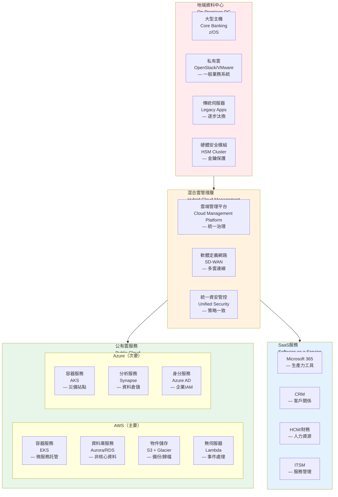

### 9.2 技術標準與平台生命週期管理

> **審查重點**：本節是架構審查中最需定期更新的部分。審查人員應對照各原廠官方生命週期頁面，確認每個組件的實際 EOS/EOL 日期。任何進入「延伸支援」或「EOS」狀態的組件，均應獲得 ITARC 級別的風雚接受或遷移決策。

| 技術類別 | 標準平台 | 版本 | 生命週期狀態 | EOS/EOL 日期 | 汰換時程 | 風險評級 | 已知重大漏洞/風雚 | 備註 |
|:---|:---|:---|:---:|:---:|:---:|:---:|:---|:---|
| **作業系統（伺服器）** | RHEL 8.x | 8.8 | 主流支援 | 主流: 2029-05、延伸: 2032-05 | 202X年評估升級至 RHEL 9 | 低 | CVE 月度修補已自動化，無重大未修漏洞 | RHEL 9 LTS 支援至 2032 |
| **作業系統（伺服器）** | Windows Server | 2022 | 主流支援 | 主流: 2026-10、延伸: 2031-10 | 規劃升級至 2025 | 低 | 每月 Patch Tuesday 管理，AD 提權風雚需持續關注 | Win 2019 延伸支援到 2029-01 |
| **資料庫管理系統** | PostgreSQL 15+ | 15.x | 主流支援 | EOL: 2027-11 | 依原廠路線圖，規劃升 PG 16/17 | 低 | CVE-2024-10979（PL/Perl 環境變數操作）已修補 | PG 16 支援至 2028-11 |
| **資料庫管理系統** | Oracle 19c | 19.20+ | **延伸支援** | ☢ **EOS: 2027-04** | ❗ 僅剩 ~1 年，優先評估遷移至 Oracle 23ai 或 PostgreSQL | **高** | CPU 季度修補 100+ CVE，延伸支援需額外付費 | Oracle 23ai LTS 已 GA，支援至 2031 |
| **容器平台** | Kubernetes（EKS/AKS） | 1.28+ | 活躍開發 | 各版本支援僅 ~14 個月 | 持續更新（N-2政策） | 低 | CVE-2024-21626（runc 容器逃逸，CVSS 8.6）已修補，需確保 runtime 持續更新 | 版本更新這度快，需自動化管理 |
| **訊息佇列** | Apache Kafka / AWS MSK | 3.6.x | 主流支援 | 無明確 EOL（社群支援） | 無 | 低 | 近年無重大 CVE，但需注意 ACL 設定與認證配置 | MSK 由 AWS 管理修補 |
| **應用伺服器** | WebLogic 14c | 14.1.1 | 主流支援 | Premier: 2029-03 | 評估遷移至雲原生（Quarkus） | 中 | Oracle CPU 季度修補，WebLogic 反序列化漏洞歷史頻繁（CVE-2023-21839 等） | 僅遺留系統使用 |
| **應用伺服器** | JBoss EAP 7 | 7.4 | **延伸支援** | ☢ **EOS: 2027-06** | ❗ 規劃遷移至 JBoss EAP 8 或 Quarkus | **高** | 逼近 EOS，Log4j 相關修補已完成但新漏洞可能不再修補 | EAP 8 已 GA，建議優先遷移 |
| **程式語言（新開發）** | Java 17 | LTS | 長期支援 | LTS 支援至 2029-09 | 評估 Java 21 LTS（支援至 2031） | 低 | 定期 CPU 修補，Spring Boot 3.x 需 Java 17+ | Java 21 引入 Virtual Threads |
| **程式語言（新開發）** | Python 3.11 | 3.11.x | 主流支援 | EOL: 2027-10 | 規劃升級至 3.12/3.13 | 低 | 無重大未修 CVE | 3.12 支援至 2028-10 |
| **程式語言（新開發）** | Node.js 20 | LTS | 長期支援 | ☢ **EOL: 2026-04** | ❗ 僅剩 ~2 個月，優先升級至 Node.js 22 LTS | **高** | 即將達 EOL，停止安全修補 | Node.js 22 LTS 支援至 2027-04 |
| **程式語言（遺留）** | COBOL / RPG | 不明 | 技術債務 | 無明確 EOL（平台依賴） | 封裝或逐步汰換 | **高** | 無 CVE 追蹤機制、人才斷層風雚、無法整合現代安全工具（SAST/DAST） | 關鍵人才平均年齡 55+ |
| **前端框架** | React / Vue.js | 最新穩定 LTS（N-1） | 活躍開發 | 社群支援（無原廠 EOL） | 持續更新 | 低 | 依賴 npm 生態系，需定期 SCA 掃描第三方套件漏洞（Snyk/Dependabot） | 元件庫標準化 |
| **行動開發** | React Native / Flutter | 最新穩定版（N-2） | 活躍開發 | 社群支援（無原廠 EOL） | 持續更新 | 低 | 原生模組依賴 iOS/Android SDK 更新週期，硬體相容性風雚 | 跨平台策略 |

> **版本管理政策**：本表不列出具體小版本號，以避免範本快速過時。各技術組件版本策略如下：
> - **程式語言/執行環境**：採用原廠 LTS 版本，不得使用 EOL 版本
> - **框架/工具**：允許落後最新穩定版 N-2，超過則須納入技術債清單
> - **版本更新檢視頻率**：季度（由各技術域主負人執行）
> - **版本紀錄維護**：於 CMDB 中紀錄實際使用版本，每季更新

### 9.3 網路架構安全審查

| 網路區域 | 功能描述 | 安全控制 | 網段隔離 | 監控狀態 | 合規驗證 |
|:---|:---|:---|:---:|:---:|:---:|
| **網際網路邊界（Internet DMZ）** | 對外服務、WAF、DNS、DDoS防護 | DDoS防護（Cloudflare/Akamai）、次世代防火牆、IPS | ✓ 物理隔離 | 24×7 SOC監控 | ✓ |
| **通路區（Channel Zone）** | 網銀、行銀、API閘道、開放銀行 | API安全（Kong）、Bot管理（DataDome）、詐欺偵測（Featurespace） | ✓ VLAN隔離 | 24×7 SOC監控 | ✓ |
| **應用區（App Zone）** | 應用伺服器、容器叢集、業務邏輯 | EDR（CrowdStrike）、微分段（Cisco ACI）、東西向流量監控（Istio） | ✓ 微分段 | 24×7 SOC監控 | ✓ |
| **資料區（Data Zone）** | 資料庫、快取、訊息佇列 | DLP（Symantec）、資料庫活動監控（IBM Guardium）、欄位加密 | ✓ 邏輯隔離 | 24×7 SOC監控 | ✓ |
| **核心區（Core Zone）** | 核心帳務、支付清算、總帳 | 實體隔離、專屬網段、嚴格存取控制（PAM）、全程側錄 | ✓ **實體隔離** | 24×7 SOC監控 + 專人監看 | ✓ |
| **管理區（Mgmt Zone）** | 跳板機、監控系統、備份、維運 | PAM（CyberArk）、特權存取管理、堡壘機、多因素認證 | ✓ 獨立網段 | 24×7 SOC監控 | ✓ |
| **開發測試區（Dev/Test Zone）** | 開發、測試、UAT環境 | 與生產環境邏輯隔離、資料脫敏、獨立IAM | ✓ 邏輯隔離 | 標準監控 | ✓ |

### 9.4 災難復原與備援架構

| 系統類別 | 備援策略 | RTO/RPO | 備援中心 | 演練頻率 | 最後演練日期 | 狀態 |
|:---|:---:|:---:|:---:|:---:|:---:|:---:|
| **核心銀行系統** | 熱備援（Active-Standby） | 4H/1H | 異地（距離>50KM） | 半年 | YYYY-MM | ⚠ RTO需優化至2H |
| **數位銀行平台** | 雙活（Active-Active） | 1H/近零 | 多可用區（AWS） | 季度 | YYYY-MM | ✓ |
| **支付清算系統** | 熱備援（Active-Standby） | 1H/15min | 異地 + 雲端備援 | 季度 | YYYY-MM | ⚠ 規劃雙活升級 |
| **資料倉儲** | 溫備援 | 24H/4H | 雲端備援（Snowflake複寫） | 年度 | YYYY-MM | ✓ |
| **檔案伺服器** | 複寫+雲端備份 | 8H/4H | 雲端（S3 Cross-Region） | 年度 | YYYY-MM | ✓ |
| **郵件/協作（O365）** | SaaS原生備援 | 依SaaS SLA | Microsoft 365 | 免演練 | N/A | ✓ |

### 9.5 可觀測性架構（Observability Architecture）

#### 三大支柱整合策略

| 支柱 | 技術實作 | 覆蓋範圍 | 資料留存 | 整合方式 | 狀態 |
|:---|:---|:---:|:---:|:---|:---:|
| **指標（Metrics）** | Prometheus + Thanos（長期儲存）+ Grafana | 100% 容器化服務、80% 傳統服務 | 熱資料 15 天、冷資料 1 年 | Prometheus Remote Write → Thanos | ✓ |
| **日誌（Logs）** | Fluentd/Fluent Bit → Elasticsearch/OpenSearch → Kibana | 90% 關鍵系統 | 熱資料 30 天、S3 Glacier 5 年 | 統一日誌格式（JSON Structured Logging） | ⚠ 覆蓋率待提升 |
| **追蹤（Traces）** | OpenTelemetry → Jaeger/Tempo → Grafana | 60% 微服務 | 熱資料 7 天、取樣後歸檔 | OpenTelemetry SDK 統一埋點 | ⚠ 覆蓋率待提升 |

#### SLO/SLI 定義框架

| 服務類型 | SLI 指標 | SLO 目標 | 測量方式 | 告警閾值 | Error Budget 政策 |
|:---|:---|:---:|:---|:---:|:---|
| **通路服務（網銀/行銀）** | 可用性（成功率） | ≥ 99.95% | (成功請求數 / 總請求數) × 100% | < 99.9% 觸發告警 | 燃盡率 > 2× 凍結變更 |
| **核心交易 API** | 延遲（P99） | ≤ 500ms | 分散式追蹤端到端延遲 | P99 > 800ms 告警 | 連續 2 週超標觸發優化 |
| **支付服務** | 交易成功率 | ≥ 99.99% | 交易完成數 / 交易發起數 | < 99.95% 立即升級 | 零容忍，立即修復 |
| **風控引擎** | 評分延遲 | ≤ 100ms（P95） | 風控服務回應時間 | P95 > 150ms 告警 | 延遲超標影響交易阻塞 |
| **Kafka 訊息佇列** | 消費者延遲（Consumer Lag） | ≤ 1000 條 | Consumer Group Lag 監控 | Lag > 5000 告警 | Lag 持續 > 10min 升級 |

#### 告警疲勞管理（Alert Fatigue Management）

| 策略 | 實施方式 | 預期效果 |
|:---|:---|:---|
| **告警分級** | P1（立即回應）/ P2（30分鐘）/ P3（工作時間）/ P4（週報追蹤） | 減少非必要叫車 |
| **告警聚合** | 同一根因的多個告警聚合為單一事件（Alertmanager Group） | 減少告警數量 50%+ |
| **靜音規則** | 維護窗口自動靜音、已知問題暫時靜音（含到期自動恢復） | 降低噪音干擾 |
| **告警審查** | 月度告警品質審查，移除無動作告警、調整閾值 | 持續優化信噪比 |
| **On-Call 輪值** | PagerDuty/OpsGenie 輪值排班，含自動升級與備援機制 | 責任明確、避免倦怠 |

### 9.6 效能與容量規劃（Performance & Capacity Planning）

#### 容量規劃方法論

| 規劃項目 | 規劃方法 | 資料來源 | 規劃週期 | 負責單位 |
|:---|:---|:---|:---:|:---|
| **運算資源（CPU/記憶體）** | 歷史趨勢分析 + 業務成長預測 + 安全餘裕（Buffer 30%） | Prometheus 歷史指標、業務成長率 | 季度 | SRE/基礎設施團隊 |
| **儲存容量** | 資料成長率分析 + 法規留存要求 + 壓縮比估算 | 儲存監控、資料治理策略 | 季度 | 資料庫/儲存團隊 |
| **網路頻寬** | 尖峰流量分析 + CDN 策略 + 跨中心複寫頻寬 | 網路監控、流量分析 | 半年 | 網路團隊 |
| **授權容量** | 用量趨勢 + 業務擴張計畫 + 授權模型轉換評估 | CMDB、授權管理系統 | 年度 | 採購/資產管理 |

#### 效能基線與目標

| 效能指標 | 基線值（現況） | 目標值 | 達標時程 | 驗證方法 |
|:---|:---:|:---:|:---:|:---|
| **尖峰 TPS** | 5,000 TPS | 10,000 TPS | 20XX-Q2 | 壓力測試（JMeter/Gatling） |
| **API P99 延遲** | 800ms | ≤ 500ms | 20XX-Q3 | APM 工具 + 分散式追蹤 |
| **資料庫查詢延遲** | 50ms（平均） | ≤ 30ms（平均） | 20XX-Q2 | 慢查詢分析 + 索引優化 |
| **Kafka 吞吐量** | 50,000 msg/s | 100,000 msg/s | 20XX-Q3 | 分區擴展 + 壓測驗證 |
| **容器啟動時間** | 45 秒 | ≤ 20 秒 | 20XX-Q1 | 映像瘦身 + 啟動優化 |

#### 自動擴縮策略（Auto-scaling）

| 資源類型 | 擴縮指標 | 擴展閾值 | 縮減閾值 | 最小/最大實例 | 冷卻時間 |
|:---|:---|:---:|:---:|:---:|:---:|
| **應用服務 Pod** | CPU 使用率 + 自訂指標（QPS） | CPU > 70% 或 QPS > 閾值 | CPU < 30% 且持續 10 分鐘 | 3 / 50 | 擴展 60s / 縮減 300s |
| **Kafka Consumer** | Consumer Lag | Lag > 5,000 | Lag < 500 持續 15 分鐘 | 3 / 20 | 擴展 120s / 縮減 600s |
| **Redis 節點** | 記憶體使用率 | > 75% | < 40% | 6 / 18 | 手動核准 |
| **資料庫讀取副本** | 連線數 + 查詢延遲 | 連線 > 80% 或 P95 > 100ms | 連線 < 30% | 2 / 6 | 手動核准 |

#### 負載測試策略

| 測試類型 | 目的 | 頻率 | 工具 | 驗收標準 |
|:---|:---|:---:|:---|:---|
| **基準測試（Baseline）** | 建立效能基線，作為比較基準 | 每次重大變更後 | JMeter / Gatling | 與前次基線偏差 < 10% |
| **壓力測試（Stress）** | 找出系統極限與瓶頸 | 季度 | Gatling + 監控整合 | 確認斷裂點與降級行為 |
| **浸泡測試（Soak）** | 驗證長時間運行穩定性（記憶體洩漏等） | 半年 | K6 / Locust | 24 小時無資源洩漏 |
| **尖峰測試（Spike）** | 模擬突發流量（如促銷、發薪日） | 季度 | Gatling | 3 倍尖峰流量下回應 < 2 秒 |

### 9.7 混沌工程與韌性測試（Chaos Engineering & Resilience Testing）

#### 混沌工程實施框架

| 項目 | 說明 |
|:---|:---|
| **目標** | 透過受控實驗，提前發現生產環境中的脆弱點，驗證系統韌性假設 |
| **方法論** | 遵循 Principles of Chaos Engineering：定義穩態 → 建立假設 → 注入故障 → 觀察偏差 → 修復驗證 |
| **工具** | Chaos Monkey（Netflix）/ Litmus（Kubernetes 原生）/ Gremlin（企業級 SaaS） |
| **環境** | 優先於 Staging 環境執行，成熟後擴展至生產環境（需經 ITARC 核准） |
| **頻率** | 基礎場景：月度 / 進階場景：季度 / GameDay 大規模演練：半年 |

#### 混沌測試場景清單

| 場景編號 | 故障類型 | 測試場景 | 預期行為 | 驗證指標 | 通過標準 |
|:---|:---|:---|:---|:---|:---|
| CE-001 | 節點故障 | 隨機終止 Kubernetes Worker Node | 自動重調度 Pod、服務不中斷 | 服務可用率、Pod 恢復時間 | 可用率 > 99.9%、恢復 < 2 分鐘 |
| CE-002 | 網路分區 | 模擬資料中心間網路中斷 | 流量自動切換至備援中心 | 切換時間、資料一致性 | 切換 < 30 秒、零資料遺失 |
| CE-003 | 延遲注入 | 核心服務回應延遲增加至 5 秒 | 熔斷器觸發、降級服務啟動 | 熔斷觸發時間、降級回應 | 熔斷 < 10 秒、降級回應可用 |
| CE-004 | 資料庫故障 | 主資料庫強制切換至備援 | 自動 Failover、交易不遺失 | Failover 時間、RPO 驗證 | Failover < 60 秒、RPO = 0 |
| CE-005 | Kafka Broker 故障 | 終止 Kafka Broker 節點 | 分區 Leader 重選、消費者自動重連 | 訊息遺失數、恢復時間 | 零訊息遺失、恢復 < 30 秒 |
| CE-006 | DNS 故障 | 模擬 DNS 解析失敗 | 本地快取生效、服務降級 | 故障影響範圍、快取命中率 | 影響範圍 < 5% 服務 |
| CE-007 | 資源耗盡 | 模擬 CPU/記憶體/磁碟耗盡 | 自動擴縮觸發、告警發送 | 擴縮回應時間、告警延遲 | 擴縮 < 2 分鐘、告警 < 30 秒 |

#### GameDay 演練規範

| 項目 | 規範 |
|:---|:---|
| **演練頻率** | 半年至少一次大規模 GameDay，涵蓋跨中心場景 |
| **參與人員** | SRE、DBA、網路團隊、應用開發、資安、營運客服（跨部門） |
| **事前準備** | 演練計畫書（含場景、時間表、回滾程序）、通知相關利害關係人 |
| **事中紀錄** | 時間軸紀錄（Timeline）、每步操作與觀察結果、螢幕錄影 |
| **事後檢討** | 撰寫 GameDay 報告、識別弱點、建立改善追蹤項目 |
| **與 BCP 銜接** | GameDay 結果納入 BCP/DRP 持續改善，驗證 RTO/RPO 達標情形 |

---

## 第十章：資訊安全架構審查（Security Architecture Review）

> **背景與威脅地景**：金融業是全球網路攻擊的首要目標。根據 Verizon 2025 DBIR，金融服務業的資料外洩事件中，70% 涉及外部攻擊者、而 30% 涉及內部人員；攻擊向量主要為懑證竊取（55%）、漏洞利用（30%）與社交工程（25%）。近年金融業重大資安事件趨勢：
>
> | 年份 | 代表事件 | 攻擊型態 | 影響 | 架構審查啟示 |
> |:---:|:---|:---|:---|:---|
> | 2023 | MOVEit 轉檔平台零日攻擊 | SQL Injection (CVE-2023-34362) | 全球 2,600+ 組織、多家金融機構受影響 | 檔案傳輸服務需納入攻擊面評估、SBOM 管理 |
> | 2024 | Ivanti VPN 零日漏洞鏈 | 驗證繞過 + 指令注入 | APT 組織利用攻擊政府與金融機構 | 縮小 VPN 暴露面、推動 ZTNA 替代 |
> | 2024 | XZ Utils 後門植入 | 供應鏈攻擊 (CVE-2024-3094) | 叠代主要 Linux 發行版差點被感染 | 開源組件審查、構建過程完整性驗證（SLSA） |
> | 2024 | CrowdStrike 當機事件 | 更新失敗 | 全球 850 萬台 Windows 當機、航空/金融瀁痢 | 更新策略分階部署、延遲推送政策 |
> | 2025 | 生成式 AI 釣魚攻擊潮 | AI 生成的精準釣魚郵件 | 釣魚成功率提升 3 倍、傳統郵件過濾失效 | 強化 DMARC/DKIM、引入 AI 反釣魚偵測 |
>
> **審查目標**：本章審查範圍涵蓋縱深防禦架構、資料保護、身分認證與存取控制、安全監控與事件回應、以及 AI/ML 模型治理（§10.4）。審查人員應以上述威脅趨勢為最新參照，驗證各層防禦措施的有效性。

### 10.1 縱深防禦架構（Defense in Depth）

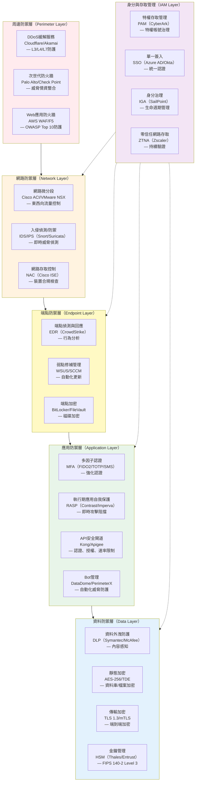

### 10.2 身分與存取控制（IAM）架構審查

| 控制項目 | 設計要求 | 實作狀態 | 驗證方法 | 風險評級 | 改善計畫 |
|:---|:---|:---:|:---|:---:|:---|
| **最小權限原則（PoLP）** | 依角色（RBAC）與屬性（ABAC）授權，預設拒絕 | 部分（80%系統） | 特權帳號盤點、存取權審查紀錄 | 中 | Q2完成剩餘20%系統導入ABAC |
| **多因子認證（MFA）** | 所有遠端存取與特權操作強制MFA | 是（95%覆蓋） | 設定檔審查、滲透測試 | 低 | Q1完成剩餘5%高風險帳號 |
| **特權存取管理（PAM）** | 特權帳號集中管理、定期輪換（90天）、全程錄影 | 是 | PAM系統報表（CyberArk） | 低 | — |
| **零信任網路存取（ZTNA）** | 預設拒絕、持續驗證、最小授權、微分段 | 規劃中（40%） | 架構設計文件、POC結果 | **高** | Q3完成核心系統ZTNA部署 |
| **客戶身分驗證（FIDO2/生物辨識）** | 高風險交易強化認證（轉帳、額度調整） | 部分（60%） | 交易流程測試、FIDO Alliance認證 | 中 | Q2完成FIDO2全面導入 |
| **定期存取權審查（Access Review）** | 季度審查、離職即時停用（<4小時） | 是 | 審查紀錄、HR系統整合 | 低 | — |
| **API安全（OAuth2/OIDC）** | 符合FAPI標準、PKCE、限制Scope、短期Token | 是（90%） | API安全評估、OAuth流程測試 | 中 | Q2完成剩餘10%舊系統升級 |

### 10.3 資安監控與應變架構（SOC/SIEM）

| 功能組件 | 技術實作 | 覆蓋範圍 | 成熟度 | 改善項目 | 時程 |
|:---|:---|:---:|:---:|:---|:---:|
| **日誌集中管理** | SIEM（Splunk Enterprise Security/Azure Sentinel） | 90%關鍵系統 | 優化中 | 增加雲端原生日誌（CloudTrail/Audit Logs） | Q2 |
| **威脅情資整合** | TIP（MISP + 商業情資：Recorded Future） | 內部+外部情資 | 基礎 | 強化自動化關聯（AI/ML驅動） | Q3 |
| **使用者行為分析（UEBA）** | 機器學習異常偵測（Splunk UBA/Exabeam） | 特權使用者（100%） | 試行 | 擴大覆蓋一般使用者（20%） | Q4 |
| **自動化回應（SOAR）** | 劇本化回應（Splunk SOAR/Palo Alto XSOAR） | 低風險事件（自動隔離） | 初期 | 擴展至中高風險事件（自動化率提升至60%） | Q3 |
| **威脅狩獵（Threat Hunting）** | 主動式威脅搜尋（MITRE ATT&CK框架） | 季度執行 | 建立中 | 建立常態化機制（月度） | Q2 |
| **資安驗證（BAS/Pentest）** | 自動化攻擊模擬（SafeBreach）、紅隊演練 | 年度紅隊、季度自動化 | 基礎 | 增加持續驗證頻率（月度BAS） | Q3 |

### 10.4 AI/ML 模型治理與生成式 AI 風險管理

> **法規依據**：金管會「金融業運用人工智慧(AI)核心原則與相關推動政策」、Fed SR 11-7 Model Risk Management。

#### AI/ML 模型生命週期治理

| 階段 | 治理要求 | 控制措施 | 驗證方法 | 負責單位 |
|:---|:---|:---|:---|:---|
| **模型開發** | 資料品質驗證、特徵工程審查、演算法選型審批 | 模型開發標準作業程序（SOP）、資料血緣追蹤 | 開發文件審查、Code Review | 數據處/模型團隊 |
| **模型驗證** | 獨立驗證、效能基準（Benchmark）、公平性檢驗 | 模型驗證報告（MV Report）、偏差測試（Bias Testing） | 獨立模型驗證團隊執行 | 風險管理處 |
| **模型部署** | 上線前安全評估、A/B測試、金絲雀部署 | 模型登記冊（Model Registry）、部署核准流程 | 部署檢核清單、壓力測試 | 資訊處/SRE |
| **模型監控** | 模型漂移偵測（Drift Detection）、效能衰退監控 | 自動化監控儀表板、告警閾值設定 | 月度模型績效報告 | 數據處 |
| **模型退役** | 退役評估、替代方案驗證、歷史保留 | 退役審查報告、歸檔政策 | ITARC 審查核准 | 模型團隊 |

#### 生成式 AI（GenAI）風險控管

| 風險類別 | 風險描述 | 控制措施 | 監控指標 |
|:---|:---|:---|:---|
| **資料洩漏** | 機敏資料透過 Prompt 或訓練資料洩漏至外部 | 輸入/輸出內容過濾（PII/機敏資料偵測）、禁止上傳客戶資料至公開 LLM | 機敏資料外洩事件數 |
| **幻覺風險（Hallucination）** | AI 生成不正確或虛構的金融資訊 | 人工審核機制（Human-in-the-loop）、事實查核流程、RAG架構 | 幻覺率、人工覆核比例 |
| **Prompt Injection** | 惡意使用者透過提示注入繞過安全機制 | 輸入驗證與消毒、Prompt Guardrails、安全沙盒 | 攻擊偵測率 |
| **公平性與偏差** | 模型輸出對特定族群產生歧視或偏差 | 公平性指標監控（Equalized Odds、Demographic Parity）、定期偏差審計 | 偏差測試通過率 |
| **可解釋性** | 金融決策無法解釋或追蹤 | SHAP/LIME 可解釋性報告、決策審計軌跡 | 可解釋性覆蓋率 |
| **智財權風險** | 生成內容侵犯第三方著作權 | 授權模型使用、輸出內容比對檢查 | IP 爭議事件數 |

#### AI 使用政策分級

| 使用等級 | 適用場景 | 允許之 AI 工具 | 核准要求 | 資料限制 |
|:---|:---|:---|:---:|:---|
| **Level 1：開放使用** | 內部行政、文件摘要、知識搜尋 | 經核准之企業版 AI 工具 | 部門主管核准 | 僅可使用公開或內部一般資料 |
| **Level 2：受控使用** | 程式碼輔助開發、測試資料生成 | 企業版 GitHub Copilot、內部 LLM | ITARC 核准 | 禁止使用客戶資料、僅限脫敏資料 |
| **Level 3：嚴格管控** | 客戶服務 Chatbot、風險評分輔助 | 自建/私有部署 LLM | ITARC + CISO 雙重核准 | 需通過 DPIA、模型驗證 |
| **Level 4：禁止使用** | 自動化信貸核准、完全自主交易決策 | — | — | 高風險金融決策不得完全依賴 AI，須保留人為判斷 |

---

## 第十一章：委外與供應鏈架構審查（Outsourcing & Supply Chain）

### 11.1 關鍵資訊服務委外架構

| 委外項目 | 服務提供者 | 服務模式 | 資料處理位置 | 風險評級 | 監管申報 | 稽核狀態 |
|:---|:---|:---:|:---:|:---:|:---:|:---:|
| **核心系統維運** | [廠商A：國際大廠] | 駐點維運 | 銀行機房 | 高 | 已申報 | 年度實地稽核 |
| **雲端基礎設施** | [AWS/Azure/GCP] | IaaS/PaaS | 指定區域（AWS ap-northeast-1 東京 / Azure Japan East）† | 高 | 已申報 | SOC2 Type II審查 |

> † **資料駐留說明**：截至本文件編寫時，AWS 尚未在台灣設立 Region，因此採用最近之東京區域（ap-northeast-1）。使用海外 Region 儲存客戶資料須依「金融機構辦理電腦系統資訊傳輸作業委外經營辦法」向金管會報備。若未來 AWS 開設台灣 Region，應優先評估遷移。
| **資安監控服務（MSSP）** | [廠商B：國內資安大廠] | 託管服務 | 廠商SOC + 銀行機房 | 高 | 已申報 | 季度滲透測試 |
| **軟體開發委外** | [廠商C：系統整合商] | 專案委外 | 廠商開發中心（國內） | 中 | 已申報 | 專案結案稽核 |
| **客服中心系統** | [廠商D：雲端服務商] | SaaS（Genesys） | 雲端（國內機房） | 中 | 已申報 | ISO 27001認證 |
| **數據分析服務** | [廠商E：AI新創] | 專案委外 | 去識別化後雲端處理 | 中 | 已申報 | 資料保護影響評估（DPIA）|

### 11.2 委外架構風險評估矩陣

```mermaid
flowchart LR
    subgraph Assessment["委外風險評估維度"]
        direction TB
        A1["資料風險<br/>機敏資料暴露<br/>— 加密、去識別化"]
        A2["營運風險<br/>服務中斷<br/>— SLA、備援"]
        A3["法遵風險<br/>監理遵循<br/>— 申報、稽核權"]
        A4["地緣政治風險<br/>跨境資料傳輸<br/>— 資料落地、出口管制"]
        A5["集中風險<br/>單一廠商依賴<br/>— 多源策略、退出機制"]
    end
    
    subgraph Controls["風險緩解控制"]
        direction TB
        C1["契約控管<br/>SLA/資安條款/罰則<br/>— 年度審查"]
        C2["技術控管<br/>加密/去識別化/存取控制<br/>— 技術驗證"]
        C3["稽核權利<br/>現場/遠端稽核/滲透測試<br/>— 季度執行"]
        C4["備援機制<br/>多廠商/異地備援/退出策略<br/>— 年度演練"]
        C5["持續監控<br/>績效/資安監控/威脅情資<br/>— 即時儀表板"]
    end
    
    Assessment --> Controls
    
    style Assessment fill:#ffebee
    style Controls fill:#e8f5e9
```

### 11.3 雲端服務架構審查重點（Cloud Security Posture Management）

| 審查項目 | 審查內容 | AWS檢核 | Azure檢核 | GCP檢核 | 風險評級 |
|:---|:---|:---:|:---:|:---:|:---:|
| **資料落地（Data Residency）** | 確認資料儲存於國內或經監理核准之海外區域 | ✓（ap-northeast-1 東京）† | ✓（Japan East）† | N/A | 中（海外儲存需監理核備） |
| **加密金鑰管理** | 客戶自有金鑰（BYOK）或持有金鑰（HYOK） | ✓（AWS KMS + 內部HSM） | ✓（Azure Key Vault） | N/A | 低 |
| **網路隔離架構** | VPC/VNet設計、私有連線（DirectConnect/ExpressRoute） | ✓（DX + VPC Peering） | ✓（ER + VNet Peering） | N/A | 低 |
| **身分整合** | 與銀行AD/LDAP整合、SSO機制 | ✓（AWS IAM Identity Center） | ✓（Azure AD Connect） | N/A | 低 |
| **日誌可視性** | 雲端活動日誌（CloudTrail/Audit Logs）收集與分析 | ✓（集中至SIEM） | ✓（Sentinel整合） | N/A | 低 |
| **合規認證** | ISO 27001、SOC 2 Type II、PCI DSS、金管會雲端委外要求 | ✓ | ✓ | N/A | 低 |
| **雲端資安姿態管理（CSPM）** | 持續監控雲端設定、合規自動化檢查 | ✓（AWS Security Hub） | ✓（Microsoft Defender for Cloud） | N/A | 中 |
| **容器安全** | 映像掃描、執行期防護、密碼管理 | ✓（ECR掃描 + GuardDuty） | ✓（ACR + Defender） | N/A | 中 |
| **退出策略（Exit Strategy）** | 資料匯出、格式轉換、廠商轉移計畫 | ⚠（待強化文件） | ⚠（待強化文件） | N/A | **高** |
| **多雲/混合雲策略** | 避免單一雲端鎖定、跨雲備援能力 | ⚠（規劃中） | ⚠（規劃中） | N/A | 中 |

---

## 第十二章：架構治理與生命週期管理（Architecture Governance）

### 12.1 架構例外管理（Architecture Exception Management）

| 例外類型 | 定義 | 核准層級 | 時效 | 追蹤機制 | 文件標示 |
|:---|:---|:---:|:---:|:---|:---:|
| **暫時性例外** | 因專案時程無法立即符合標準，需限期改善 | ITARC主席 | 6個月 | 專案風險登錄、月度追蹤 | 🟡 |
| **策略性例外** | 因業務策略或技術限制，長期偏離標準 | 資訊長（CIO） | 1年 | 年度架構檢討、技術債管理 | 🟠 |
| **緊急性例外** | 緊急應變所需之暫時架構調整 | 資訊安全長（CISO） | 30日 | 事件後檢討、根因分析 | 🔴 |
| **永久性例外** | 經評估標準不適用，需修訂標準 | 董事會審計委員會 | 永久 | 標準文件修訂、版本紀錄 | 🔵 |

### 12.2 架構成熟度評估模型（Architecture Maturity Model）

| 等級 | 說明 | 特徵 | 本行現況 | 目標 |
|:---|:---|:---|:---:|:---:|
| **L1：概念架構** | 高階概念設計，缺乏細節 | 口頭描述、草圖、無標準 | — | — |
| **L2：可驗證設計** | 具備基本文件，可初步驗證 | 基本圖表、部分標準 | 10% | — |
| **L3：可實作藍圖** | 詳細設計文件，可指導開發 | 完整4+1視圖、技術選型、介面規範 | 50% | — |
| **L4：生產級架構** | 經生產驗證，具備監控與治理 | 自動化部署、可觀測性、安全內建 | 35% | 50%（20XX年）|
| **L5：金融級韌性架構** | 符合最高監理要求，持續優化 | 混沌工程、AI驅動、零信任、自動修復 | 5% | 15%（20XX年）|

### 12.3 技術債務管理（Technical Debt Management）

> **章程依據**：本節對應「架構審查委員會章程」第四條「識別並控管潛在技術風險及技術債」。

#### 技術債分類與評估框架

| 技術債類型 | 定義 | 評估方法 | 典型影響 | 優先級 |
|:---|:---|:---|:---|:---:|
| **架構債務** | 過時架構模式「如單體式、緊耦合、直接DB連結） | 架構評估報告、依賴分析 | 系統演進受阻、變更風險高 | 高 |
| **程式碼債務** | 程式碼品質低、缺乏測試、複雜度過高 | SonarQube 掃描、技術債評分 | 維護成本增加、缺陷率上升 | 中 |
| **基礎設施債務** | 過時作業系統、未修補元件、EOL技術 | CVE 掃描、版本檢查 | 資安漏洞、穩定性風險 | 高 |
| **文件債務** | 架構文件過時、API文件不完整、缺乏操作手冊 | 文件審查、實際與文件差異分析 | 知識斷層、交接困難 | 中 |
| **流程債務** | 缺乏 CI/CD、手動部署、無自動化測試 | DevOps 成熟度評估 | 部署速度慢、人為錯誤風險 | 中 |

#### 技術債登記與追蹤表

| 債務編號 | 類型 | 描述 | 影響系統 | 財務量化（年化增額成本） | 優先級 | 夞還計畫 | 預計完成 | 狀態 |
|:---|:---|:---|:---|---:|:---:|:---|:---:|:---:|
| TD-001 | 架構 | 遺留系統直接DB連結（15個） | 核心銀行、10個周邊系統 | [N]萬/年（維護+變更風險） | 高 | API化+CDC模式替換 | 20XX-Q4 | 進行中 |
| TD-002 | 基礎設施 | COBOL核心系統缺乏維護人才 | 核心銀行系統 | [N]萬/年（人才風險+外包成本） | 高 | API封裝+逐步汰換 | 20XX+ | 規劃中 |
| TD-003 | 程式碼 | 舊版報表系統缺乏單元測試 | 報表平台 | [N]萬/年（缺陷修復時間） | 中 | 補寫測試+重構 | 20XX-Q3 | 規劃中 |
| TD-004 | 文件 | 40%系統架構文件過時或缺失 | 全行系統 | [N]萬/年（交接成本+重工） | 中 | 文件補強計畫 | 20XX-Q2 | 進行中 |

#### 技術債管理政策

| 政策項目 | 規定 |
|:---|:---|
| **債務解析** | 所有新專案不得新增技術債，積欠債務請單須在提案時同時納入夞還計畫 |
| **債務預算** | 每季編列至少 15% 開發能量用於技術債夞還 |
| **債務審查** | ITARC 每季審查技術債清單，評估優先級與融資感影響 |
| **債務比率** | 技術債與新功能開發比率不得超過 30%，超過時優先夞還債務 |
| **財務量化** | 所有技術債須量化年化增額成本，納入 TCO 分析（§4A.1） |

---

## 第十三章：審查發現與改善追蹤（Findings & Remediation）

### 13.1 審查發現總表（Findings Summary）

> **評分說明**：風險等級與風險評分依 §3.3 審查評分準則統一標準。

| 項次 | 發現編號 | 架構領域 | 發現標題 | 風險等級 | 風險評分 | 負責單位 | 預計完成日 | 狀態 | 佐證文件 |
|:---:|:---|:---:|:---|:---:|:---:|:---|:---:|:---:|:---|
| 1 | ARCH-YYYY-001 | 技術架構 | 核心系統單點故障風險，異地備援RTO未達監理要求（現況4H，要求2H） | 🟠 重大 | 7 | 資訊處 | 20XX-Q2 | 進行中 | 災難復原計畫書 |
| 2 | ARCH-YYYY-002 | 安全架構 | API閘道缺乏統一速率限制與異常行為偵測，存在DDoS與暴力破解風險 | 🟠 重大 | 6 | 資安處 | 20XX-Q1 | 進行中 | 滲透測試報告 |
| 3 | ARCH-YYYY-003 | 資料架構 | 資料品質監控覆蓋率不足（40%），影響監理申報準確性與BCBS 239合規 | 🟡 輕微 | 4 | 數據處 | 20XX-Q3 | 規劃中 | 資料品質評估報告 |
| 4 | ARCH-YYYY-004 | 應用架構 | 遺留系統間直接資料庫連結未依計畫移除（剩餘15個） | 🟡 輕微 | 3 | 資訊處 | 20XX-Q4 | 規劃中 | 技術債清單 |
| 5 | ARCH-YYYY-005 | 委外架構 | 雲端服務退出策略文件未完整，缺乏具體資料遷出與格式轉換計畫 | 🟡 輕微 | 4 | 採購/資訊 | 20XX-Q2 | 進行中 | 雲端服務合約 |
| 6 | ARCH-YYYY-006 | 安全架構 | 零信任架構（ZTNA）實施進度落後（僅40%），核心區尚未覆蓋 | 🟠 重大 | 6 | 資安處 | 20XX-Q3 | 進行中 | ZTNA導入計畫 |
| 7 | ARCH-YYYY-007 | 技術架構 | 壓力測試顯示尖峰處理量僅達5,000 TPS，未達目標10,000 TPS | 🟡 輕微 | 4 | 資訊處 | 20XX-Q2 | 規劃中 | 壓力測試報告 |
| 8 | ARCH-YYYY-008 | 安全架構 | AI/ML模型治理框架未建立，缺乏模型風險評估與偏差監控機制 | 🟠 重大 | 5 | 資訊處/數據處 | 20XX-Q3 | 規劃中 | AI治理政策草案 |
| 9 | ARCH-YYYY-009 | 業務架構 | 成本效益分析機制未建立，缺乏TCO基線與投資報酬評估 | 🟡 輕微 | 3 | 資訊處/財務處 | 20XX-Q2 | 規劃中 | — |

### 13.2 風險等級分佈

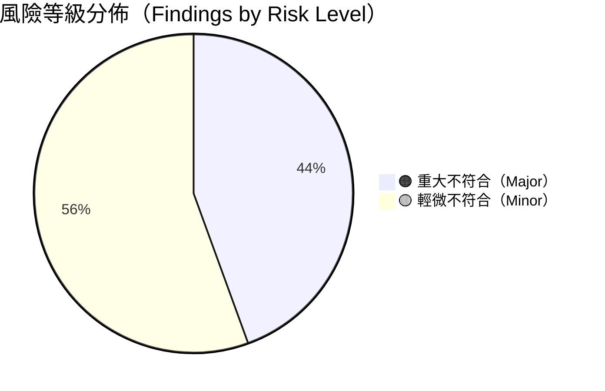

### 13.3 改善路徑圖（Architecture Roadmap）

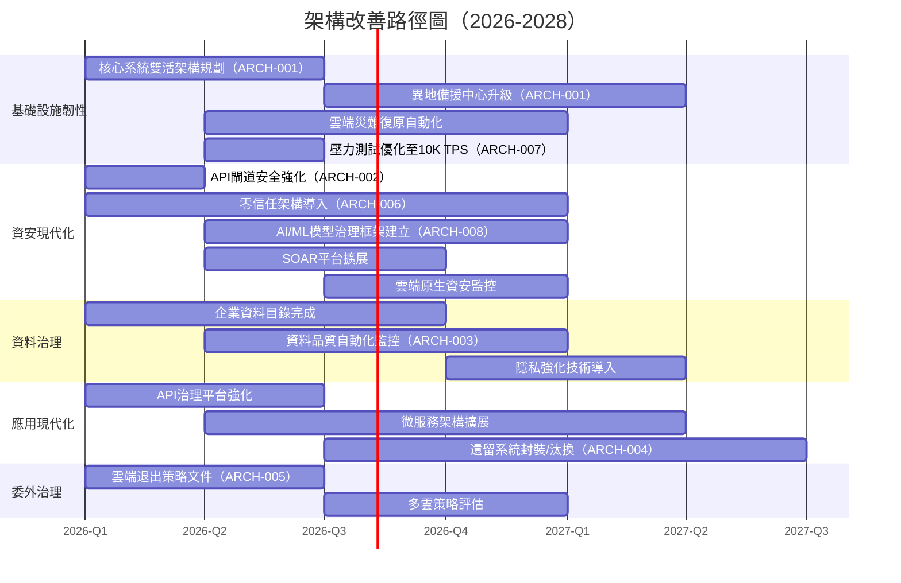

---

## 第十四章：審查簽署與批准（Approval & Sign-off）

本文件經審查委員會確認，架構設計符合銀行業安全與穩健經營原則，所有發現均已記錄並排定改善計畫。

| 角色 | 姓名 | 職稱 | 簽署 | 日期 | 備註 |
|:---|:---|:---|:---:|:---:|:---|
| **專案架構師** | [姓名] | 企業架構師 | ☐ | YYYY-MM-DD | 技術內容完整性負責 |
| **資安架構師** | [姓名] | 資安架構師 | ☐ | YYYY-MM-DD | 安全控制有效性評估 |
| **資料架構師** | [姓名] | 資料架構師 | ☐ | YYYY-MM-DD | 資料架構與治理審查 |
| **基礎設施架構師** | [姓名] | 雲端架構師 | ☐ | YYYY-MM-DD | 基礎設施與網路審查 |
| **資安長（CISO）** | [姓名] | 資訊安全長 | ☐ | YYYY-MM-DD | 資安風險把關 |
| **風險長（CRO）** | [姓名] | 風險管理長 | ☐ | YYYY-MM-DD | 整體風險評估 |
| **資訊長（CIO）** | [姓名] | 資訊長 | ☐ | YYYY-MM-DD | 技術策略決策 |
| **業務負責人** | [姓名] | 業務部門主管 | ☐ | YYYY-MM-DD | 業務需求對齊 |
| **架構審查委員會主席** | [姓名] | 資訊架構長 | ☐ | YYYY-MM-DD | 最終審查核准 |

---

## 附錄（Appendices）

### 附錄A：參考標準與最佳實務

| 標準/框架 | 版本 | 適用範圍 | 引用章節 |
|:---|:---|:---|:---|
| TOGAF Standard | 10th Edition | 企業架構開發方法 | 第三章 |
| ArchiMate Specification | 3.2 | 架構描述語言 | 第五章 |
| ISO/IEC/IEEE 42010 | 2022 | 系統與軟體架構描述 | 第三章 |
| ISO 27001:2022 / ISO 27002:2022 | 2022 | 資訊安全管理 | 第七章、第十章 |
| ISO 22301:2019 | 2019 | 業務持續管理 | 第八章 |
| NIST Cybersecurity Framework | 2.0 | 網路安全框架 | 第十章 |
| NIST SP 800-53 Rev. 5 | Rev. 5 | 安全與隱私控制 | 第十章 |
| PCI DSS | v4.0 | 支付卡產業資料安全標準 | 第六章、第七章 |
| CSA Cloud Controls Matrix | v4.0 | 雲端安全控制 | 第十一章 |
| MAS TRM Guidelines | 最新版 | 新加坡金融管理局科技風險管理 | 參考 |
| **金管會「銀行資訊系統安全及防護基準」** | 最新版 | 台灣銀行業監理要求 | 全文件 |
| **金融機構作業委外內部作業制度** | 最新版 | 委外治理 | 第十一章 |
| SWIFT Customer Security Controls Framework | 2024 | SWIFT安全控制 | 第七章 |
| OWASP Top 10 | 2021 | 應用程式安全風險 | 第十章 |
| MITRE ATT&CK Framework | v14 | 威脅情資與狩獵 | 第十章 |

### 附錄B：術語定義（Glossary）

| 術語 | 英文 | 定義 |
|:---|:---|:---|
| **RTO** | Recovery Time Objective | 復原時間目標：災難發生後系統必須恢復運作的時間上限 |
| **RPO** | Recovery Point Objective | 復原點目標：災難發生後可接受的資料遺失時間範圍 |
| **MDM** | Master Data Management | 主資料管理：確保關鍵資料實體的單一真實版本 |
| **SIEM** | Security Information and Event Management | 資安資訊與事件管理：整合安全日誌收集、分析與警報 |
| **SOAR** | Security Orchestration, Automation and Response | 資安協作自動化與回應：自動化事件處理與回應 |
| **ZTNA** | Zero Trust Network Access | 零信任網路存取：預設拒絕、持續驗證的存取模式 |
| **PAM** | Privileged Access Management | 特權存取管理：高權限帳號的集中治理 |
| **DLP** | Data Loss Prevention | 資料外洩防護：防止機敏資料未經授權流出 |
| **BAS** | Breach and Attack Simulation | 入侵與攻擊模擬：自動化驗證安全控制有效性 |
| **PETs** | Privacy Enhancing Technologies | 隱私強化技術：去識別化、差分隱私、同態加密等 |
| **EDA** | Event-Driven Architecture | 事件驅動架構：以事件為核心的系統設計模式 |
| **SAGA** | Saga Pattern | 長時間執行交易的分散式一致性模式 |
| **CQRS** | Command Query Responsibility Segregation | 命令查詢職責分離：讀寫分離的架構模式 |
| **CDC** | Change Data Capture | 變更資料捕捉：即時捕捉資料庫變更的技術 |

### 附錄C：文件範本使用說明

1. **審查頻率**：本文件應至少每年進行一次全面審查，重大系統變更時應啟動專案審查
2. **角色職責**：
   - **資訊架構師**：負責技術內容完整性與準確性
   - **資安架構師**：負責安全控制有效性評估
   - **風險管理單位**：負責風險評級與接受決策
   - **法遵單位**：負責監理要求符合性驗證
   - **業務代表**：負責業務需求對齊確認
3. **文件維護**：任何發現的更新應於30日內更新本文件，並記錄於修訂紀錄
4. **分發控制**：本文件為**極機密**文件，分發應依據「文件控制資訊」區段所列對象，並記錄分發紀錄
5. **工具支援**：建議使用架構管理工具（如BiZZdesign、Mega、OrbusInfinity）維護架構模型，確保一致性與可追溯性

### 附錄D：架構審查檢核清單（快速版）

| 檢核類別 | 檢核項目 | 符合 | 不符合 | N/A | 備註 |
|:---|:---|:---:|:---:|:---:|:---|
| **業務架構** | 業務策略與IT架構對齊 | ☐ | ☐ | ☐ | |
| | 業務流程完整映射 | ☐ | ☐ | ☐ | |
| | RTO/RPO定義符合監理要求 | ☐ | ☐ | ☐ | |
| **應用架構** | 微服務鬆耦合設計 | ☐ | ☐ | ☐ | |
| | API標準化（OpenAPI 3.0） | ☐ | ☐ | ☐ | |
| | 直接DB連結已移除或計畫移除 | ☐ | ☐ | ☐ | |
| **資料架構** | 資料分類分級完成 | ☐ | ☐ | ☐ | |
| | 敏感資料加密（靜態+傳輸） | ☐ | ☐ | ☐ | |
| | 資料留存與銷毀政策 | ☐ | ☐ | ☐ | |
| **技術架構** | 高可用設計（無SPOF） | ☐ | ☐ | ☐ | |
| | 多中心備援架構 | ☐ | ☐ | ☐ | |
| | 容器化/雲端就緒 | ☐ | ☐ | ☐ | |
| **安全架構** | 零信任架構實施 | ☐ | ☐ | ☐ | |
| | MFA強制啟用 | ☐ | ☐ | ☐ | |
| | 資安監控（SIEM/SOAR） | ☐ | ☐ | ☐ | |
| **合規性** | 法規對照矩陣完整 | ☐ | ☐ | ☐ | |
| | 監理申報資料品質 | ☐ | ☐ | ☐ | |
| | 委外服務合規審查 | ☐ | ☐ | ☐ | |
| **成本效益** | TCO 分析完成（§4A.1） | ☐ | ☐ | ☐ | |
| | 授權模式評估（§4A.2） | ☐ | ☐ | ☐ | |
| | 投資報酬分析（§4A.3） | ☐ | ☐ | ☐ | |
| | 人力資源配置合理性（§4A.4） | ☐ | ☐ | ☐ | |
| **AI/ML 治理** | AI 模型生命週期管理（§10.4） | ☐ | ☐ | ☐ | |
| | 生成式 AI 風險控管 | ☐ | ☐ | ☐ | |
| | AI 使用政策分級核准 | ☐ | ☐ | ☐ | |
| **可觀測性** | SLO/SLI 定義完成（§9.5） | ☐ | ☐ | ☐ | |
| | 三大支柱整合（Metrics/Logs/Traces） | ☐ | ☐ | ☐ | |
| | 告警疲勞管理策略 | ☐ | ☐ | ☐ | |
| **效能容量** | 效能基線建立（§9.6） | ☐ | ☐ | ☐ | |
| | 自動擴縮策略驗證 | ☐ | ☐ | ☐ | |
| | 負載測試計畫（季度） | ☐ | ☐ | ☐ | |
| **混沌工程** | 混沌測試場景清單（§9.7） | ☐ | ☐ | ☐ | |
| | GameDay 演練紀錄（半年） | ☐ | ☐ | ☐ | |
| **技術債管理** | 技術債登記與追蹤（§12.3） | ☐ | ☐ | ☐ | |
| | 技術債財務量化 | ☐ | ☐ | ☐ | |
| | 夞還計畫與預算編列 | ☐ | ☐ | ☐ | |
| **開放銀行** | TSP 兆入評估完成（§7.5） | ☐ | ☐ | ☐ | |
| | FAPI 合規性驗證 | ☐ | ☐ | ☐ | |
| | Consent 機制架構審查 | ☐ | ☐ | ☐ | |
